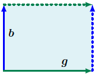
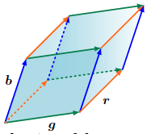
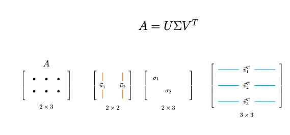
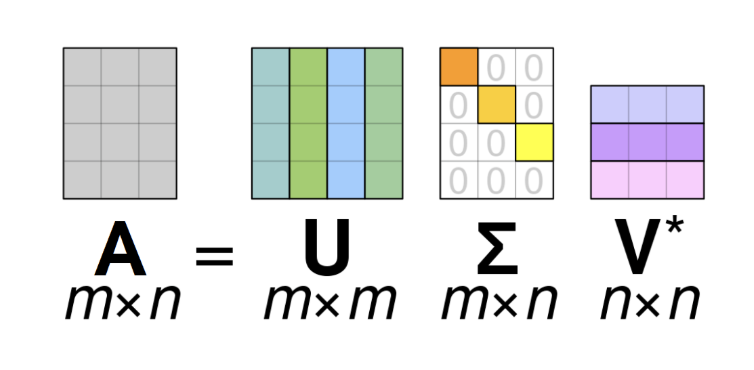
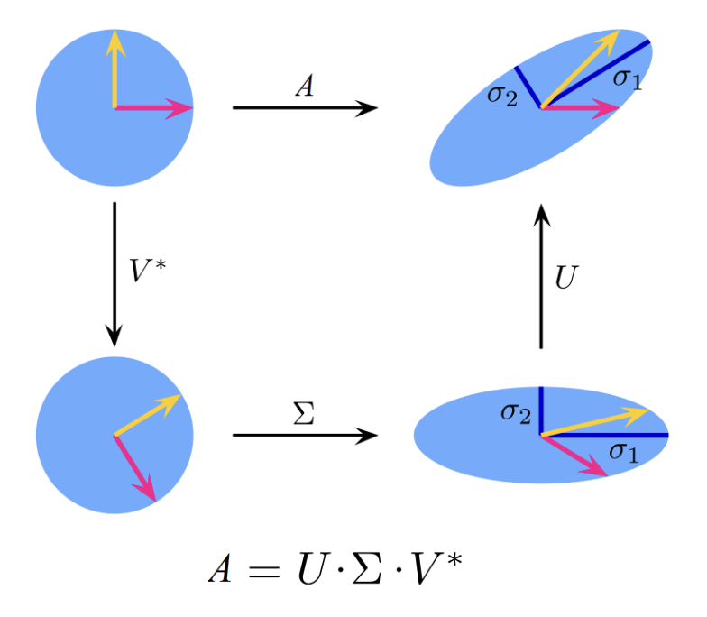

# Matrix decompositions

So what is matrix decomposition? And why we need it? This is what we will try to answer in this tutorial.

In general we have seen in previous tutorials how `mappings` and `transformations` of vectors can be conveniently seen as `linear transformation` and described as`matrices`. We saw how `data` can be represented by `matrices` where the rows of the matrix for example represent different people or as they called `instances` and the columns
describe different `features` of the people, such as: `weight`, `height`, and other information about the individuals. That row and column order does not play a really important role and we can have each 
instance to be a column vector so a column of the matrix. That is simply a transpose of the initial matrix.

In this page, we will present three different aspects of these matrices: how to `summarize matrices`, how matrices can be `decomposed`, and how these decompositions can be used for matrix approximations. 
We will analyze multiple ways to perform matrix decomposition and eventually we will show why this is really important in `Machine Learning`. 

We will start our journey by considering methods that allow us to describe matrices with just a few numbers that characterize the overall properties of matrices. These methods are the `determinants`, `traces` and `eigenvalues`.

Matrix decompositions usually decompose an original matrix 
into a product of simpler matrices, which have some specific features. In this theory page, we cover two important decompositions: 
`Eigenvalue decomposition (Diagonalization)` and `Singular value Decomposition (SVD)`. Finally we show that one of the most important algorithms in Machine Learning
called `Principal Component Analysis (PCA)` is based on matrix decomposition and SVD.

Ok but first things first, lets start with simple ways to describe matrices. The first methodology or function of the matrix it is called the `determinant`.

## Determinant of a matrix

Let's assume a square matrix $\boldsymbol{A} \in \mathbb{R}^{n \times n}$, we can write the determinant of this matrix as follows:

$$
\det(A) = \begin{vmatrix}
a_{11} & a_{12} & \ldots & a_{1n} \\
a_{21} & a_{22} & \ldots & a_{2n} \\
\vdots & \vdots & \ddots & \vdots \\
a_{n1} & a_{n2} & \ldots & a_{nn}
\end{vmatrix}
$$

Determinant is a function that maps a matrix into a scalar value $\det(A) \in \mathbb{R}$. The determinant is the entity that we use to check whether a matrix is invertible. It holds
that if a matrix $\boldsymbol{A}$ is `invertible` then $\det(A) \neq 0$. That means that we cannot compute $\boldsymbol{A}^{-1}$ In case, that $\det(A) = 0$ then the matrix is not invertible and it is called a `singular matrix`.

The notion of a determinant is natural when we consider it as a mapping from a set of $n$ vectors spanning an object in $\mathbb{R}^n$. 
It turns out that the determinant $\det(A)$ is the signed volume of an $n$-dimensional parallelepiped formed by columns of the matrix $\boldsymbol{A}$. To better grasp this, we can start with the following example: Let's say that we got two vector $\mathbf{g} = [g, 0]^T$ and $\mathbf{b} = [0, b]^T$ in standard basis $\{\mathbf{e}_1 = [1, 0]^T  \mathbf{e}_2 = [0, 1]^T \}$:

  

 and we can place them in the following matrix:

$$
\det(A) = \begin{vmatrix}
g & 0 \\
0 & b
\end{vmatrix}
$$

In this case, we define as determinant to be:

$$det(A) = g\cdot b + 0 =  g\cdot b $$

 which is the area of the parallelogram defined by the two vectors. The same happens in the below image, where we can compute the area in the $\mathbb{R}^{3}$ space using the 
 determinant of the matrix that contains the vectors:

  

 $$
\boldsymbol{A} = \begin{vmatrix}
\mathbf{g} & \mathbf{b} & \mathbf{r}
\end{vmatrix}
 $$

If for example we do have: 

$$r = \begin{bmatrix} 2 \\ 0 \\ -8 \end{bmatrix}, \quad g = \begin{bmatrix} 6 \\ 1 \\ 0 \end{bmatrix}, \quad b = \begin{bmatrix} 1 \\ 4 \\ -1 \end{bmatrix}$$

Then, the volume of these three vectors can be found in we compute $det(A)$:

$$
\det(A) = \begin{vmatrix}
2 & 6 & 1 \\
0 & 1 & 4 \\
-8 & 0 & -1
\end{vmatrix} = 186
$$

One prerequisite is that the vectors are `linearly independent` otherwise we cannot compute the volume. Lets us imagine that the vectors $\mathbf{b}$ and $\mathbf{g}$ are dependant, that means that they are parallel and thus, the area that they define is equal to zero. `That observation is really important!` If a matrix contains columns that are linearly dependant then, `the determinant is equal to zero` and thus we can say that this matrix is a `singular matrix`. 

The important message in this section is that if the determinant of a matrix is not zero, then, it represents the volume that the column vector define is $\mathbb{R}^{n}$ space. A second useful observation, is that we can compute the determinant only for square matrices. If the matrix contains columns that are linearly dependant then we have a `singular matrix`.

<!-- The sign of the determinant indicates the orientation of the spanning vectors $\mathbf{b}, \mathbf{g}$ 
with respect to the standard basis $(\mathbf{e}_1, \mathbf{e}_2)$. In our figure, flipping the order to $\mathbf{g}, \mathbf{b}$ 
swaps the columns of $A$ and reverses the orientation of the shaded area. This becomes the familiar formula: area = height $\times$ length. 
This intuition extends to higher dimensions. In $\mathbb{R}^3$, we consider three vectors $\mathbf{r}, \mathbf{b}, \mathbf{g} \in \mathbb{R}^3$ 
spanning the edges of a parallelepiped, i.e., a solid with faces that are parallel parallelograms (see Figure 4.3). The absolute value of the 
determinant of the $3 \times 3$ matrix $[\mathbf{r}, \mathbf{b}, \mathbf{g}]$ is the volume of the solid. Thus, the determinant acts as a 
function that measures the signed volume formed by column vectors composed in a matrix. -->

## Trace of a matrix 

The second important way to summarize matrix is by using a function called `trace`. This function takes as input $\boldsymbol{A} \in \mathbb{R}^{n \times n}$ and maps it into real-world
values $\mathbb{R}$ in the following way:

$$
tr(\boldsymbol{A}) = \sum_{i=1}^n a_{ii}
$$

where $a_{ii}$ are the diagonal elements of the squared matrix.

The trace satisfies the following properties:

- $tr(\boldsymbol{A} + \boldsymbol{B}) = tr(\boldsymbol{A}) + tr(\boldsymbol{B})$ for $\boldsymbol{A}, \boldsymbol{B} \in \mathbb{R}^{n \times n}$
- $tr(\alpha \cdot \boldsymbol{A}) = \alpha \cdot tr(\boldsymbol{A})$, $\alpha \in \mathbb{R}$ for $\boldsymbol{A} \in \mathbb{R}^{n \times n}$
- $tr(\boldsymbol{I}_n) = n$
- $tr(\boldsymbol{AB}) = tr(\boldsymbol{BA})$ for $\boldsymbol{A} \in \mathbb{R}^{n \times k}$, $\boldsymbol{B} \in \mathbb{R}^{k \times n}$

It can be shown that only one function satisfies these four properties together -- the trace (Gohberg et al., 2012).

The properties of the trace of matrix products are more general. Specifically, the trace is invariant under cyclic permutations, i.e.,

$$
tr(\boldsymbol{AKL}) = tr(\boldsymbol{KLA})
$$

for matrices $\boldsymbol{A} \in \mathbb{R}^{a \times k}$, $\boldsymbol{K} \in \mathbb{R}^{k \times l}$, $\boldsymbol{L} \in \mathbb{R}^{l \times a}$. This property generalizes to products of an arbitrary number of matrices. As a special case of (4.19), it follows that for two vectors $\boldsymbol{x}, \boldsymbol{y} \in \mathbb{R}^n$

$$
tr(\boldsymbol{xy}^\top) = tr(\boldsymbol{y}^\top \boldsymbol{x}) = \boldsymbol{y}^\top \boldsymbol{x} = \boldsymbol{x}^\top \boldsymbol{y} \in \mathbb{R}
$$

This trace of a matrix places an important role in eigen-decomposition and SVD and it is important to understand the basics so we can apply them later during 
the eigen-decomposition. 

# Matrix decomposition

Ok so far we found two ways to describe a square matrix using two functions the determinant and the trace. There are plenty of useful properties
for these functions. For instance, the trace of the matrix is equal with the summation of the `eigenvalues` (we will see soon what are these values). Now equipped with these two basic functions we can proceed with the concept of `matrix decomposition`. We will start by explaining with the really important concepts of `eigenvalues` and `eigenvectors`.

## Eigenvalues and Eigenvectors

In linear algebra, `eigensystems` denote a set of problems that include finding `eigenvectors` and `eigenvalues`. The word `eigen` comes from
German and means `own`, which will make sense when we formulate the problem more concretely. We will start with a square matrix $\mathbf{A} \in \mathbb{R}^{n \times n}$. We have seen before that a matrix performs a linear transformation that maps vectors from $\mathbf{R}^{n} \to \mathbf{R}^{n}$ in a specific way. The core idea of eigen-decomposition is to find 
vectors $\mathbf{x}$ that when we apply the transformation matrix $\mathbf{A}$ they are affected
`the least` by the transformation, and by least we mean that they are not rotated, but are `only scaled` by a scalar factor $\lambda$. Formally, given a
vector $\mathbf{x}$ and a transformation $\mathbf{A}$, this requirement can be written as:

$$
\mathbf{A}\mathbf{x} = \lambda \mathbf{x}

$$

Since on the right-hand side we multiply a vector by a scalar, we can equivalently add the identity matrix as $\lambda \rightarrow \lambda \mathbf{I}$. Rearranging terms gives us the following equation:

$$
(\mathbf{A} - \lambda \mathbf{I})\mathbf{x} = \mathbf{0}

$$

Assuming that $\mathbf{A} \in \mathbb{R}^{n \times n}$ and $\mathbf{x} \in \mathbb{R}^n$,
we can rewrite the former equation in an expanded form:

$$
\begin{pmatrix}
A_{11} - \lambda & A_{12} & \cdots & A_{1n} \\
A_{21} & A_{22} - \lambda & \cdots & A_{2n} \\
\vdots & \vdots & \ddots & \vdots \\
A_{n1} & A_{n2} & \cdots & A_{nn} - \lambda
\end{pmatrix}
\begin{pmatrix}
x_1 \\
\vdots \\
x_n
\end{pmatrix}
=
\begin{pmatrix}
0 \\
\vdots \\
0
\end{pmatrix}
$$

The equation above represents a system of linear equations, and the goal is to
find vectors $\mathbf{x} = (x_1 \ \cdots \ x_n)^\top$ and $\lambda$ that satisfy
it. For example, the $m$-th equation is given by:

$$
A_{m1} x_1 + \cdots + (A_{mm} - \lambda) x_m + \cdots + A_{mn} x_n = 0.

$$

What we can see is that in every equation, we have all the unknowns (elements of
the vector). Therefore, if the equations are not linearly independent, the only
solution is the trivial one, i.e.\ $x_1 = x_2 = \cdots = x_n = 0$. This is a detrimental solution, and we are interested in the case that this vector is non-zero. 
In this case, it should hold that:

$$
|\boldsymbol{A} - \lambda \boldsymbol{I}| = 0
$$

We can say that matrix $\boldsymbol{A} - \lambda \boldsymbol{I}$ is `singular` in this case. If that was not the case, then, we can multiply with the inverse of this matrix

$$
(\mathbf{A} - \lambda \mathbf{I})^{-1} (\mathbf{A} - \lambda \mathbf{I})\mathbf{x} = (\mathbf{A} - \lambda \mathbf{I})^{-1} \mathbf{0}
$$

which would lead to detrimental solutions that $\mathbf{x} = \mathbf{0}$ and we actually are interested in non-detrimental solutions. Finally, by using the properties of the determinant we can eventually compute
the `eigenvectors` and `eigenvalues`.

### Geometrical interpretation and an example

So what exactly is an eigenvector from the geometrical perspective. Eigenvalue portrays the variance of the initial data to the new coordinate axis that is 
represented by each eigenvector. However, what exactly this direction of each eigenvector could tell us?

The geometric interpretation for eigenvector is that once we compute the eigenvectors 

$$\mathbf{x}_{1}, \mathbf{x}_{2}, \cdots, \mathbf{x}_{m}$$

 of matrix $\mathbf{A}$, then these vectors are not affected by the transformation with the 
matrix $\boldsymbol{A}$ except by a stretching factor $\lambda_{1}, \lambda_{2}, \cdots, \lambda_{m}$ in each case.

Why is this important? Maybe add a little bit more on this!
 
## Matrix diagonalization

Suppose that we do have a matrix $\boldsymbol{A} \in \mathbb{R}^{n \times n}$ and it has $n$ linearly independent eigenvectors. Then, we can place these eigenvectors in matrix $\boldsymbol{S}$. Then, the product $\boldsymbol{S}^{-1}\boldsymbol{A}\boldsymbol{S} = \boldsymbol{\Lambda}$ is a diagonal matrix with the diagonal elements to be the eigenvalues of matrix $\boldsymbol{A}$.  

$$\boldsymbol{S}^{-1}\boldsymbol{A}\boldsymbol{S} = \boldsymbol{\Lambda} = \begin{bmatrix}
\lambda_1 & & & \\
& \lambda_2 & & \\
& & \ddots & \\
& & & \lambda_n
\end{bmatrix}$$

The proof is simple, if we stick to the product $\boldsymbol{A}\boldsymbol{S} $ we got:

$$
\boldsymbol{A}\boldsymbol{S} = A \begin{bmatrix}
| & | & & | \\
x_1 & x_2 & \cdots & x_n \\
| & | & & |
\end{bmatrix} = \begin{bmatrix}
| & | & & | \\
\lambda_1 x_1 & \lambda_2 x_2 & \cdots & \lambda_n x_n \\
| & | & & |
\end{bmatrix}
$$

Then the trick is to split this last matrix into a quite different product 

$$
\begin{bmatrix}
| & | & & | \\
\lambda_1 x_1 & \lambda_2 x_2 & \cdots & \lambda_n x_n \\
| & | & & |
\end{bmatrix} = \begin{bmatrix}
| & | & & | \\
x_1 & x_2 & \cdots & x_n \\
| & | & & |
\end{bmatrix} \begin{bmatrix}
\lambda_1 & & & \\
& \lambda_2 & & \\
& & \ddots & \\
& & & \lambda_n
\end{bmatrix}
$$

thus we can get:

$$
\boldsymbol{A}\boldsymbol{S} = \boldsymbol{S}\boldsymbol{\Lambda} 
$$

and finally its really easy to get if we apply in both sides of the equation with $\boldsymbol{S}^{-1}$:

$$
\boldsymbol{A}\boldsymbol{S}\boldsymbol{S}^{-1} = \boldsymbol{S}\boldsymbol{\Lambda}\boldsymbol{S}^{-1}
$$

we do have that $\boldsymbol{S}\boldsymbol{S}^{-1} = \boldsymbol{I}$ (remeber the this matrix contains an orthogocal basis) and for that:

$$
\boldsymbol{A} = \boldsymbol{S}\boldsymbol{\Lambda}\boldsymbol{S}^{-1}
$$

To grasp the importance of diagonalization we can have a view to the following example:

If we want to compute $\boldsymbol{A}^{n}$ we can simplify the computations as follows:

$$
\mathbf{A}^n = \underbrace{\mathbf{A} \cdots \mathbf{A}}_{n \text{ times}}
$$

and by replacing $\boldsymbol{A} $ with $\boldsymbol{S}\boldsymbol{\Lambda}\boldsymbol{S}^{-1}$ we do have:

$$
\mathbf{A}^n = \underbrace{(\boldsymbol{S}\boldsymbol{\Lambda}\boldsymbol{S}^{-1}) \cdots (\boldsymbol{S}\boldsymbol{\Lambda}\boldsymbol{S}^{-1})}_{n \text{ times}}
$$

$$
= \boldsymbol{S}\boldsymbol{\Lambda}\boldsymbol{S}^{-1}\boldsymbol{S}\boldsymbol{\Lambda}\boldsymbol{S}^{-1} \cdots \boldsymbol{S}\boldsymbol{\Lambda}\boldsymbol{S}^{-1}\boldsymbol{S}\boldsymbol{\Lambda}\boldsymbol{S}^{-1}
$$

$$
= \boldsymbol{S}\boldsymbol{\Lambda}^{n}\boldsymbol{S}^{-1}
$$

since all the intermediate steps $\boldsymbol{S}^{-1}\boldsymbol{S} = \boldsymbol{I}$. Now computing the $n$-th of the matrix can be computing by decompose the matrix into eigenvectors and eigenvalues
and computing the $n$-th power of the diagonal matrix which computational wise is an extreme simplification.

We should finally state here a fact in Linear Algebra that a `symmetric positive definite` matrix has eigevectors that are orthogonal. In this case we can use the fact from the previous analysis and the diagonalization:

$$
\mathbf{A} = \boldsymbol{S}\boldsymbol{\Lambda}\boldsymbol{S}^{-1} = \boldsymbol{S}\boldsymbol{\Lambda}\boldsymbol{S}^{T}
$$

### Singular value decomposition

However, most of matrices are not square matrices and computing the diagonal is not as straight forward. One solution to this issue, is to perform `Singular value decomposition (SVD)`. 

SVD is a generalization of matrix decomposition and the diagonalization for non-square matrices (or non `symmetric positive definite`) and in essence it tries to decompose the initial matrix $\boldsymbol{A} \in \mathbb{R}^{n \times m}$. 

There is ususally at this point of analysis in Linear Algebra a mantra that says that `any rectangular matrix can be always decomposed into a set of three special matrices`:

$$
\boldsymbol{A} = \boldsymbol{U} \boldsymbol{\Sigma} \boldsymbol{V}^{T}
$$

where $ \boldsymbol{U} \in \mathbb{R}^{n \times n}$ and $\boldsymbol{V} \in \mathbb{R}^{m \times m}$ are orthogonal matrices while $\boldsymbol{\Sigma} \in \mathbb{R}^{n \times m}$ is a diagoral matrix. It is good to remember here that an orthogonal matrix performs
a rotation while a diagonal matrix streches the intital matrix along its direction. 

So we can say that the transformation from the matrix:

$$\textit{transformation} = \textit{rotation} \times \textit{scaling} \times \textit{rotation}$$

Intermezzo: rectangular matrices can transform a vector to a different vector space. For example, matrix transformation $\boldsymbol{A} \in \mathbb{R}^{n \times m}$ if it will be applied (multiplied) by a vector $\mathbf{x} \in \mathbb{R}^n$ then it transforms from $\mathbb{R}^n \to \mathbb{R}^m$.

To understand better what is going on, let us focus on recatungular matrix $\boldsymbol{A} \in \mathbb{R}^{3 \times 2}$. This matrix can be perceived as a complex linear transformation from 
$\mathbb{R}^3 \to \mathbb{R}^2$. If we apply this tranformation to a matrix $\mathbf{x} \in \mathbb{R}^3$ it will return a new vector that lives in $\mathbb{R}^2$ space. When we factorize
this matrix using SVD, matrix $\boldsymbol{\Sigma} \in \mathbb{R}^{3 \times 2}$ lives in the same space with the initial matrix $ \boldsymbol{A}$, and it is a diagonal matrix that contains 
the so-called singular values. Matrices $ \boldsymbol{U} \in \mathbb{R}^{3 \times 3}$ and $\boldsymbol{V} \in \mathbb{R}^{2 \times 2}$ are orthogonal basis in the two spaces that are related to the transformation matrix $\boldsymbol{A}$.

To better grasp the idea behind these matrices, lets think for a moment about the properties of a symmetric matrix which is square matrix with the property which the two sides of the diagonal matrix 
contains identical entries. That is reflected from the following obvious property: $\boldsymbol{B} = \boldsymbol{B}^{T}$.
The second property is the fact that the eigenvectors of the symmetric matrix is perpendicular to each other. If we store these eigenvectors into a matrix that implies some rotation matrix.

These two properties are important for SVD. Note that our matrix $\boldsymbol{A} \in \mathbb{R}^{3 \times 2}$ is rectangular. However, matrices $\boldsymbol{A}\boldsymbol{A}^{T} \in \mathbb{R}^{2 \times 2}$ (can be denoted as $S_L$)
and $\boldsymbol{A}^{T}\boldsymbol{A} \in \mathbb{R}^{3 \times 3}$ ($S_R$) are always symmetric.  Here you can see the whole process of SVD:

  

To reason why this decomposition holds can be proven if we perform diagonization of the matrix $\boldsymbol{A}^{T}\boldsymbol{A}$. This will easily lead to the defition of SVD decomposition. At then end of the section with SVD we added an alaysis with the proof why this decomposition actually holds.

### Visualization of SVD

The visualization of these matrices is shown below (adapted from Wikipedia). We can see that the matrix $\boldsymbol{\Sigma}$
has a diagonal part (which can have zero and non-zero elements), whereas the rest of the matrix is equal to zero.

 

  

The diagonal elements $\sigma_i = \Sigma_{ii}$ of the matrix $\Sigma$ are called
`singular values` of $\mathbf{A}$. 

<!-- We can show that the number of nonzero
singular values is equal to the rank of $\mathbf{A}$. From decompositions
explained in the Rank of a Matrix theory page, we can see that the SVD
expression is equivalent to the following:

$$
\mathbf{A} = \mathbf{U} \Sigma \mathbf{V}^{\top}
= \sum_{i=1}^{\min(m,n)} \sigma_i \, \mathbf{u}_i \mathbf{v}_i^{\top}
$$

From this, we see that the SVD of matrix $\mathbf{A}$ expresses it as a
(nonnegative) linear combination of rank-1 matrices, and we know that the
number of nonzero terms in such a linear combination is equal to the rank of
the matrix. -->

Geometrically, SVD actually performs very simple and intuitive operations.
Firstly, the matrix $\mathbf{V}$ performs a rotation in $\mathbb{R}^n$.
Next, the matrix $\Sigma$ simply rescales the rotated vectors by a singular
value and appends/deletes dimensions to match the dimension $n$ to $m$.
Finally, the matrix $\mathbf{U}$ performs a rotation in $\mathbb{R}^m$.

In the case of a real matrix, SVD can be visualized as shown below
(adapted from Wikipedia). On the top route, we can see the direct application
of a matrix $\mathbf{A}$ on two unit vectors. On the bottom route, we can see
the action of each matrix in the SVD. We have used a case of a square matrix,
as it is easier to visualize (in general, the matrix $\Sigma$ would add or
remove dimensions, depending on the form of the matrix $\mathbf{A}$).

 

  

### Proof of SVD decomposition

To prove `SVD` decompoition, let's think of the matrix $\boldsymbol{A}^{T}\boldsymbol{A} \in \mathbb{R}^{m \times m}$. Since it is a symmetric and square we
can perform eigendecomposition and decompose it in matrix $\boldsymbol{V}$ that contains the eigenvectors and $\boldsymbol{\Sigma}^{T}\boldsymbol{\Sigma}$ that contains the eigevalues which are denoted as $\sigma_{i}^{2}$.

Then it each column vector $\mathbf{v}_j$ of matrix $\boldsymbol{V}$ is an eigenvector and thus:

$$
\boldsymbol{A}^{T}\boldsymbol{A} \cdot \mathbf{v}_j = \sigma_{j}^{2} \mathbf{v}_j 
$$

Then, if we apply matrix $\boldsymbol{A}$ in both sides of the equation we can end-up having something like as follows:

$$
\boldsymbol{A} \boldsymbol{A}^{T} \boldsymbol{A} \cdot \mathbf{v}_j = \sigma_{j}^{2} \boldsymbol{A} \mathbf{v}_j 
$$

That shows that $\mathbf{u}_j = \boldsymbol{A} \mathbf{v}_j $ is an eigenvector of matrix $\boldsymbol{A} \boldsymbol{A}^{T}$ or we normalize by dividing with $\frac{1}{\sigma_j}$ we end up having
the following equation:

$$
\boldsymbol{A} \cdot \mathbf{v}_j = \sigma_{j} \mathbf{u}_j
$$

Thus, it holds that $\boldsymbol{A} \boldsymbol{V} = \boldsymbol{U} \boldsymbol{\Sigma}$. The final step is to multiply with $\boldsymbol{V}^{-1}$ in both sides and we are finally get

$$
\boldsymbol{A}  = \boldsymbol{U} \boldsymbol{\Sigma} \boldsymbol{V}^{-1} = \boldsymbol{U} \boldsymbol{\Sigma} \boldsymbol{V}^{T}
$$

### Dimensionality Reduction with Principal Component Analysis

Ok so far we saw multiple ways to describe a matrix with data $\boldsymbol{A}$. We learn about how to compute determinants and the trace of a matrix. We saw also 
how to perform an eigen-analysis of the matrix and what is the geometric interpretation of it. We examine how to diagonalize a matrix and how to perform decomposition for rectangular matrices using `Singular value 
decomposition` (SVD). 

In this part of the tutorial, we will see its real merit and the reasons why we would like to perform matrix decomposition in Machine Learning. A simple and direct answer on that is that matrix decomposition paves the way for `dimensionality reduction` and the `discovery of embeddings` that can be meaningfully characterize the 
initial feature space of our data in hand.

In ML the most interesting and challenging problems are coupled with data that live in `high-dimensionalities` such as images. This high-dimensionality comes 
with multiple problems such as it makes the ML algorithm hard to parse data to interpret them while it is merely impossible to visualize them and really expensive to 
store the data in servers. At the same time, there are properties of these high-dimensional data that we can take advantage of. For instance, many dimensions are redundant since they 
could simply represented `a linear combination` of other dimensions. `Dimensionality reduction` exploits structure and correlation and allows us to work with a more compact representation of the data, ideally without losing information. We can think of dimensionality reduction as a compression technique, similar to `jpeg` or `mp3`, which are compression algorithms  for images and music.

### Principle component analysis

We will start the explanation of PCA with a simple intuitive example that I like to use when explaining this method. 

Conceptually the way that PCA works reminiscence the way that the photography works in the physical space of three dimensions. Imagine the following setup: we do have living persons in the physical world of three dimensions $(x, y, z)$, that represents the coordinates or `width, length and height`. 

We want to collect images in such as way that we will represent perfectly all the living persons in the scene. One option since our problem lives in 3d would be to collect data from three different axis. However, in practice that is not necessary and what a photographer does is to find the `perfect angle` in 3D space where he can perfectly capture the ideal information for all the subjects in the scene. In the same spirit, we can perceive PCA as finding a new angle to capture our data which better characterize the initial information from our data. 

  

  

  

This `proper angle` is an efficient `point of view` of observing the data. It can be perceived also as the proper basis that we project the data where we do not need all the dimensions to efficiently describe our data and datasets.

Now the intuition sounds sweet, however, how this is done in practice? 

In Principle component analysis (PCA) we are interested in finding projections of the initial data $\mathbf{x}_n \in \mathbb{R}^{D}$ denoted as $\mathbf{\tilde{x}}_n \in \mathbb{R}^{D'}$ which are as close as
possible to the original point but at the same time lives in a dimensionality and is lower than the initial one $D' \ll D$.

Usually, the setup is the following: we do have access to a dataset $\mathcal{D} = \\{ \mathbf{x}_1, \mathbf{x}_2, ..., \mathbf{x}_n \\} \in \mathbb{R}^{N \times D}$ with $N$ to be the number of instances and $D$ the dimensionality of each feature and we can re-write:

$$\boldsymbol{D} = \begin{bmatrix}
| & | & & | \\
x_1 & x_2 & \cdots & x_n \\
| & | & & |
\end{bmatrix} \in \mathbb{R}^{N \times D}$$

with matrix $\boldsymbol{S}$ to be the data covariance matrix:

$$
\boldsymbol{S} = \frac{1}{N}\sum_{i=1} ^N \mathbf{x}_n \mathbf{x}_n^T \in \mathbb{R}^{D \times D}
$$

Then in PCA we assume that there is a low dimension representation that is characterized by projection matrix $\boldsymbol{\mathcal{B}} = \[ \mathbf{b}_1, \mathbf{b}_2, \cdots, \mathbf{b}_D' \] \in \mathbb{R}^{D \times D'}$ where you 
can project each instance $\mathbf{x}_n$ as:

$$
\mathbf{z}_n = \boldsymbol{B}^{T} \mathbf{x}_n \in \mathbb{R}^{D'}
$$

so we project the data in lower dimensionality $D' \ll D$

Our target is to find the projection matrix $\boldsymbol{\mathcal{B}}$ that maps the original data with minimal compression loss while keeps the data information intact. In the below sections we will analyze two approaches to find this projection matrix. The first approach, aims at finding the direction that maximizes the variance, while in the second perspective, we are trying to minimize the reconstruction loss.

#### First perspective maximizing the variance

Each vector $\[ \mathbf{b}_1, \mathbf{b}_2, \cdots, \mathbf{b}_D' \] \in \mathbb{R}^{D \times D'}$ projects the initial data into a new coordinate space. The total amount of dimensions is $D'$ and this is a hyperparameter that we
usually need to decide or to figure out which dimensionality is more suitable for the problem in hand. The ideas is also to sort these projections in such a way that that the first projection leads to the 
direction with the maximum variance and so on for the rest of the projections. If the dimensionality of the initial data is $D$ then we can find initially $D$ new projections that the variance is 
maximized and sorted in descending order. Thus, we will need to find these projection vectors that lead to directions where the variance of the data is sorted in this way. 

Initially, we start by trying to find the projection vector $\mathbf{b}_1 \in \mathbb{R}^{D}$ that maximizes the variance of the projected data. Usually, in PCA, we make the assumption that the data are centered around mean since the variance is not 
affected by this mean. That means that even if the data are not centered around the mean, if we subtract the mean and center the data, the variance is the same. Thus, we can compute the variance of the first coordinate as:

$$
V_1 = \mathbb{V}[z_1] =  \frac{1}{N}\sum_{i=1}^{N}z_{1n}^{2}
$$

where $z_{1n} = \mathbf{b}_{1}^{T} \mathbf{x}_n$ is the first coordinate that corresponds to the projection of $\mathbf{x}_n$ onto the one-dimensional space spanned by vector $\mathbf{b}_1$. Thus, we can compute
the total variance for this dimension based on the input data $\mathcal{D} = \\{ \mathbf{x}_1, \mathbf{x}_2, ..., \mathbf{x}_n \\} \in \mathbb{R}^{N \times D}$:

$$
V_1
= \frac{1}{N} \sum_{n=1}^{N} (b_1^\top x_n)^2
= \frac{1}{N} \sum_{n=1}^{N} b_1^\top x_n x_n^\top b_1 $$

$$
= \boldsymbol{b}_1^\top \left( \frac{1}{N} \sum_{n=1}^{N} x_n x_n^\top \right) \boldsymbol{b}_1
= \boldsymbol{b}_1^\top S \boldsymbol{b}_1 .
$$

We have expanded the variance and reach to the final expression by using the property that dot product is symmetric. Moreover, we have already defined everything in the parenthesis to be the data covariance:

$$
\boldsymbol{S} = \frac{1}{N}\sum_{i=1} ^N \mathbf{x}_n \mathbf{x}_n^T \in \mathbb{R}^{D \times D}
$$

To make things easy, in our search for the direction that maximizes the variance, we can assume without that the magnitude of this vector is normalized to be equal to one, thus: 
$||\mathbf{b}_1|| = 1$ since what we care is the direction and not the length of the vector. 

Since we want to find the optimal vector $\mathbf{b}_1 \in \mathbb{R}^{D}$ that maximizes the variance after the projection of the data in hand in this direction that opens the gate for constraint optimization techniques like Lagrangian multipliers:

$$
\max_{\boldsymbol{b}_1} \; \boldsymbol{b}_1^{\top} S \boldsymbol{b}_1
$$

$$
\text{subject to } \|\boldsymbol{b}_1\|^2 = 1.

$$

This is an equality constraint optimization problem, so we can introduce the following Lagrangian:

$$
\mathcal{L} = \boldsymbol{b}_1^\top S \boldsymbol{b}_1 + \lambda_1 (1 - b_1^\top \boldsymbol{b}_1)
$$

The recipe for Lagrangian constraint optimization is to find the partial derivatives with respect to $b_{1} $ and $\lambda_{1}$ which leads to the following outcome:

$$
\boldsymbol{S}\boldsymbol{b}_1 = \lambda_{1} \boldsymbol{b}_1
$$

It is obvious that by computing the partial derivatives we ended up in an equation system that is equal to eigen-decomposition and vector $b_{1}$ is an eigenvector while 
parameter $\lambda_{1}$ is an eigenvalue. Now, if we dig further we do have the following expression:

$$
V_1 = \boldsymbol{b}_1^\top S \boldsymbol{b}_1  = \boldsymbol{b}_1^\top \lambda_{1} \boldsymbol{b}_1 =  \lambda_{1} \boldsymbol{b}_1^\top  \boldsymbol{b}_1  = \lambda_{1}
$$

What this equation express is that the to maximize the variance of this projection, we need to find the eigenvector with the largest eigenvalue of the data covariance matrix. Then,
this vector $ \boldsymbol{b}_1$ is called `first principal component`.

Once we found the first PC we can subtract this from the data matrix and perform the same process again until we find $M$ principal component vectors. While we will not present here all the details of how this
is done, in principle we can have:

$$
\boldsymbol{\hat{X}} = \boldsymbol{X}  - \sum_{i=1}^{m-1} b_i b_i^{T} \boldsymbol{X}  = \boldsymbol{X}  - \boldsymbol{B}_{m-1} \boldsymbol{X} 
$$

The above shows a generalization of how we can subtract the first $m-1$ principal components from our matrix $\boldsymbol{X}$.

We can proceed that way that we can compute $M$ principal components. We can even compute $M = D$ components. Once we compute all of them, we can sort the PC based on their eigenvalue so the
variance in the projected coordinate. Finally, we can keep all the coordinates that lead to minimum reduce of the variance in data with the respect to the variance of the initial data.

#### Projection perspective

In the following, we will derive PCA as an algorithm that directly minimizes the average reconstruction error which is a second perspective in PCA. The aim in this perspective is to find a projection $\mathbf{\tilde{x}}_n$ for an instance input $\mathbf{x}_n$ that minimizes the following:

$$
\frac{1}{N} \sum_{n=1}^{N}||\mathbf{x}_n - \mathbf{\tilde{x}}_n||
$$

For a dataset $\mathcal{D}$:

$$
\boldsymbol{D} = \begin{bmatrix}
| & | & & | \\
x_1 & x_2 & \cdots & x_n \\
| & | & & |
\end{bmatrix} \in \mathbb{R}^{N \times D}
$$

#### Example MNIST embeddings

#### How to use SVD for computing PCA in practise

[back](./)