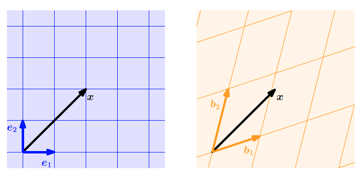
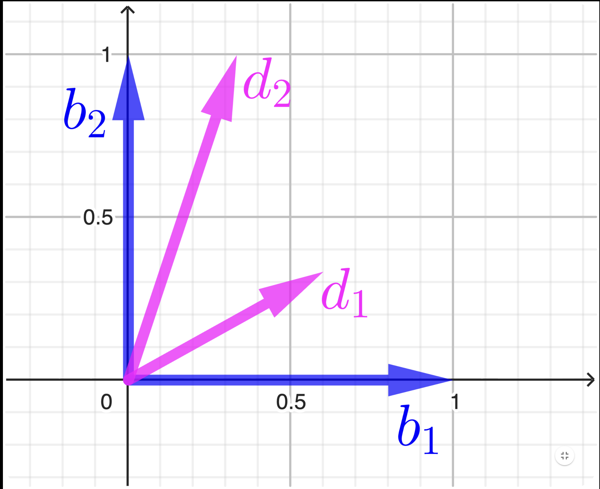
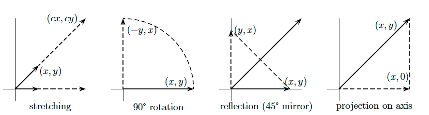

# Linear independence

In the previous sections we defined vectors, vector spaces and subspaces. We saw that we can add vectors and multiply then with scalars. The closure property guarantees that 
we end up with another vector in the same vector space. It is possible to find a set of vectors with which we can represent every vector in the vector
space by adding them together and scaling them. 

Consider now a vector space $\mathbb{V}$ and a finite number of vectors $\mathbf{x}_1, \mathbf{x}_2, \cdots, \mathbf{x}_k \in \mathbb{V}$. Then, every $\mathbf{u} \in \mathbb{V}$ can be written as follows:

$$\mathbf{u}  = \lambda_1 \mathbf{x}_1 + \lambda_2 \mathbf{x}_2 + \cdots + \lambda_{k} \mathbf{x}_k \in \mathbb{V} $$

with $\lambda_1, \lambda_2 ,\cdots, \lambda_{k}$ to be a linear combination of vectors $\mathbf{x}_1, \mathbf{x}_2, \cdots, \mathbf{x}_k$.
 
Definition: Linear independence it is an important feature of vectors and a set of vectors which states the following: Having a set of vector $\{ \mathbf{x}_1, \mathbf{x}_2, \cdots \mathbf{x}_k  \}$ with $\mathbf{x}_i \in \mathbb{R}^{D}$, the vectors are linearly independent if and only if:

$\lambda_1 \cdot \mathbf{x}_1 + \lambda_2 \cdot \mathbf{x}_2 + \cdots + \lambda_k \cdot \mathbf{x}_k = 0$ that is only the case when $\lambda_1 = \lambda_2 = ... = \lambda_k = 0$.

If at least one of the $\lambda_i \neq 0$ then the vectors are linearly dependent.

Linear independence is one of the most important concepts in linear
algebra. Intuitively, a set of linearly independent vectors consists of vectors
that have no redundancy, i.e., if we remove any of those vectors from
the set, we will lose something. Throughout the next sections, we will
formalize this intuition more.

To check any set of vectors $\mathbf{x}_1, \mathbf{x}_2, \cdots, \mathbf{x}_k \in \mathbb{V}$ for independence, put them in the columns of $A$:

$$

\begin{bmatrix}
| & | &        & | \\
| & | &        & | \\
\mathbf{x}_1 & \mathbf{x}_2 & \cdots & \mathbf{x}_k \\
| & | &        & |\\
| & | &        & |
\end{bmatrix}

$$

Then solve the system $\mathbf{A} \cdot \boldsymbol{\lambda} = 0$ the vectors are dependent if there is a solution other than
$\boldsymbol{\lambda} = 0$. So analytically:

$$
\begin{bmatrix}
| & | &        & | \\
| & | &        & | \\
\mathbf{x}_1 & \mathbf{x}_2 & \cdots & \mathbf{x}_k \\
| & | &        & |\\
| & | &        & |
\end{bmatrix}

\begin{bmatrix}
\lambda_1 \newline
\lambda_2 \newline
\vdots \newline
\lambda_{k} 
\end{bmatrix}
=
\begin{bmatrix}
0 \newline
0 \newline
\vdots \newline
0
\end{bmatrix}
$$

## Basis, Rank and span

Now, consider a vector space $\mathbb{V}$ and a set of vectors $A = \{\mathbf{x}_1, \mathbf{x}_2, \cdots , \mathbf{x}_k \} \subseteq \mathbb{V}$. If we can express every 
vector $\mathbf{u} \in \mathbb{V}$ as a linear combination of the vectors $ \{\mathbf{x}_1, \mathbf{x}_2, \cdots , \mathbf{x}_k \}$ then we can say that this set can generate 
the whole space, or alternatively, this set `spans` the vector space $\mathbb{V}$.

Generating sets are sets of vectors that span vector (sub)spaces, i.e., every vector can be represented as a linear combination of the vectors
in the generating set. Now, we will be more specific and characterize the smallest generating set that spans a vector (sub)space.

### Basis

Basis: Consider a vector space $V = (\mathcal{V}, +, \cdot)$ and $\mathcal{A} \subseteq \mathcal{V}$. 
A generating set $\mathcal{A}$ of $V$ is called `minimal` if there exists no smaller set $\mathcal{A}' \subsetneq \mathcal{A} \subseteq \mathcal{V}$ 
that spans $V$. Every linearly independent generating set of $V$ is minimal and is called a \textit{basis} of $V$.

If $\mathcal{B}$ is a basis of vector space $\mathbb{V}$ then $\mathcal{B}$ is the maximal linear independent set of vectors in $\mathbb{V}$, adding any additional 
vector will make this set linear dependent. 

An alternative definition: A `basis` for vector space $\mathbb{V}$ is a sequence of vectors having two properties:

- The vectors are linearly independent.
- They span vector space $\mathbb{V}$.

This combination of properties is absolutely fundamental to linear algebra. It means
that every vector in the space is a combination of the basis vectors, because they span. It also means that the combination is unique.

**Example 2.16**

- In $\mathbb{R}^3$, the *canonical/standard basis* is

$$
\mathcal{B} = \left\{ \begin{bmatrix} 1 \\ 0 \\ 0 \end{bmatrix}, \begin{bmatrix} 0 \\ 1 \\ 0 \end{bmatrix}, \begin{bmatrix} 0 \\ 0 \\ 1 \end{bmatrix} \right\}.
\tag{2.78}
$$

- Different bases in $\mathbb{R}^3$ are

$$
\mathcal{B}_1 = \left\{ \begin{bmatrix} 1 \\ 0 \\ 0 \end{bmatrix}, \begin{bmatrix} 1 \\ 1 \\ 0 \end{bmatrix}, \begin{bmatrix} 1 \\ 1 \\ 1 \end{bmatrix} \right\}, \mathcal{B}_2 = \left\{ \begin{bmatrix} 0.5 \\ 0.8 \\ 0.4 \end{bmatrix}, \begin{bmatrix} 1.8 \\ 0.3 \\ 0.3 \end{bmatrix}, \begin{bmatrix} -2.2 \\ -1.3 \\ 3.5 \end{bmatrix} \right\}.
\tag{2.79}
$$

- The set

$$
\mathcal{A} = \left\{ \begin{bmatrix} 1 \\ 2 \\ 3 \\ 4 \end{bmatrix}, \begin{bmatrix} 2 \\ -1 \\ 0 \\ 2 \end{bmatrix}, \begin{bmatrix} 1 \\ 1 \\ 0 \\ -4 \end{bmatrix} \right\}
\tag{2.80}
$$

is linearly independent, but not a generating set (and no basis) of $\mathbb{R}^4$: For instance, the vector $[1, 0, 0, 0]^\top$ cannot be obtained by a linear combination of elements in $\mathcal{A}$.

A basis effectively defines a coordinate system. We are familiar with the Cartesian coordinate system in two dimensions, which is spanned by the
canonical basis vectors $\mathbf{e}_1 = \begin{bmatrix} 1 \\ 0 \end{bmatrix}^T$ and $\mathbf{e}_2 = \begin{bmatrix} 0 \\ 1 \end{bmatrix} ^T$. In this coordinate system, a specific 
vector $\mathbf{x} \in \mathbb{R}^2$ just tell us how we can linearly combine the two basis vectors to obtain $\mathbf{x}$. However, any basis in $\mathbb{R}^2$ defines a valid coordinate system. Thus, the vector $\mathbf{x}$ will be represented with different coordinates in another basis ($\mathbf{b}_1, \mathbf{b}_2$). An example of this can be seen in the following figure:

  

Here we can see vector $\mathbf{x}$ in two different bases $\mathbf{e}_1 = \begin{bmatrix} 1 \\ 0 \end{bmatrix}^T$ and $\mathbf{e}_2 = \begin{bmatrix} 0 \\ 1 \end{bmatrix} ^T$ where $\mathbf{x} =  \begin{bmatrix} 2 \\ 2 \end{bmatrix}^T$ while it is $\mathbf{x} =  \begin{bmatrix} 1.09 \\ 0.72 \end{bmatrix}^T$ in the basis $(\mathbf{b}_1, \mathbf{x}_2)$.

We can think of a basis as a language we use to explicitly write vectors and operators as matrices. However, the way an arbitrary operator $\boldsymbol{A}$ transforms a vector $\boldsymbol{x}$  shouldn’t depend on the basis we use. Therefore, we must adjust the entries of the matrix depending on which basis we use, because as described before, rows of the matrix correspond to the vectors to which the basis vectors transform to. So let’s try to motivate intuitively how we can transform a matrix $\boldsymbol{A}$ that is written in the canonical basis.

If we think of the following example:

  

We have the canonical basis $\mathbf{e}_1 = \begin{bmatrix} 1 \\ 0 \end{bmatrix}^T$ and $\mathbf{e}_2 = \begin{bmatrix} 0 \\ 1 \end{bmatrix} ^T$  and the new basis $\mathbf{d}_1 = \begin{bmatrix} 3/5 \\ 1/3 \end{bmatrix}^T$ and $\mathbf{d}_2 = \begin{bmatrix} 1/3 \\ 1 \end{bmatrix} ^T$. If $\boldsymbol{A}$ is the transformation matrix in the canonical basis to find the equivalent transformation for the new basis then we can compute as follows:

$$
\boldsymbol{A}' = \boldsymbol{S}^{1}\boldsymbol{A}\boldsymbol{S}
$$

Where of course $\boldsymbol{A}$ is the transformation matrix that maps the initial basis to the new one, thus:

$$
S = \begin{bmatrix}
\frac{3}{5} & \frac{1}{3} \\
\frac{1}{3} & 1
\end{bmatrix}
$$

and we compute then:

$$
S^{-1} = \begin{bmatrix}
\frac{45}{22} & -\frac{15}{22} \\
-\frac{15}{22} & \frac{27}{22}
\end{bmatrix}
$$

### Matrix transformation 

### Basis change

### Rank

In linear algebra, the rank of a matrix is the number of linearly independent rows or columns in the matrix. 
In other words, it is the maximum number of rows or columns that can be linearly combined to create a non-zero row or column in the matrix. 
This makes sense, as these two definitions are similar up to an action of the matrix transpose, and if the rank is to measure the number of essential components, 
›then transposing a matrix shouldn’t change that.

As an example, let's find the rank of the following simple $3 \times 3$ matrix $\mathbf{A}$:

$$\mathbf{A} = \begin{pmatrix} 1 & 0 & 2 \\ 0 & 1 & 1 \\ 2 & 0 & 4 \end{pmatrix}$$

Now, let's denote the $i$-th column vector of the matrix $\mathbf{A}$ as $\mathbf{a}_i$. We can show that the third column vector $\mathbf{a}_3$ can be represented as a linear combination of the first two column vectors:

$$\mathbf{a}_3 = 2\mathbf{a}_1 + \mathbf{a}_2 = \begin{pmatrix} 2 \\ 1 \\ 4 \end{pmatrix}$$

From this we can see that one of the column vectors is not linearly independent, so the rank of the matrix $\mathbf{A}$ is equal to $2$ as we have two linearly independent vectors.

Linear independence revised with rank: To check any set of vectors $\mathbf{x}_1, \ldots, \mathbf{x}_n$ for independence, put them in the columns of $\boldsymbol{A}$. Then solve the system $A\boldsymbol{\lambda} = \boldsymbol{0}$; the vectors are dependent if there is a solution other than $\boldsymbol{\lambda} = \boldsymbol{0}$. With no free variables (rank $n$), there is no nullspace except $\boldsymbol{\lambda} = \boldsymbol{0}$; the vectors are independent. If the rank is less than $n$, at least one free variable can be nonzero and the columns are dependent.

## Linear Mappings or Linear Transformation

Support a vector $\mathbf{x}  = \{x_1, x_2, \cdots, x_D \} \in \mathbb{R}^D$. Then, if a matrix $\boldsymbol{A} \in \mathbb{R}^{D \times D}$ matrix. When matrix $\mathbf{A}$ 
multiplies $\mathbf{x}$ it transforms this vector into a new one $\mathbf{A \cdot x}$. This matrix transforms every possible vector $\mathbf{x}$ into new space. We can say the whole space is transformed, or `mapped into itself` by the matrix $\boldsymbol{A}$. Four really common transformations are the following:

- A multiple of identity matrix $\boldsymbol{A} = c \cdot \mathbf{I}$ `stretches` every vector by the same factor $c$. The whole space expands or contracts (or
somehow goes through the origin and out the opposite side, when $c$ is negative). 

$$
A = \begin{bmatrix} c & 0 \\ 0 & c \end{bmatrix}
$$

- A rotation matrix turns the whole space around the origin. This example turns all vectors through $90 \angle $, transforming every point $(x, y)$ to $(-y, x)$:

$$
A = \begin{bmatrix} 0 & -1 \\ 1 & 0 \end{bmatrix}
$$

- A reflection matrix transforms every vector into its image on the opposite side of a mirror. In this example the mirror is the $45 \angle $ line $y = x$

$$

A = \begin{bmatrix} 0 & 1 \\ 1 & 0 \end{bmatrix}

$$

- A projection matrix takes the whole space onto a lower dimensional subspace (not invertible). The example transforms
each vector $(x, y)$ in the plane to the nearest point $(x, 0)$ on the horizontal axis. That axis is the column space of A. The y-axis that projects to $(0, 0)$ is the nullspace.

  

### Linear transformations

### Change of basis

[back](./)