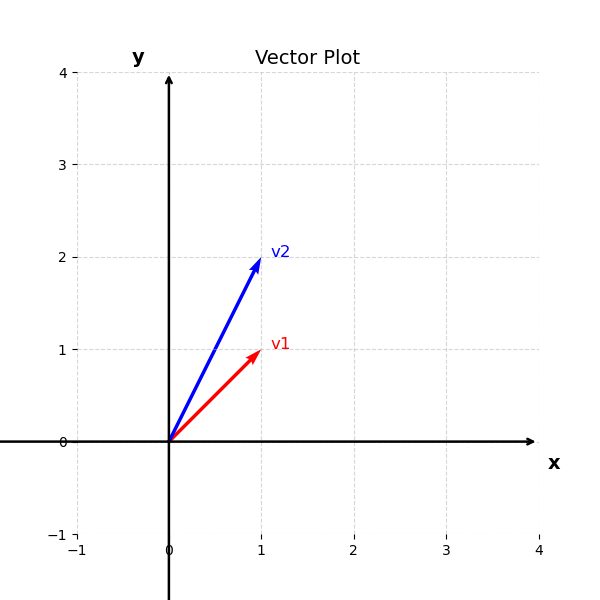
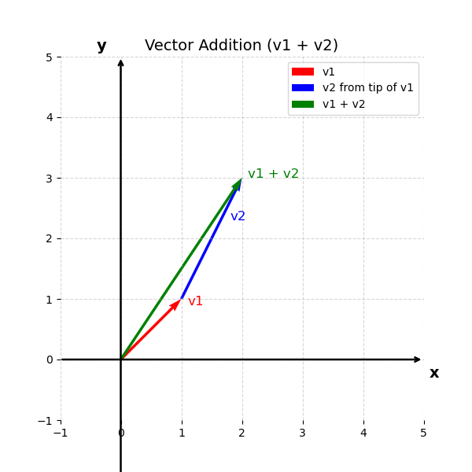
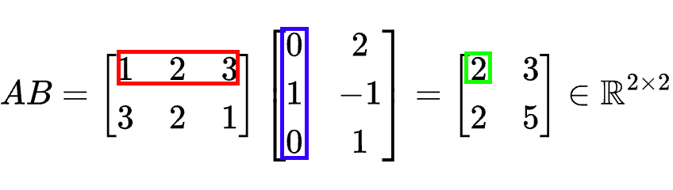
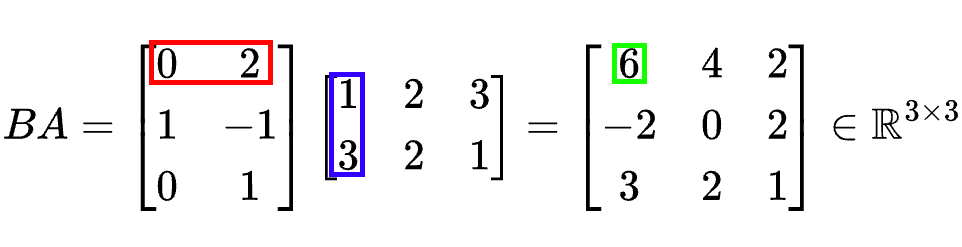
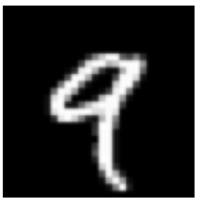

## Introduction to Machine Learning

> Machine learning domain concerns the designing of algorithms that automatically extracts interesting information from knowledge sources that we call data. 

Machine learning is data-driven and the data is at core of machine learning. The goals is to design general purposes methodologies with which we can extract interesting patterns and that are not dependent in expertise domain. For instance having a huge corpus of textual data from Wikipedia we can extract information about these wikipedia sites such as the topic of each page but also event analysis or sentiment analysis in reviews from webpages such as IMDB.

Object recognition, music recommendation, text generation, voice detection, image generation, stock market prediction etc. Some of the ML techniques require some expertise when collecting the data and some annotation of the data. For example when we collect object as images we can annotate the content of the images with what it can be found within these images, or we can have information about the houses and annotate them with the prices of the houses. There are some cases, that is not possible, or it is not necessary to annotate these data like when we mine text from the web. 

## Data and the concept of a dataset

However, so far, we have discuss about data and datasets that are crucial on ML but we haven't gave any definition on what we mean when we talk about data and datasets.
There are actually multiple definitions for the word `data`. We will try to make sense for this word by providing several definitions for this word:

> Data refers to recorded observations or measurable pieces of information, often collected from experiments, transactions, sensors, texts, or user behavior, that are used to represent phenomena, derive insights, or inform decision-making through analysis.

> Data are values or observations, usually structured, often numeric, that represent attributes of entities and are used to answer questions.

> Data are representations of variables measured from the real world, which can be used to model and infer patterns or causality.

So central to the concept of data is the representation of information about the real world through numerical or not ways about an under study domain that can be found or produced extracted or post processed. That involves information that we exchange as human beings or measurements that stems from scientific experiments and eventually are structured and presented in a formatted and formal way.

When we talk about a dataset usually we refer to structure data that are referring to a specific under-study problem by computer. These datasets contains multiple observations about our problems and they have been annotated (or not) and curated by experts in the field of study.

## Types of Data 

Data exists in different flavours. First and foremost could be numerical data: imagine for example the measurements of scientific tools. Scientific instruments used to quantify physical properties. These tools range from simple rulers and graduated cylinders to more advanced devices like micrometers, pH meters, and data loggers. Could be text information that can be found for instance in social media in forums forums etc. Could be digitalized images and audio signals.

## Data as vectors and matrices

While as we just mentioned not all data are inherently numerical, for the computer perspective, it is always necessary to transform these data into a numerical representation. Thus, when we talk about digital images we talk about pixel numerical representation. Regarding textual data, each character letter, digit, symbol is assigned a number via an encoding standard, such as ASCII or Unicode pls check this site for further information. Another example concerns auditory data which when we digitalize it, we actually captured the the amplitude of sound waves over time.

For comprehensive purposes of the humans and computers, when we collect, store and share these data we need to make use of placeholders, entities that can store information and can be easy to represent and manipulate them from computer and mathematical perspective. Hence, we can introduce in our terminology the concept of a `vector` as the main placeholder of `data`. Dataset as we mentioned before are usually composed with a set of multiple observations, for instance when we do have a set of images we can say that each image each a different `observation` or a different `instance`. Each `instance` could be eventually be represented by a corresponding `vector`. As we said the dataset is a collection of observations and thus a collection of `vectors`. We can introduce also the concept of a matrix as a set of multiple `vectors` grouped together.

## Intro to Linear Algebra

### Vectors

The vectors many of us know from school are called `geometric vectors`, which are usually denoted by a small arrow above the letter, e.g. $\vec{v_1}$ and $\vec{v_2}$. In this tutorial, we will simply denote the vectors as $\mathbf{v}_1$, $\mathbf{v}_2$ as a collection of numerical values. For example we can have that $\mathbf{v}_1 = [1, 1]$ and $\mathbf{v}_2 = [1, 2]$. That are example of two dimensional vectors that lies on the cartesian space $\{x, y\}$. Each dimension of this vector it is called a `feature` and can represent a characteristic value for the observation. For example, these two value of the vector $\mathbf{v}_1$ could be the values of an image that contains just two pixels.

You may recall from high-school that these vectors can be visualized in the cartesian 2-dimensional space as:

  

Once we represent our observations in vectors and visualize them in the cartesian space we can actually perform some basic mathematical computations. One simple and straightforward example is to add these two vectors. That can be represented as $\mathbf{v}_1 + \mathbf{v}_2 = [2, 3]$ That is represented by the following image:

  

Another simply example is the multiplication of a vector with the scalar. For instance $\mathbf{v}_3 = 2 \cdot \mathbf{v}_1 = [2, 2]$

  

### Inner product

A really important computation in Linear algebra is called `inner product`. If we stick with the above-mentioned vectors we can calculate the following entity $\mathbf{v}_4 =\mathbf{v}_1 \cdot \mathbf{v}_2  = 1 \cdot 1 + 1 \cdot 2 = 3$. Eventually, we end up calculating a scalar value which represents the similarity of these two vectors. It shows actually if these two vectors point to the same direction they are perpendicular or point to opposite direction. Thus, the inner product:

- Is positive if the angle between vectors is less than 90°,
- Zero if the vectors are orthogonal (perpendicular),
- Negative if the angle is greater than 90°.

Another thing to keep in mind is that this product relates also with the angle between the two vectors. It ends up being as follows:

$$\mathbf{v}_1 \cdot \mathbf{v}_2 =  \lVert \mathbf{v}_1  \lVert  \lVert  \mathbf{v}_2 \lVert   \cdot cos(\theta)$$.

The norm of a vector $\lVert \mathbf{v}_1 \lVert = \sqrt{1^2 + 1^2 } = \sqrt{2} $, $\lVert \mathbf{v}_2 \lVert = \sqrt{1^2 + 2^2 } = \sqrt{5} $  represents the length of the vector.

We can also re-write as:

$$\lVert \mathbf{v}_1^{2} \lVert = 1^2 + 1^2 $$

and the angle between the two vectors as:

$$cos(\theta) = \frac{\mathbf{v}_1 \cdot \mathbf{v}_2}{\lVert \mathbf{v}_1 \lVert  \lVert \mathbf{v}_2 \lVert }$$

### Matrices

Now if we would like to create a placeholder in order to store multiple vectors together, we can construct a `matrix`. A matrix could encapsulate the given set of observation into a rectangular entity that looks like an extended version of a vector. For instance given the observation $\mathbf{v}_1, \mathbf{v}_2$ we can group them together into a `dataset` or a `matrix` as follows:

$$D = \begin{bmatrix}
1 & 1 \newline
1 & 2
\end{bmatrix}$$

And that can of course can be generalized with multiple vectors of n-th dimensions as follows:

$$A = \begin{bmatrix}
a_{11} & a_{12} & \cdots & a_{1n} \newline
a_{21} & a_{22} & \cdots & a_{2n} \newline
\vdots & \vdots & \ddots & \vdots \newline
a_{m1} & a_{m2} & \cdots & a_{mn}
\end{bmatrix}$$

with $a_{ij}\in \mathbb{R}$, where $\mathbb{R}$ is the set with all the real-values. We then can denote that a vector $\mathbf{v}_1 \in \mathbb{R}^2$ and the matrix $\mathbf{A} \in \mathbb{R}^{m \times n}$, where $\mathbb{R}^{m \times n}$ is the set of all real-valued $m \times n$ matrices.

#### Matrix addition

In the same spirit with the addition of a vector, we can define also the addition of two (or more) matrices. For example if we have a matrix $\mathbf{B}$ as:

$$B = \begin{bmatrix}
b_{11} & b_{12} & \cdots & b_{1n} \newline
b_{21} & b_{22} & \cdots & b_{2n} \newline
\vdots & \vdots & \ddots & \vdots \newline
b_{m1} & b_{m2} & \cdots & b_{mn}
\end{bmatrix}$$

Then, $\mathbf{C} = \mathbf{B} + \mathbf{A}$ can be defined as follows:

$$C = \begin{bmatrix}
a_{11} + b_{11} & a_{12} + b_{12} & \cdots & a_{1n} + b_{1n} \newline
a_{21} + b_{21} & a_{22} + b_{22} & \cdots & a_{2n} + b_{2n} \newline
\vdots & \vdots & \ddots & \vdots \newline
a_{m1} + b_{m1} & a_{m2} + b_{m2} & \cdots & a_{mn} + b_{mn}
\end{bmatrix}$$

It\s important to note that in order to be able to add two matrices they need to have the same size otherwise it is not possible to perform the matrix addition.

#### Matrix multiplication

Another important operation in matrixes is the matrix multiplication. For matrices $\mathbf{A} \in \mathbb{R}^{m \times n} $, $\mathbf{B} \in \mathbb{R}^{n \times k} $, the multiplication operation can be denoted as $\mathbf{D} = \mathbf{A} \cdot \mathbf{B}$, with to be:

$$ \mathbf{D} = \begin{bmatrix}
d_{11} & d_{12} & \cdots & d_{1k} \newline
d_{21} & d_{22} & \cdots & d_{2k} \newline
\vdots & \vdots & \ddots & \vdots \newline
d_{m1} & d_{m2} & \cdots & d_{mk}
\end{bmatrix}$$

the elements $ d_{ij} $ of the product 

$$\mathbf{D} = \mathbf{A}\cdot \mathbf{B} \in \mathbb{R}^{m \times k} $$

are computed as: 

$$d_{ij} = \sum_{l=1}^{n} a_{il} b_{lj}, \quad i = 1, \ldots, m, \quad j = 1, \ldots, k$$

Hence, in the case of matrix multiplication it is important to note that the number of columns of the first matrix should be the same for the number of rows of the second matrix in order the multiplication to be a valid operation.

That means that in order to calculate $d_ij$ element we need to multiple the elements of the i-th row of $\mathbf{A}$ with the j-th column of $\mathbf{B}$ and sum them up, so to calculate the inner product of these two. Of course, a row in matrix can be considered as a vector and thus, we can just use the inner product that we can discuss earlier.

The matrices can only be multiplied if their `neighboring` dimensions match. For instance, an $n \times k$-matrix $\mathbf{A}$can be multiplied with a $k \times m$-matrix $\mathbf{B}$, but only from the left side:

$$\underbrace{A}_{n \times k} \cdot \underbrace{B}_{k \times m} =  \underbrace{D}_{n \times m}$$

The product $BA$ is not defined if $m \ne n$ since the neighboring dimensions do not match.

#### Example of matrix multiplications

An example to help you grasp the detail inner working of the matrix multiplication is placed below. By having two matrices $\mathbf{A}$ and $\mathbf{B}$:

$$A = \begin{bmatrix} 1 & 2 & 3 \newline 3 & 2 & 1 \end{bmatrix} \in \mathbb{R}^{2 \times 3}$$

$$B = \begin{bmatrix} 0 & 2 \newline 1 & -1 \newline 0 & 1 \end{bmatrix} \in \mathbb{R}^{3 \times 2}$$

we can obtain the results of multiplying $\mathbf{A}$ with $\mathbf{B}$

  

<!-- $$\begin{align}
AB &= \begin{bmatrix} 1 & 2 & 3 \newline 3 & 2 & 1 \end{bmatrix} \begin{bmatrix} 0 & 2 \newline 1 & -1 \newline 0 & 1 \end{bmatrix} = \begin{bmatrix} 2 & 3 \newline 2 & 5 \end{bmatrix} \in \mathbb{R}^{2 \times 2}
\end{align}$$ -->

and the results multiplying $\mathbf{B}$ and $\mathbf{A}$:

  

<!-- $$\begin{align}
BA &= \begin{bmatrix} 0 & 2 \newline 1 & -1 \newline 0 & 1 \end{bmatrix} \begin{bmatrix} 1 & 2 & 3 \newline 3 & 2 & 1 \end{bmatrix} = \begin{bmatrix} 6 & 4 & 2 \newline -2 & 0 & 2 \newline 3 & 2 & 1 \end{bmatrix} \in \mathbb{R}^{3 \times 3}
\end{align}$$ -->

From this example, we can already see that matrix multiplication is not commutative, i.e., $AB \neq BA$; 

#### Matrix properties

- Associativity
- Distributivity
- Multiplication with the identity matrix
- Inverse and Transpose

#### Vector transformation

### Linear models in Machine learning

But ok why do we event mentioned all these computations of vectors and matrices. We are just interested in data and making machines learning patterns out of these data.

Using these type of placeholders for our data ends-up being the easiest way to process data and perform calculation in computers.

Having for instance a set of images for example [MNIST dataset: ](https://en.wikipedia.org/wiki/MNIST_database) that contains 70.000 gray scale images of handwritten digits (with pixel size $28 \times 28$) and name after the digit they represent. So there is a way to know what each image represent. That type of `naming` entity is called `label` or `annotation`. That being said we can represent this label using an integer variable that takes the following values $t = \{0, 1, 2, ..., 9\}$.

Each input image can be represented as a vector after placing each row next to each other. Eventually, instead of 28 rows with 28 columns we can end up having 1 row with 784 columns. We can actually use as placeholder a vector $\mathbf{x} \in \mathbb{R}^{784}$. We can store all the vector-images in one big matrix:

$$ \mathbf{D} = \begin{bmatrix}
\text{---} & \mathbf{x}_1  & \text{---} \newline
\text{---}&  \mathbf{x}_2 & \text{---} \newline
\vdots & \vdots  & \vdots \newline
\text{---} &  \mathbf{x}_n  & \text{---}
\end{bmatrix}$$

Where each row is represented by a vector $\mathbf{x}$. The task is extract useful information and patterns from these data. For example in classification, we would like to build a ML model to predict the digits in images that contains handwritten text. We can also place each label that corresponds to each image in a vector $\mathbf{t} \in {\(0, 1, 2, ..., 9\)}^{60000}$.

A standard method to approach this is by performing simple operations by introducing some parameters $\mathbf{w}$ which are variables that needs to be tuned in such a way that each time that we will have an observation $\mathbf{x}^{\prime}$ if we multiply (`inner product`) these parameters $\mathbf{w}$ the output should be a numerical value that will represent the digit that the input observation contains.

$$y = \mathbf{w} \cdot  \mathbf{x}^{\prime}$$

of a bit more elaborate (using some linear or non-linear function $f$) 

$$y =  f(\mathbf{w} \cdot  \mathbf{x}^{\prime})$$

Thus, if the input image looks as follows:

  

The output $y \approx 9$ or some value that codifies this specific digit.

It is important of course to figure out a good way to tune the parameters $\mathbf{w}$ in such a way that the above tasks is feasible. The process of tuning these parameters is called in machine learning `training` or `learning` process. 

A gentle introduction on this process is as follows: Firstly, we want to perform a simple operation between the data in the dataset and the introduced parameters $\mathbf{w}$. For example we can consider the following:

$$\mathbf{y} = \mathbf{D} \cdot \mathbf{w}$$ 

or 

$$\mathbf{y} = f(\mathbf{D} \cdot \mathbf{w})$$

now a very good question is the following: `how can we set meaningful values to parameters` $\mathbf{w}$?. 

We can start by setting these values randomly. Then we can calculate the output vector $\mathbf{y}$. This vector represents now the predictions of the model during the `training process`. However, given that we initialize the parameters $\mathbf{w}$ randomly there is not any quarantee that the values $\mathbf{y}$ could represent the MNIST digits. However, we already have some information about what this vector should be and this is the annotations that are stored and place in vector $\mathbf{t}$.

We should thus find a way to measure the distance between the predictions $\mathbf{y}$ and the annotations $\mathbf{t}$ and then update the values of $\mathbf{w}$ in a way that this distance between the two vectors is minimized.

We then need to find a way to measure the distance between predictions and labels and then a way to update the weights $\mathbf{w}$ in order to minimize this distance. 

And hooray, we have just given a simple explanation of how classification ans supervised learning works in Machine Learning. 

Of course, we do have other problems that are more elaborate and different in nature and this will be the task of the course to give you a some sneak peak on how these problems are tackled.

[back](./)
