## Machine Learning definition

We will start this tutorial by introducing the concept of Machine Learning (ML). A popular definition regarding ML could be the following:

> Machine learning (ML) domain concerns the designing of algorithms that automatically extracts interesting information from knowledge sources that we call data. 

Machine learning (ML) is data-driven and the `data` is at the core of machine learning. The goal is to design `general purpose machine algorithms`, with which we can automatically extract `interesting patterns` from the data, that are not necessarily dependent in expertise domain. 

This way we can automate many tasks.
1) Having a huge corpus of textual data from Wikipedia, we can automatically extract information about these Wikipedia sites, such as the topic of each page.
2) We can also perform event analysis or sentiment analysis on reviews from webpages such as the IMDB or Google reviews. 

Example: Let's say that we have the following review from the IMDB:

> "Horrible script with mediocre acting. This was so bad I could not finish it. The actresses are so bad at acting it feels like a bad comedy from minute one. The high rated reviews is obviously from friend/family and is pure BS."

A useful application for a review database is to classify reviews as positive or negative. In this case, we can create a ML algorithm that automatically recognizes that this is a review has a `negative` sentiment. We call this type of ML application: `sentiment analysis` or `sentiment recognition`.

Other examples of tasks that concern ML are `object recognition`, `recommendation systems`, `text generation`, `voice detection`, `image generation`, `stock market prediction` etc. Some of the ML techniques require some expertise when collecting the data, and some annotation of the data. For example when we collect objects as images we can annotate images with what can be found within these images (we can collect images that contain flowers and annotate them with the name of each flower). In some cases, it is not possible or not necessary to annotate these data, like when we mine text from the web. 

The ML systems are based on three key ingredients which are the following: `data`, `the task` and finally the `the model`. 

> We could say that in ML we use a `model` to extract interesting patterns from our `data` to perform a specific `task`.

In the following section, we will mainly analyze the first concept of ML, that is the `data`. After, we present mathematical concepts we can use to calculate interesting properties of the data, like similarity. Lastly, we show an application in a model for a classification task.

## From data to datasets, vectors and matrices

So far, we talked about `data`, a crucial concept in ML, but we haven't given any definition of what we mean when we talk about `data`, and by extension `datasets`. There are actually multiple definitions for this word `data`. We will try to make sense of this word by providing several definitions:

> Data refers to recorded observations or measurable pieces of information, often collected from experiments, transactions, sensors, texts, or user behavior, that are used to represent phenomena, derive insights, or inform decision-making through analysis.

> Data are values or observations, usually structured, often numeric, that represent attributes of entities and are used to answer questions.

> Data are representations of variables measured from the real world, which can be used to model and infer patterns or causality.

Central to the concept of `data` is the numerical representation of information about real world phenomena, in a domain `under study`. That could be information that we exchange as human beings, or measurements from scientific experiments. In both cases, the data are structured and presented in a formatted and formal way. The sources of information about the studied phenomena are called `observations` or `instances`. 

For example, the phenomenon we would like to study is the market value of houses in Amsterdam. We could gather information about a number of different houses, which are our `observations` or `instances`. The observations can be composed of several pieces of information like: 

- `Neighborhood`, 
- `Size`, 
- `Number of rooms`, 
- `Condition`
- `Year of construction`,
- `Has a balcony`, 
- `Distance from the nearest tram stop`, 
- `Has a jacuzzi`
- `Condition of the interior`, `furniture` etc. 

These pieces of information in the nomenclature of ML are called `features`.

Finally, when we talk about a `dataset`, usually we refer to structured data that is a collection of `observations`. Usually, these datasets contains multiple observations which sometimes are accompanied by annotations that are curated by experts in the domain of study. For example, we can collect first scans of several patients (collection of observations) and then an expert can annotate whether the scans contain a specific disease or not.

### Types of Data 

Data exists in different flavours. First and foremost could be `numerical data`: imagine for example the measurements of scientific instruments used to quantify physical properties. These tools range from simple rulers and graduated cylinders to more advanced devices like micrometers, pH meters, and data loggers. Other examples are `textual data` (for instance in social media forums), `digitalized images`, `audio signals`, and `boolean values` (`True` or `False`). We can actually group the data into the following categories:

- Structure data (tabular data, spreadsheet).
- Unstructured data (text, images).
- Semi-Structured Data (json files).
- Time series data (audio, stock market values).
- Categorical Data (gender, race, etcetera).
- Numerical Data

### Example of a dataset

We present a data set in Table 1.1, where each `observation` is a person, and the `features` are characteristics of people: `name`, `gender`, `degree`, `postcode`, `age`, `salary`. Note this table extracted by a popular dataset that studies `gender biases`. We could use this dataset to create a ML algorithm to estimate salaries for new observations. The dataset must be prepared before we can do this. There is not one right way to prepare a dataset.

$$\begin{aligned}
& \text {Table 1.1. A collected dataset of people and their salaries.}\\
&\begin{array}{cccc}
\hline \hline \text { Name } & \text { Gender} & \text { Degree} & \text { postcode } & \text { age } & \text { salary } \\
\hline David & M & PhD & 1011MK & 41 & 9900$ \\
James & M & BsC & 1223LK & 19 & 1780$ \\
Dale & M & PhD & 2122JJ & 27 & 7560$ \\
Laura & F & MSc & 1212NK &  19 & 1460$\\
Donna & F & MSc & 1112AA & 20 & 1400$\\
\hline
\end{array}
\end{aligned}$$

Even when we have data in tabular format, there are still choices to be
made to obtain a numerical representation. For example, in Table 1.1, the
gender column (a categorical variable) may be converted into numbers 0
representing `Male` and 1 representing `Female`. Alternatively, the gender
could be represented by numbers `−1`, `+1`, respectively (as shown in
Table 1.2). It is often important to use `domain knowledge`
when constructing the representation, such as knowing that university
degrees progress from `bachelor’s` to `master’s` to `PhD`, or realizing that the
postcode provided is not just a string of characters but actually encodes
an area in London.

$$\begin{aligned}
& \text {Table 1.2. Transformed data into numerical representation }\\
&\begin{array}{cccc}
\hline \hline \text { Name } & \text { Gender} & \text { Degree} & \text { Latitude } & \text { age } & \text { salary } \\
\hline 1 & 1 & 3 & 51.507 & 41 & 9.9k \\
2 & 1 & 1 & 51.5074 & 19 & 1.7k \\
3 & 1 & 3 & 51.607 & 27 & 7.5k$ \\
4 & 2 & 2 & 51.207 &  19 & 1.6k\\
5 & 2 & 1 & 51.407 & 20 & 1.6k\\
\hline
\end{array}
\end{aligned}$$

### Representing data as vectors and matrices

We just saw that not all data are inherently numerical, and from the computer perspective, it is always necessary to transform these data into a numerical representation during data preparation. Thus, when we talk about digital images we talk about pixel numerical representation. Regarding textual data, each character letter, digit, symbol is assigned a number via an encoding standard, such as `ASCII` or `Unicode` (pls check this site for further information). Another example concerns auditory data which when we digitalize it, we actually captured the the amplitude of sound waves over time.

For comprehensive purposes between humans and computers, when we collect, store and share these data, we need to make use of `placeholders`: entities that can store information and can be easy to represent and manipulate from mathematical perspective. 

Hence, we can introduce in our terminology the concept of a `vector` as the main placeholder of `data`.  `Vectors` are used to store information about `observations` in our data. In the previous example, each row of the table (each different person) is considered an `observation` and is represented by `vectors`.

We also introduce the concept of a `matrix`: a set of multiple `vectors` grouped together, as a `placeholder` of a `dataset`. A dataset, as we mentioned before, is usually composed of multiple observations. For example, when we have a set of images we can say that each image is a different `observation` or a different `instance`, represented by a corresponding `vector`. It is useful to be able to study a collection of observations and thus a collection of `vectors`, which is why we use `matrices`.

In practice, a vector (a single observation or instance) can be represented as $\mathbf{x}$. So so we can have 2 vectors $$\mathbf{x}_1 and $$\mathbf{x}_2:

$$\mathbf{x}_1 = \{1, 1, 3, 41.507, 41, 9.9 \}$$ 

and  

$$\mathbf{x}_2 = \{2, 1, 1, 51.5074, 19, 1.7 \}$$ 

These observations are part of a whole dataset, represented by the following `matrix`:

$$
\mathbf{X} = \begin{pmatrix}
1 & 1 & 3 & 51.507 & 41 & 9.9 \\
2 & 1 & 1 & 51.5074 & 19 & 1.7 \\
3 & 1 & 3 & 51.607 & 27 & 7.5 \\
4 & 2 & 2 & 51.207 & 19 & 1.6 \\
5 & 2 & 1 & 51.407 & 20 & 1.6 \\
\end{pmatrix}$$

## Intro to Linear Algebra

Vectors could be regarded as `placeholders` from the `computer science` perspective, but at the same time they can be perceived as objects in the geometric space. Therefore, they could be manipulated by Linear Algebra or geometric tools (that you may have already encountered in high-school mathematics courses). 
 
### Geometric Vectors
As objects in geometric space, `vectors` have length, direction, and they live in a multi-dimensional space. We can also call them `geometric vectors`. These `geometric vectors` are usually denoted by a small arrow above the letter, e.g. $\vec{v_1}$ and $\vec{v_2}$. In this tutorial, we will simply denote the vectors as $\mathbf{v}_1$, $\mathbf{v}_2$ as a collection of numerical values. 

For example, we can have that:

$$\mathbf{v}_1 = [1, 1]$$

and 
 
$$\mathbf{v}_2 = [1, 2]$$
 
These are examples of two dimensional vectors, objects in a 2-demensional space called the `Cartesian space`, with coordinates $\{x, y\}$. We denote that vector $\mathbf{v} = [x, y] \in \mathbb{R}x\mathbb{R} = \mathbb{R}^{2}$, where $\mathbb{R}$ is the set of all real values.

In the context of ML, each dimension (or `coordinate`) of this vector can be a `feature` representing a characteristic value of our observation. For example, these two values of the vector $\mathbf{v}_1$ (its coordinates) could be the values of an image that contains just two pixels, or the score of students in two different classes. Ιn general they represent observations with two features.

These vectors can be visualized in the cartesian 2-dimensional space as:

  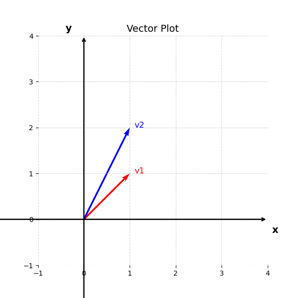

#### Vector addition
Once we represent our observations as vectors and visualize them in the `Cartesian space`, we can actually perform some basic mathematical computations. One simple and straightforward example is to add these two vectors: 

$$\mathbf{v}_1 + \mathbf{v}_2 = [2, 3]$$ 

That is represented by the following image:

  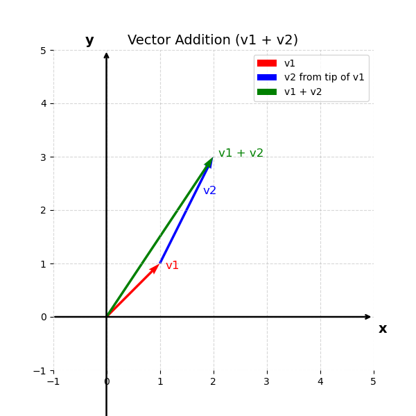

As you might recall, the addition of the vectors in two-dimensions works as follows: you can start with the first vector which points to the position $\mathbf{v}_1 = [1, 1]$. Then you add 1 in the `x-coordinate` and 2 in the `y-coordinate`. The result of this addition is another vector that points to $\mathbf{v}_1 + \mathbf{v}_2 = [2, 3]$. This operation is called a `tip and tail` addition. The tail here refers to the starting point of the vector, while the tip (or head) is the ending point, typically indicated by an arrowhead

#### Scalar multiplication 
Another simple example is the multiplication of a vector with a scalar. For instance. scaling vector $\mathbf{v}_1$ by 2 requires multiplying each coordinate by 2. The resulting vector is:

$$\mathbf{v}_3 = 2 \cdot \mathbf{v}_1 = [2, 2]$$

  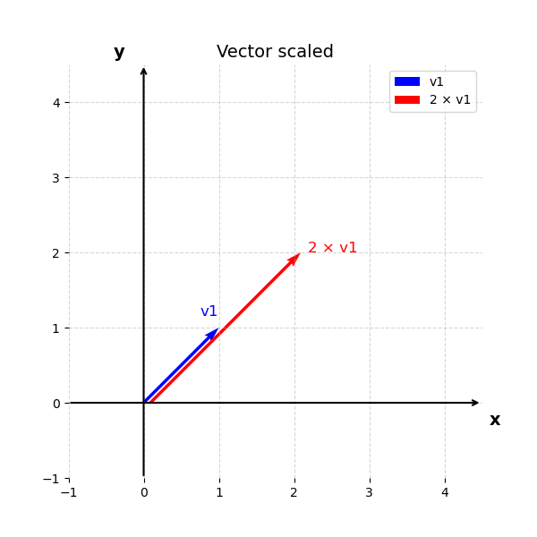

#### Vector subtraction

What if we would like to subtract two vectors. In this case, we can simple perform vector addition, however, instead of adding the two vectors directly, we will need to add the negative of a vector, an operation that looks as follows: 

$$\mathbf{v}_4 = \mathbf{v}_1 - \mathbf{v}_2 = \mathbf{v}_1 + (-\mathbf{v}_2)$$

So in our example $\mathbf{v}_4 = [0, -1]$

One remark here that is good to remember is that the vectors in our example live in the two-dimensional space, and thus, it is easy to visualize. However, they could easily live in a higher dimensionality, which is also more practical, since the most interesting problems live in a high-dimension. Unfortunately, we cannot visualize these vectors. Thus, in this tutorial, we usually employ two-dimensional vectors as example.

#### Inner product

A really important concept in Linear algebra is called `inner product`: coordinate-wise multiplication. If we stick with the above-mentioned vectors we can calculate the following entity $\mathbf{v}_5 =\mathbf{v}_1 \cdot \mathbf{v}_2  = 1 \cdot 1 + 1 \cdot 2 = 3$. 

The result of an inner product of two vectors represents the `similarity` of these two vectors. It shows actually if these two vectors point to the same direction, if they are perpendicular, or point to opposite directions. Thus, the `inner product` is:

- Positive, if the angle between vectors is less than $90^\circ$,
- Zero, if the vectors are orthogonal (perpendicular),
- Negative, if the angle is greater than $90^\circ$.

This product also relates to the angle between the two vectors as follows:

$$\mathbf{v}_1 \cdot \mathbf{v}_2 = \lVert \mathbf{v}_1  \lVert  \lVert  \mathbf{v}_2 \lVert   \cdot cos(\theta)$$

 $\lVert \cdot \lVert$ is called the norm of a vector, which represents the length of the vector. It is calculated as follows: 

$$\lVert \mathbf{v}_1 \lVert = \sqrt{1^2 + 1^2 } = \sqrt{2} \text{, }\lVert \mathbf{v}_2 \lVert = \sqrt{1^2 + 2^2 } = \sqrt{5} $$  

Here you should think of the Pythagorean theorem and how to compute the hypotenuse of a triangle with sides the length of the x and y coordinates.

 We can also re-write as:

$$\lVert \mathbf{v}_1^{2} \lVert = 1^2 + 1^2 $$

and the angle between the two vectors as:

$$cos(\theta) = \frac{\mathbf{v}_1 \cdot \mathbf{v}_2}{\lVert \mathbf{v}_1 \lVert  \lVert \mathbf{v}_2 \lVert }$$

### Geometric matrices

As introduced, we can construct a `matrix` as a placeholder to store multiple vectors. For instance, given the observation $\mathbf{v}_1, \mathbf{v}_2$ we can group them together into a `dataset` or a `matrix` as follows:

$$D = \begin{bmatrix}
1 & 1 \newline
1 & 2
\end{bmatrix}$$

We introduce notation and generalise to n dimensions with m vectors as follows: 

$$A = \begin{bmatrix}
a_{11} & a_{12} & \cdots & a_{1n} \newline
a_{21} & a_{22} & \cdots & a_{2n} \newline
\vdots & \vdots & \ddots & \vdots \newline
a_{m1} & a_{m2} & \cdots & a_{mn}
\end{bmatrix}$$

with $a_{ij}\in \mathbb{R}$, where $\mathbb{R}$ is the set with all the real-values. We denote that a vector $\mathbf{v}_1 \in \mathbb{R}^m$ and the matrix $\mathbf{A} \in \mathbb{R}^{m \times n}$, where $\mathbb{R}^{m \times n}$ is the set of all real-valued $m \times n$ matrices.

#### Matrix addition

In the same spirit as the addition of a vector, we can define also the addition of two (or more) matrices. For example if we have a matrix $\mathbf{B}$ as:

$$B = \begin{bmatrix}
b_{11} & b_{12} & \cdots & b_{1n} \newline
b_{21} & b_{22} & \cdots & b_{2n} \newline
\vdots & \vdots & \ddots & \vdots \newline
b_{m1} & b_{m2} & \cdots & b_{mn}
\end{bmatrix}$$

Then, $\mathbf{C} = \mathbf{B} + \mathbf{A}$ can be defined as follows:

$$C = \begin{bmatrix}
a_{11} + b_{11} & a_{12} + b_{12} & \cdots & a_{1n} + b_{1n} \newline
a_{21} + b_{21} & a_{22} + b_{22} & \cdots & a_{2n} + b_{2n} \newline
\vdots & \vdots & \ddots & \vdots \newline
a_{m1} + b_{m1} & a_{m2} + b_{m2} & \cdots & a_{mn} + b_{mn}
\end{bmatrix}$$

It is important to note that in order to be able to add two matrices they need to have the same size, otherwise it is not possible to perform the matrix addition.

#### Matrix multiplication

Another important operation in matrixes is the matrix multiplication. For matrices $\mathbf{A} \in \mathbb{R}^{m \times n} $, $\mathbf{B} \in \mathbb{R}^{n \times k} $, the multiplication operation can be denoted as $\mathbf{D} = \mathbf{A} \cdot \mathbf{B}$, with to be:

$$ \mathbf{D} = \begin{bmatrix}
d_{11} & d_{12} & \cdots & d_{1k} \newline
d_{21} & d_{22} & \cdots & d_{2k} \newline
\vdots & \vdots & \ddots & \vdots \newline
d_{m1} & d_{m2} & \cdots & d_{mk}
\end{bmatrix}$$

the elements $ d_{ij} $ of the product 

$$\mathbf{D} = \mathbf{A}\cdot \mathbf{B} \in \mathbb{R}^{m \times k} $$

are computed as: 

$$d_{ij} = \sum_{l=1}^{n} a_{il} b_{lj}, \quad i = 1, \ldots, m, \quad j = 1, \ldots, k$$

That means that in order to calculate $d_{ij}$ element, we need to multiply the elements of the i-th row of $\mathbf{A}$ with the j-th column of $\mathbf{B}$ and sum them up. Of course, a row (or column) in a matrix can be considered as a vector, and thus we can just use the inner product that we can discussed earlier.

In the case of matrix multiplication, it is important to note that the number of columns of the first matrix should be the same for the number of rows of the second matrix, in order for the multiplication to be a valid operation. The matrices can thus only be multiplied if their `neighboring` dimensions match. For instance, an $n \times k$-matrix $\mathbf{A}$can be multiplied with a $k \times m$-matrix $\mathbf{B}$, but only from the left side:

$$\underbrace{A}_{n \times k} \cdot \underbrace{B}_{k \times m} =  \underbrace{D}_{n \times m}$$

The product $BA$ is not defined if $m \ne n$ since the `neighboring dimensions` do not match.

An example to help you grasp the detailed inner working of the matrix multiplication is placed below. We have  two matrices $\mathbf{A}$ and $\mathbf{B}$:

$$\mathbf{A} = \begin{bmatrix} 1 & 2 & 3 \newline 3 & 2 & 1 \end{bmatrix} \in \mathbb{R}^{2 \times 3}$$

$$\mathbf{B} = \begin{bmatrix} 0 & 2 \newline 1 & -1 \newline 0 & 1 \end{bmatrix} \in \mathbb{R}^{3 \times 2}$$

we can obtain the results of multiplying $\mathbf{A}$ with $\mathbf{B}$

  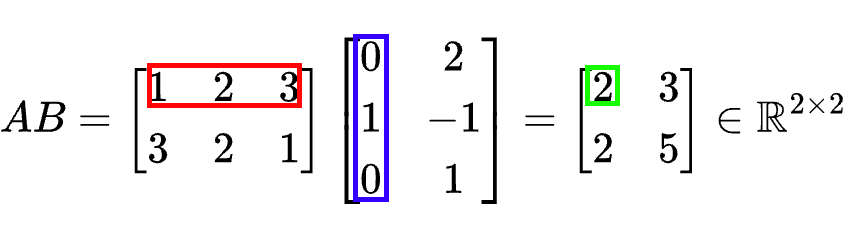

<!-- $$\begin{align}
AB &= \begin{bmatrix} 1 & 2 & 3 \newline 3 & 2 & 1 \end{bmatrix} \begin{bmatrix} 0 & 2 \newline 1 & -1 \newline 0 & 1 \end{bmatrix} = \begin{bmatrix} 2 & 3 \newline 2 & 5 \end{bmatrix} \in \mathbb{R}^{2 \times 2}
\end{align}$$ -->

and the results multiplying $\mathbf{B}$ and $\mathbf{A}$:

  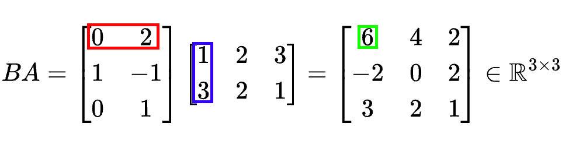

<!-- $$\begin{align}
BA &= \begin{bmatrix} 0 & 2 \newline 1 & -1 \newline 0 & 1 \end{bmatrix} \begin{bmatrix} 1 & 2 & 3 \newline 3 & 2 & 1 \end{bmatrix} = \begin{bmatrix} 6 & 4 & 2 \newline -2 & 0 & 2 \newline 3 & 2 & 1 \end{bmatrix} \in \mathbb{R}^{3 \times 3}
\end{align}$$ -->

From this example, we can already see that matrix multiplication is not commutative, i.e., $\mathbf{A}\mathbf{B} \neq \mathbf{B}\mathbf{A}$; 

#### Identity matrix

A very interesting and useful type of matrix is called the `identity matrix`. The properties of this matrix is that every item of the matrix is zero, except the diagonal of the matrix where the value is equal to $1$. An example of this matrix can be found as follows:

$$\mathbf{I}_n := 
\begin{bmatrix}
1 & 0 & \cdots & 0 & 0 \newline
0 & 1 & \cdots & 0 & 0 \newline
\vdots & \vdots & \ddots & \vdots & \vdots \newline
0 & 0 & \cdots & 1 & 0 \newline
0 & 0 & \cdots & 0 & 1
\end{bmatrix}
\in \mathbb{R}^{n \times n}$$

You should note that the identity matrix is always squared, meaning that it has the same number of rows and columns which is represented by the number $n$.

#### Matrix properties

There are a lot of properties that stem from the previous mentioned operations (addition and multiplication)

- Associativity: $ \forall \mathbf{A} \in \mathbb{R}^{m \times n}, \mathbf{B} \in \mathbb{R}^{n \times p}, C \in \mathbb{R}^{p \times q} : (\mathbf{A}\mathbf{B})\mathbf{C} = \mathbf{A}(\mathbf{BC}) \tag{2.18}$
- Distributivity:  $ \forall \mathbf{A}, \mathbf{B} \in \mathbb{R}^{m \times n}, \mathbf{C}, \mathbf{D} \in \mathbb{R}^{n \times p} : (\mathbf{A} + \mathbf{B})\mathbf{C} = \mathbf{A}\mathbf{C} + \mathbf{B}\mathbf{C} \tag{2.19a}$, $\mathbf{A}(\mathbf{C} + \mathbf{D}) = \mathbf{AC} + \mathbf{AD}$

- Multiplication with the identity matrix: $ \forall \mathbf{A} \in \mathbb{R}^{m \times n}$: $\mathbf{I}_m \cdot \mathbf{A} = \mathbf{A} \cdot \mathbf{I}_n = \mathbf{A}$

- Inverse and Transpose

#### Inverse of a matrix

Consider a square matrix $\mathbf{A} \in \mathbb{R}^{n \times n}$. Let matrix $\mathbf{B} \in \mathbb{R}^{n \times n}$ have the property that $\mathbf{A} \cdot \mathbf{B} = \mathbf{I}_n = \mathbf{B} \cdot \mathbf{A}$. $\mathbf{B}$ is called the `inverse` of $A$ and denoted by $\mathbf{A}^{-1}$. 

For instance if we have the following matrices:

$$\mathbf{A} = \begin{bmatrix}
1 & 2 & 1 \newline
4 & 4 & 5 \newline
6 & 7 & 7 
\end{bmatrix} \in \mathbb{R}^{3 \times 3}$$

and 

$$\mathbf{B} = \begin{bmatrix}
-7 & -7 & 6 \newline
2 & 1 & -1 \newline
4 & 5 & -4 
\end{bmatrix} \in \mathbb{R}^{3 \times 3}$$

Then the product $\mathbf{A} \cdot \mathbf{B} = \mathbf{I}_3$  

Unfortunately, not every matrix $A$ possesses an inverse $\mathbf{A}^{-1}$. If this inverse does exist, $\mathbf{A}$ is called `invertible`, otherwise `noninvertible`. When the matrix inverse exists, it is unique. There are ways to determine whether a matrix is invertible but this is out of the scope of the mathematics intro.

#### Transpose of a matrix

Another definition that we will encounter in this course is the `transpose` matrix. So if we have two matrices again $\mathbf{A} \in \mathbb{R}^{n \times m}$ and $\mathbf{B} \in \mathbb{R}^{m \times n}$, then we call matrix $\mathbf{B}$ as the transpose matrix $\mathbf{A}$ if 
the transpose matrix of $\mathbf{B}$ denoted as $\mathbf{B}^T$ is equal with matrix $\mathbf{A}$, $\mathbf{A} = \mathbf{B}^T$. Thus, if we calculate the transpose of $\mathbf{A}^T$, from the previous example, then we can calculate the following:

$$\mathbf{A}^T = \begin{bmatrix}
1 & 4 & 6 \newline
2 & 4 & 7 \newline
1 & 5 & 7 
\end{bmatrix} \in \mathbb{R}^{3 \times 3}$$

We can say that the rows of the initial matrix become the columns of the transpose matrix. Now several interesting properties for inverse and transpose matrices arise:

$$\mathbf{A} \cdot \mathbf{A}^{-1} = \mathbf{I} =  \mathbf{A}^{-1}  \cdot \mathbf{A}$$

$$\mathbf{(AB)}^{-1} = \mathbf{A}^{-1} \cdot \mathbf{B}^{-1}$$

$$(\mathbf{A+B})^{-1} \neq \mathbf{A}^{-1} + \mathbf{B}^{-1}$$

$$(\mathbf{A}^T)^{T} = \mathbf{A}$$

$$\mathbf{(AB)}^{T} = \mathbf{B}^{T} \cdot \mathbf{A}^{T}$$

$$(\mathbf{A+B})^{T} = \mathbf{A}^{T} + \mathbf{B}^{T}$$

### Linear systems

The usefulness of `matrices` and `vectors` extend beyond placeholders for data. They can be used to solve problems in `linear systems` (as you may recall from high school). We define a` linear system` as a collection of linear equations that involve the same set of variables. 

To grasp this concept in the context of datasets, let us try to solve the following problem: `movie-recommendation`. We have the following scenario:

A movie platform wants to understand a user’s taste based on three `features`:
- $w_1$ $\rightarrow$ the user's liking of action characteristics.
- $w_2$ $\rightarrow$ the user's liking of romantic-comedy characteristics.
- $w_3$ $\rightarrow$ the user's liking of horror-style characteristics.

We observe how the user rated three different movies (on a 1–10 scale). Each movie has known `feature` intensities (e.g., how much action, romance, and horror it has). The rating for the first movie is 7, for the second 9 and the third 5. 

The movie platform tried to understand the interest of the user. That problem can be represented by the following `linear system ` of equations:

$$2w_1 + 3 w_2 + 1 w_3 = 7$$

$$3w_1 + 2 w_2 + 2 w_3 = 9$$

$$1w_1 + 4 w_2 + 3 w_3 = 5$$

To describe this linear system, we deffine matrix $\mathbf{X}$ as a `placeholder` for the dataset with the feature intensities of 3 movies: 

$$\mathbf{X} = \begin{bmatrix}
2 & 3 & 1 \newline
3 & 2 & 2 \newline
1 & 4 & 3 
\end{bmatrix} \in \mathbb{R}^{3 \times 3}$$

Next, we define $\mathbf{w}$ as a placeholder for the user's taste:

$$\mathbf{w} = [w_1, w_2, w_3] \in \mathbb{R}^{3 \times 1}$$ 

and $\mathbf{y}$ as a placeholder for the user's movie ratings:

$$\mathbf{y} = [y_1, y_2, y_3] = [7, 9, 5] \in \mathbb{R}^{3 \times 1}$$

We can simply write $\mathbf{X} \cdot \mathbf{w} = \mathbf{y}$ or $\mathbf{y} = \mathbf{X} \cdot \mathbf{w}$, which stems from the properties of matrix multiplication. 

We can also use the following representation:

$$
\begin{pmatrix}
2 & 3 & 1 \newline
3 & 2 & 2 \newline
1 & 4 & 3 
\end{pmatrix}
\begin{pmatrix}
w_1 \newline
w_2 \newline
w_3
\end{pmatrix}
=
\begin{pmatrix}
7 \newline
9 \newline
5
\end{pmatrix}
$$

So in essence we can see the matrix multiplication as a simple way to represent linear equations of multiple variables $\mathbf{w} = [w_1, w_2, w_3]$. 

Now, we want to solve this system to figure out how much this user likes action, romantic and horror movies in general.

By using the matrix properties for inverse matrices, it can be proven that we can solve this linear equation problem and calculate the variables $\mathbf{w}$ as follows: 

$$\mathbf{w} = \mathbf{X}^{-1} \cdot \mathbf{y}$$

The final results is:

$$ \mathbf{w} = [w_1, w_2, w_3] = 
\begin{bmatrix}
1.8 \\[4pt]
-4.87 \\[4pt]
2
\end{bmatrix}.
$$

Thus, we have transformed the linear equation problem to matrix inverse, and matrix computation, in order to find a solution. Something we need to keep in mind that is omnipotent in machine learning: We are usually trying to solve a set of linear equations given a matrix $\mathbf{X}$ that represents our `data`.

### Matrix transformations

As an extension of the section on linear systems, we can regard matrices in general are as `linear functions`. That means if we have an input vector $\mathbf{w}$ and we multiply it with a matrix $\mathbf{X}$ we end up transforming the initial vector to a new one. Thus, matrix here plays the role of linear function or more usually called `linear transformation` or `matrix transformation`.

The idea here is that when we perform $\mathbf{X} \cdot \mathbf{w} = \mathbf{y}$ then we can see 
$\mathbf{w}$ as our input and $\mathbf{y}$ as out output. Matrix $\mathbf{X} $ can be considered as a function transformation f that maps input vector to the output vector. We can say that $\mathbf{X} \in \mathbb{R}^{n \times n}$ receives a matrix $\mathbf{w} \in \mathbb{R}^{n}$ and outputs a vector $\mathbf{y} \in \mathbb{R}^{n}$. Depending on the dimensionality of the matrix $\mathbf{X}$ this transformation could output the same dimensionality, or change the dimensionality of the output vector.

We will show some classic examples of matrix transformation that can help grasp some intuitions on what it means to multiply a `vector` with the `matrix`. We can even visualize the effect of matrix transformation. Let us say that we have a vector: 

$$\mathbf{v}_2 = [1, 2]$$

and the matrix:

$$\mathbf{I}_2 = \begin{pmatrix}
1 & 0  \newline
0 & 1 
\end{pmatrix}$$

If we multiply $\mathbf{v}_2 \cdot \mathbf{I}_2$ its easy to figure out that we end up having as a result the same vector $[1, 2]$.

If we instead multiply $\mathbf{v}_2$ with matrix $\mathbf{A}$:

$$\mathbf{A} = \begin{pmatrix}
a & 0  \newline
0 & b 
\end{pmatrix}$$

That will return a slightly different vector, which is $[a, 2\cdot b]$. So this diagonal-matrix $\mathbf{A}$ (only the diagonal values are non-zero) scales the values of the vector. Another example matrix is:

$$\mathbf{A} = \begin{pmatrix}
1 & 0  \newline
0 & -1 
\end{pmatrix}$$

which flips the y-coordinate of the vector in the negative direction (mirrors the geometric vector around the x-axis). 

As a final example, we have matrix $\mathbf{C}$:

$$\mathbf{C} = \begin{pmatrix}
0 & -1  \newline
1 & 0 
\end{pmatrix}$$

which rotates a vector $90^\circ$. This can be validated by the following:

$$\mathbf{v}_2 \cdot \mathbf{C} = [1, 2] \cdot \begin{pmatrix}
0 & -1  \newline
1 & 0 
\end{pmatrix} = [-2,  1]$$

To better understand what happened, we can visualize vector $\mathbf{v}_2$ and the result of transformation:

  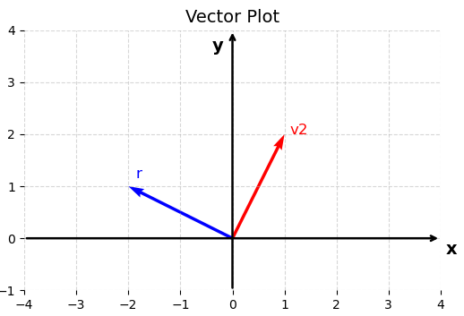

So there is always some geometric interpretation of the result of the matrix-vector multiplication. This can be extended for the matrix-to-matrix multiplication.

### Distance between vectors

As a quick recap, so far we have seen that we can express `instances`, that represent observations from real-world (or experiments), as vectors. Each different value of the vector, a `feature` or `dimension`, represents a different measurement for the instance. We discussed some basic tool in Linear algebra that helps us manipulate these vectors.

It is really useful also to introduce a notion of `distance` with which we can measure the closeness of vectors. In this way, we can compare different instances and judge which one are close to or far from each other. 

In real datasets these vectors can represent images or text. For example, we want to build an web-image-recommendation system like `Google Lens`. Representing the query image as a `vector`, and the dataset of all the other images as vectors, we can easily use this `distance metric` to compute the closeness of the query image with all the images in our dataset.

If we have two vectors $\mathbf{x} = (x_1, x_2, \cdots, x_n )$ and  $\mathbf{y} = (y_1, y_2, \cdots, y_n)$ a very popular distance is the `Euclidean distance` which can be defined as:

$$
\text{Dis}_2(\mathbf{x}, \mathbf{y}) 
= \sqrt{(x_1 - y_1)^2 + (x_2 - y_2)^2 + \cdots + (x_n - y_n)^2}$$

$$= \sqrt{\sum_{j=1}^{d} (x_j - y_j)^2} $$

$$= \sqrt{(\mathbf{x} - \mathbf{y})^\top (\mathbf{x} - \mathbf{y})}$$

Another `distance metric` ist the 1-norm distance, which is the following:

$$
\text{Dis}_1(\mathbf{x}, \mathbf{y}) 
= {\sum_{j=1}^{d} ||(x_j - y_j)||} 

$$

The generalized version of the previous distance metrics is called `Minkowski distance`, and it is as follows:

$$
\text{Dis}_p(\mathbf{x}, \mathbf{y})  = \Bigg({\sum_{j=1}^{d} (x_j - y_j)^p} \Bigg)^{1/p} 

$$

The main take-home message in this sub-section is that we can make use one of the previous tools as a means to gauge the closeness of two vectors. By employing such a tool we can create powerful Machine Learning models.

### Vector projection (and rejection)

In Linear Algebra we often want to calculate the orthogonal projection of vector $\vec{a}$ to $\vec{b}$ (from the below figure) : $p_\vec{b} \vec{a} $. The legs (or catheti) of the hypotenuse $\vec{a}$ are $\vec{a_1}$ and $\vec{a_2}$. The leg that is parallel with the 
vector $\vec{b}$ is the projection that we are looking for.

  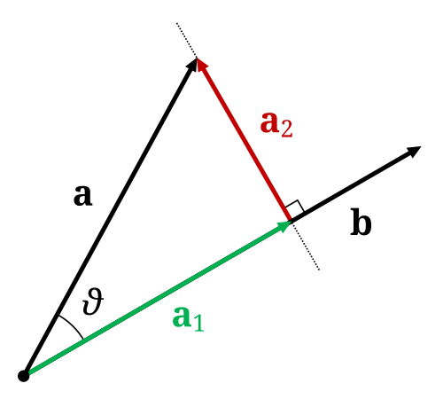

This projection is calculated as:

$$p_\vec{b} \vec{a} = \frac{a \cdot b}{||a||||b||} b$$

where the length of the projection is 

$$d = \frac{a \cdot b}{||a||||b||} $$

## Identifying classes of observations in datasets

Now lets say that we are conducting an experiment and we gather observations (`instances`) that live in two dimensions. We can plot the results of these observations in a cartesian two-dimensional plot as follows: 
 

  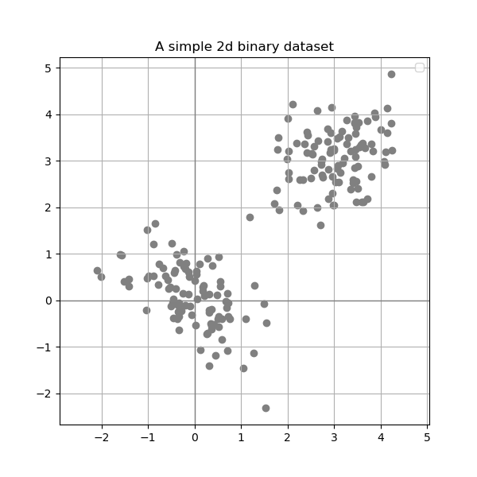

If our observations are students, and the `features` are student grades on Mathematics and Physics in high school.

Say that we know that these observations belong to two distinct classes (lets say bachelor and master students). Two popular techniques in ML are `clustering` and `classification`. In `clustering` we do not use information about any observation what class they belong to, sometimes not even what classes are possible. So, we create 2 groups based on similarity (or `distance`). In `classification`, we know the classes of a sample of observations, and use this information to separate and annotate the other observations using `distance` to the annotated observations. The known class annotations can be represented as follows:

  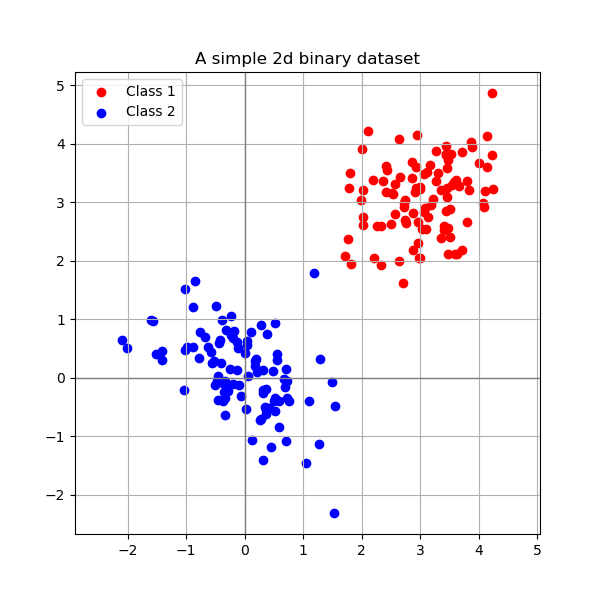

Of course most of the problems lie in a higher dimensionality than the previous problem. We can consider the case of three dimensions which can be visualized as:

  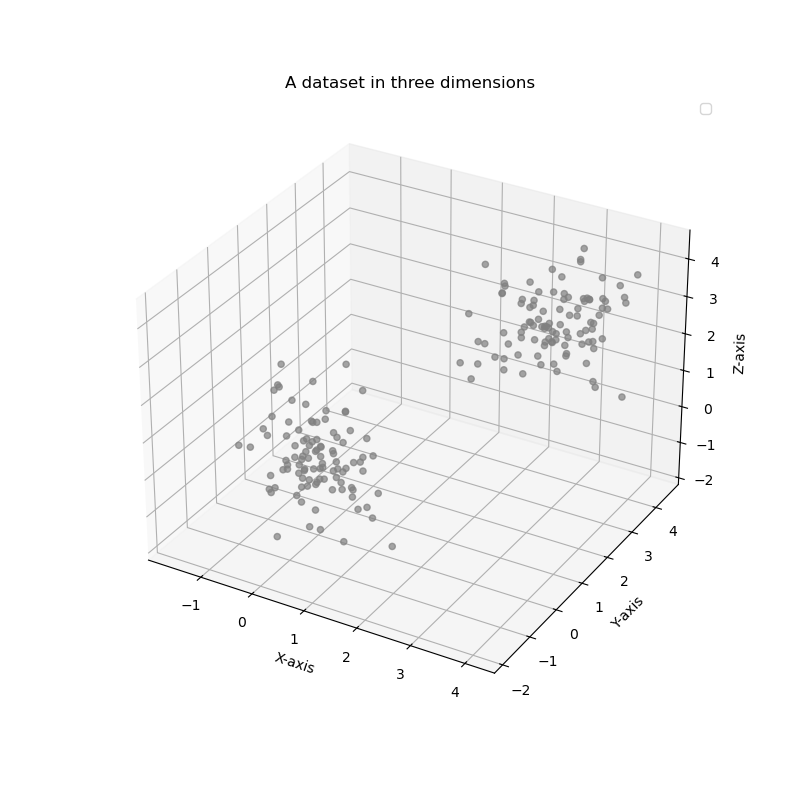

  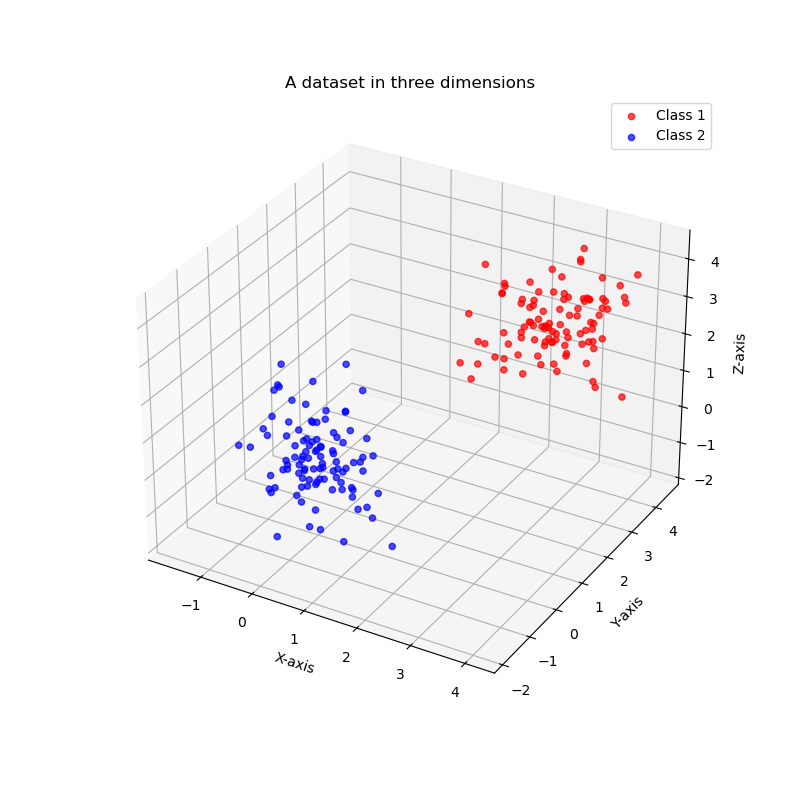

But we can also speak for higher than three dimensions. This is the case of the most interesting problems, however, it is impossible to visualize the values of these problems in a similar way. In this course, to help you with the understanding of key concepts, we will make use of example datasets with two or three dimensions to explain nuances. We will assume that the same concepts can be generalized in higher dimensions.

Knowing the class annotations of a sample of observations, we are looking for a line that separates the two classes. That can be seen in the following image;

  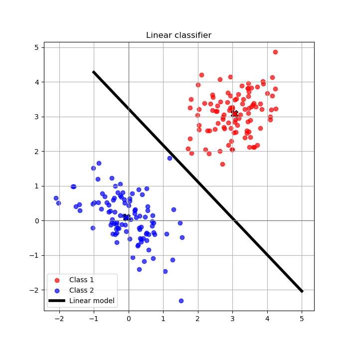

This line is our `linear classification model`, which estimates the class of non-annotated observations based on `distance` to the line. The next chapter presents a more extensive example of a linear classification model. But first, in the coming section we will discuss the geometry behind linear classification and several strategies to optimize and find good parameters.

### Geometry of linear classifiers

Let us assume that we do have a linear separable binary dataset (class A and B) as depicted in the following figure:

  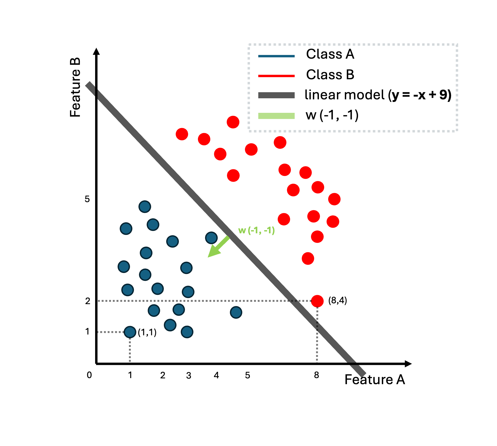

It is clear that we can find a line that separates the two classes. For instance, the following equation 

$$y = -x1 -x2 + 9 = 0$$

could separate the two classes. We can alternatively write :

$$y = \mathbf{w}^{T}\mathbf{x} + w_0$$

We thus introduce some parameters $\mathbf{w}, w_0$ (parameter $w_0$ is also called sometimes $b$) and the idea is to tune these parameters to find a decision line that separates the two classes. 

Our data lives in two dimensions $\mathbf{x} \in \mathbb{R}^{2}$. Thus, the linear function maps input $y: \mathbb{R}^2 \to \mathbb{R}$ to a value.
- When $y = 0$ we have the decision boundary for the two classes;
- When $y>0$ we have a region for the class B;
- when $y<0$ for class A. 
Βy tuning these parameters $\mathbf{w}, w_0$, for instance $\mathbf{w}^{T} = [-1, -1]$ and $w_0 = 9$, we found a way to separate the two given classes. 

In principle, the idea behind linear classification is to find the ideal parameters that can separate the two classes. 

### Simple geometry exercise using linear algebra

Imagine that we have two vectors $\mathbf{x}_A, \mathbf{x}_B$ that live in the decision boundary line. For the points that live in the decision line we know that $y = 0$. Thus, by definition, $y_A = y_B = 0$ or we can develop further, 

$$\mathbf{w}^T \mathbf{x}_A + b = \mathbf{w}^T \mathbf{x}_B + b = 0$$ 

and by performing simple vector calculations we have:

$$\mathbf{w}^T ( \mathbf{x}_A - \mathbf{x}_B) = 0$$

We already have mentioned that when the dot product of two vectors is zero then, the two vectors are orthogonal. Thus, $\mathbf{w}$ and $\mathbf{x}_A - \mathbf{x}_B$ are orthogonal to each other. Now, what we need to take into account also is that 
vector $\mathbf{x}_A - \mathbf{x}_B$ is always parallel to the decision boundary. Thus the final conclusion: the vector of weights
always points perpendicular to the decision boundary. This gives us the `slope` of the line.

It is also easy to extract that the parameter $w_0$ or sometimes $b$ is the `offset` of the line and reveals how far the line is from the original $(0, 0)$. 

  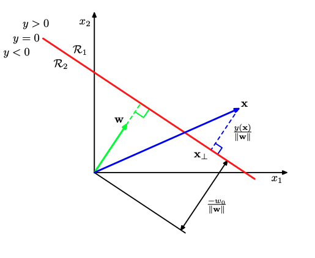

We know also that 

$$y= \mathbf{w}^{T}\mathbf{x} =0$$ 

is a vector that points to the decision line, but it also passes through the origin. 

To compute the distance between the boundary and the origin, we will need to pick this vector that lies in boundary and calculate the projection of this vector to the intercept $\mathbf{w}$. That is actually the case due to the `Euclidean distance`. 

We saw before that the projection of a vector over another is computed as:

$$d = \frac{\mathbf{w}^{T}\mathbf{x}}{||\mathbf{w}||}$$

since $\mathbf{w}^{T}\mathbf{x} + w_0 = 0$, we can write:

$$d = \frac{-w_0}{||\mathbf{w}||}$$

Finally, we conclude that the general distance of a vector in space from the decision boundary can be computed as:

$$d = \frac{y(\mathbf{x})}{||\mathbf{w}||}$$ 

The proof for that should be considered as a given and it is trivial to be made. If you feel curious on it please ask us during the lecture or tutorials of the course. 

> Application: The main principle behind Support Vector Machines (SVM) is that we would like to find parameters $\mathbf{w}, w_0$ in such a way that the distance of the closest vectors to the decision boundary will be maximized.

## Linear models in Machine learning

But ok seriously, why do we even mention all these above calculations and linear algebra tools for vectors and matrices? We are just interested in data and making machines `more clever`.

The reason why we mess with these placeholders and their mathematical properties is multi-faceted:

- Firstly, it is somehow intuitive to place numerical entities in boxes that look like `vectors, matrices`.
- Moreover, it ends up being a convenient abstract representation of what the placeholders look like in computers. 
- We can use a lot of calculation tools that are provided by linear algebra and calculus and optimization to work with our data. 
- Having placed all our data observations in placeholders (`vectors`) we can now make use of computation tools to measure similarities and be able to group together things. 
- `Python` has a lot of nice packages that we can use to process our data. You will get familiar with them in the three assignments of this course. More info regarding the assignment is available here.

In the following paragraphs, we will introduce an example of  a `dataset` and a `model` that performs the task of `linear classification`. We will introduce this process with a very simplistic example that works as a basis to understand the whole concept. This should work as a mere blueprint in order to grasp the idea behind training a ML algorithm. During the lecture we will analyze several training methodologies and algorithms in more details that work in practice for multiple tasks (`classification`, `regression`, `clustering` etcetera). 

Firstly, we will start by making a simple hypothesis that our data are linearly separable meaning that we could find a simple `line` (or a `surface plane` in multi-dimensional space) that could separate each different class for our problem.

### Example MNIST: digit-classification

Let's say that we would like to study images with handwritten digits. Each time that you write a numerical digit on paper and scan the document, you would like your machine learning algorithm to recognize the digit. This is a `classification` task.

For this purpose, we can employ a set of image-examples from the popular [MNIST dataset](https://en.wikipedia.org/wiki/MNIST_database) (developed some decades ago) that contains 70.000 gray scale images of handwritten digits (with pixel size of $28 \times 28$) which are `named` (or `labelled` or `annotated`) after the digit that they represent. So there is a way to know what each image represents. We can represent this label using an integer variable that takes the following values $t = \{0, 1, 2, ..., 9\}$. We can actually place all the labels for each image in a single vector $\mathbf{t} \in {\{0, 1, 2, ..., 9\}}^{70000}$.

#### Data preparation

First we prepare the dataset. Each input image is a collection of rows of pixels. They can be represented as a `vector` after placing each row next to each other: Instead of $28$ rows with $28$ columns, we can end up having a matrix with $1$ row and $784$ columns. We can actually use as placeholder a vector $\mathbf{x} \in \mathbb{R}^{784}$. Finally, we can store all the vector-images in one big matrix:

$$ \mathbf{X} = \begin{bmatrix}
\text{---} & \mathbf{x}_1  & \text{---} \newline
\text{---}&  \mathbf{x}_2 & \text{---} \newline
\vdots & \vdots  & \vdots \newline
\text{---} &  \mathbf{x}_n  & \text{---}
\end{bmatrix} \in \mathbb{R}^{70000 \times 784}$$

Where each row is represented by a vector $\mathbf{x}_i$. Our task is to extract useful information and patterns from these data. Specifically in digit-classification, we would like to build a ML model to predict automatically the digits in MNIST images. Once we build this system, we can apply to each image that contains handwritten digits and create our [OCR software](https://en.wikipedia.org/wiki/Optical_character_recognition).

To illustrate, we have as our new observation the following digit $\mathbf{x}'$:

  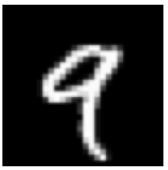

The first thing to do is that we place each row of pixels next to each other. We have a vector that looks as follows (note this is a part of the final vector and not full vector):

  

#### Tuning phase

Next, we use a simple approach to create our first classifier (our machine learning model) as follows: 

- We introduce some parameters (we can also call them variables or `weights`) $\mathbf{w} \in \mathbb{R}^{784}$. 
- Then, we need to `tune` these parameters in such a way that each time we have a new unlabeled observation $\mathbf{x}^{\prime}$ that contains a handwritten digit, the innerproduct $\mathbf{w} \cdot  \mathbf{x}^{\prime} = y$ is as close as possible to the right label $\mathbf{t}$.

For now, we can intuit that the output of the ML model should be something like $y = \mathbf{w} \cdot \mathbf{x}' \approx 9$ (or some other value that codifies this specific digit.

> Note: instead of a scalar, we could want a vector as an output: $\mathbf{y} \in \mathbb{R}^{9}$ where each dimensionality represents each of the desired digits. In this case, we should replace $\mathbf{w}$ with a matrix. But for now, we will stick to the simple case of the scalar output.

In `Machine Learning` we are trying to figure out a good way to `tune` these parameters $\mathbf{w}$ in such a way that the above `classification` task will be resolved. The process of tuning these parameters is called in machine learning `training` or `learning process`. Now, how can we engineer meaningful values to these parameters $\mathbf{w}$ to classify handwritten digits?

- We have already accessed and prepared the MNIST dataset of handwriting images that contain some annotation or label describing the digit in the image.
- We can split our MNIST dataset into two sets: `training` and `test` set. The training set $\mathbf{X'}$ is used during the `training phase` where we will `tune` the parameters of the model.
- Then, the test set will be used for `evaluating the quality of the tuned parameters` of our new model: $\mathbf{y} = \mathbf{X'} \cdot \mathbf{w}$.

We can do the `tuning` by performing a simple linear operation between the data in the training dataset $\mathbf{X'}$ and the introduced parameters $\mathbf{w}$. This operation looks like:

$$\mathbf{y} = \mathbf{X'} \cdot \mathbf{w}$$ 

Now we can proceed to the so-called training process, which is usually as follows (another reminder that this is a very simplistic example):
- We start by tuning these parameters $\mathbf{w}$ randomly. 
- Having done that, we can calculate the output $\mathbf{y}$ using the previous linear equation $\mathbf{y} = \mathbf{X'} \cdot \mathbf{w}$.  
- As we initialized the parameters $\mathbf{w}$ randomly, there is not any quarantee that the values $\mathbf{y}$ could codify any meaningful information related to MNIST dataset. 
- We already know the output should be the stored label information $\mathbf{t}$.
- It is natural to measure the `distance` between the predictions $\mathbf{y}$ and the annotations $\mathbf{t}$.
- Then update the values of $\mathbf{w}$ in a way that this distance (think about the distance metrics we talked before) between the two vectors is minimized. 
- In this way, we can measure the total error between the model output and the real labels. This is called alternatively `loss function` or `error function`.
- Then we can use this loss output as a compass to modify our parameters $\mathbf{w}$ and direct them towards minimizing this entity. After all, we want to minimize this distance between correct label and the predicted values.
- Throughout this course, we will analyze several key ways of tuning our parameters given this error calculation.

Hooray, we have just given a very simple explanation of how classification and supervised learning works in Machine Learning.

Of course, the whole training problem is a lot more involved that our previous description. One of the initial hypothesis that we made is that our data are linearly separable and we can use a surface to separate its classes. However, this is
not the case in the most of the data. This example meant to be a gentle introduction on how the linear classification looks like.

## The ingredients of ML

To conclude and come back to our `EoML course`, during the lectures, we defined as key ingredients of ML the following concepts: `data (instances, features)`, `the task`, and `the model`.

In the previous example, we defined that a single image $\mathbf{x}$ acts as the instance or `observation` and its pixel-value as the `feature`. Our dataset is a set of images that could include annotation in the case of supervised learning and linear classification like the case of the MNIST datasets. However, we might still have a set of images without annotation and can still employ algorithms that find interesting patterns in data (`clustering`, `image compression` or `image generation` using `GANs` or `stable diffusion` models).

In this tutorial, we mainly focused on the `linear classification` task. The model is actually the parameters $\mathbf{w}$ that we introduced during the example and tuned during the training process. Thus, for each different task we have a different type of a model and different type of introduced parameters $\mathbf{w}$ that needs to be `tuned`. 

##

Here our quick introductory story in ML ends. I am sure that this content can be a bit hard to parse for some, however, this page means to be a supplementary material for those are curious to learn more on linear algebra and mathematics for Machine Learning.

[back](./)
