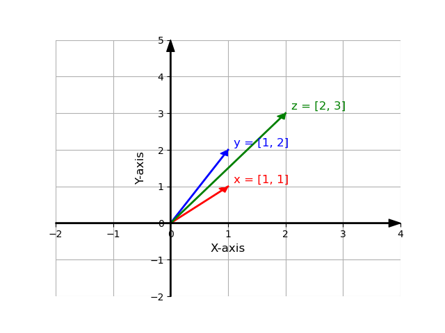

## Introduction to Machine Learning

> Machine learning domain concerns the designing of algorithms that automatically extracts interesting information from knowledge sources that we call data. 

Machine learning is data-driven and the data is at core of machine learning. The goals is to design general purposes methodologies with which we can extract interesting patterns and that are not dependent in expertise domain. For instance having a huge corpus of textual data from Wikipedia we can extract information about these wikipedia sites such as the topic of each page but also event analysis or sentiment analysis in reviews from webpages such as IMDB.

Object recognition, music recommendation, text generation, voice detection, image generation, stock market prediction etc. Some of the ML techniques require some expertise when collecting the data and some annotation of the data. For example when we collect object as images we can annotate the content of the images with what it can be found within these images, or we can have information about the houses and annotate them with the prices of the houses. There are some cases, that is not possible, or it is not necessary to annotate these data like when we mine text from the web. 

## Data and the concept of a dataset

However, so far, we have discuss about data and datasets that are crucial on ML but we haven't gave any definition on what we mean when we talk about data and datasets.
There are actually multiple definitions for the word `data`. We will try to make sense for this word by providing several definitions for this word:

> Data refers to recorded observations or measurable pieces of information, often collected from experiments, transactions, sensors, texts, or user behavior, that are used to represent phenomena, derive insights, or inform decision-making through analysis.

> Data are values or observations, usually structured, often numeric, that represent attributes of entities and are used to answer questions.

> Data are representations of variables measured from the real world, which can be used to model and infer patterns or causality.

So central to the concept of data is the representation of information about the real world through numerical or not ways about an under study domain that can be found or produced extracted or post processed. That involves information that we exchange as human beings or measurements that stems from scientific experiments and eventually are structured and presented in a formatted and formal way.

When we talk about a dataset usually we refer to structure data that are referring to a specific under-study problem by computer. These datasets contains multiple observations about our problems and they have been annotated (or not) and curated by experts in the field of study.

## Types of Data 

Data exists in different flavours. First and foremost could be numerical data: imagine for example the measurements of scientific tools. Scientific instruments used to quantify physical properties. These tools range from simple rulers and graduated cylinders to more advanced devices like micrometers, pH meters, and data loggers. Could be text information that can be found for instance in social media in forums forums etc. Could be digitalized images and audio signals.

## Data as vectors and matrices

While as we just mentioned not all data are inherently numerical, for the computer perspective, it is always necessary to transform these data into a numerical representation. Thus, when we talk about digital images we talk about pixel numerical representation. Regarding textual data, each character letter, digit, symbol is assigned a number via an encoding standard, such as ASCII or Unicode pls check this site for further information. Another example concerns auditory data which when we digitalize it, we actually captured the the amplitude of sound waves over time.

For comprehensive purposes of the humans and computers, when we collect, store and share these data we need to make use of placeholders, entities that can store information and can be easy to represent and manipulate them from computer and mathematical perspective. Hence, we can introduce in our terminology the concept of a `vector` as the main placeholder of `data`. Dataset as we mentioned before are usually composed with a set of multiple observations, for instance when we do have a set of images we can say that each image each a different `observation` or a different `instance`. Each `instance` could be eventually be represented by a corresponding `vector`. As we said the dataset is a collection of observations and thus a collection of `vectors`. We can introduce also the concept of a matrix as a set of multiple `vectors` grouped together.

## Intro to Linear Algebra

The vectors many of us know from school are called `geometric vectors`, which are usually denoted by a small arrow above the letter, e.g. $\vec{x}$ and $\vec{y}$. In this tutorial, we will simply denote the vectors as $\mathbf{x}$, $\mathbf{y}$ as a collection of numerical values. For example we can have that $\mathbf{x} = [1, 1]$ and $\mathbf{y} = [1, 2]$.

These vectors can be visualized in the cartesian space as:

Once we represent our observations in vectors and visualize them in the cartesian space we can actually perform some basic mathematical computations. One simple and straightforward example is to add these two vectors. That is represented by the following image:

## Geometry

[back](./)
