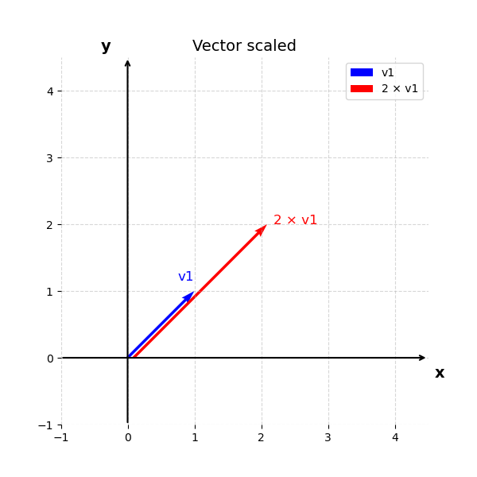

## Machine Learning definition

> Machine learning (ML) domain concerns the designing of algorithms that automatically extracts interesting information from knowledge sources that we call data. 

Machine learning (ML) is data-driven and the data is at core of machine learning. The goals is to design general purposes machine algorithms with which we can extract automatically interesting patterns from the data that are not necessarily dependent in expertise domain. For instance having a huge corpus of textual data from Wikipedia we can automatically extract information about these Wikipedia sites such as the topic of each page but also event analysis or sentiment analysis in reviews from webpages such as IMDB or Google reviews.

For instance, let's say that we have the following review from IMDB:

> Horrible script with mediocre acting. This was so bad I couldn´t finish it. The actresses are so bad at acting it feels like a bad comedy from minute one. The high rated reviews is obviously from friend/family and is pure BS.

In this case, with ML we would like to create a software that will be able to automatically recognize that this is a review with a `negative` sentiment.

Other examples of tasks that concern ML are object recognition, music recommendation, text generation, voice detection, image generation, stock market prediction etc. Some of the ML techniques require some expertise when collecting the data and some annotation of the data. For example when we collect object as images we can annotate the content of the images with what it can be found within these images, or we can have information about the houses and annotate them with the prices of the houses. There are some cases, that is not possible to do that, or it is not necessary to annotate these data like when we mine text from the web. 

## Data and the concept of a dataset

However, so far, we talked about `data` and `datasets` that are crucial on ML but we haven't gave any definition on what we mean when we talk about `data` and `datasets`. There are actually multiple definitions for the word `data`. We will try to make sense for this word by providing several definitions for this word:

> Data refers to recorded observations or measurable pieces of information, often collected from experiments, transactions, sensors, texts, or user behavior, that are used to represent phenomena, derive insights, or inform decision-making through analysis.

> Data are values or observations, usually structured, often numeric, that represent attributes of entities and are used to answer questions.

> Data are representations of variables measured from the real world, which can be used to model and infer patterns or causality.

So central to the concept of data is the representation of information about the real world through numerical or other representations about an under study domain that can be found or produced extracted or post processed. That involves information that we exchange as human beings or measurements that derives from scientific experiments and eventually are structured and presented in a formatted and formal way. These observations about an under study phenomenon are called `observations` or `instances`. For instance if we would like to study the market value of houses in Amsterdam, we could gather information about a huge number of houses (which are our `observations` or `instances`) and composed from several bits of info like: `neighborhood`, `size`, `number of rooms`, `year of construction`, `has a balcony`, `distance from the nearest tram stop`, `condition of the interior`, `furniture` etc. These bits of information in the jargon of ML is called `feature`

When we talk about a `dataset` usually we refer to structure data that are referring to a specific under-study problem by computer. So having collected several `observations` about these data we can place them in a data structure. These datasets contains multiple observations about our problems and they can be annotated (or not) and curated by experts in the field of study.

## Types of Data 

Data exists in different flavours. First and foremost could be numerical data: imagine for example the measurements of scientific tools. Scientific instruments used to quantify physical properties. These tools range from simple rulers and graduated cylinders to more advanced devices like micrometers, pH meters, and data loggers. They could be also textual data that can be found for instance in social media in forums forums etc. Could be digitalized images and audio signals. It could be boolean values (`True` or `False`). We can actually group the data into the following categories:

- Structure data
- Unstructured data
- Semi-Structured Data
- Time series data
- Categorical Data
- Numerical Data

## Data as vectors and matrices

While as we just mentioned not all data are inherently numerical, from the computer perspective, it is always necessary to transform these data into a numerical representation. Thus, when we talk about digital images we talk about pixel numerical representation. Regarding textual data, each character letter, digit, symbol is assigned a number via an encoding standard, such as ASCII or Unicode (pls check this site for further information). Another example concerns auditory data which when we digitalize it, we actually captured the the amplitude of sound waves over time.

For comprehensive purposes of the humans and computers, when we collect, store and share these data we need to make use of placeholders, entities that can store information and can be easy to represent and manipulate them from computer and mathematical perspective. Hence, we can introduce in our terminology the concept of a `vector` as the main placeholder of `data`. Dataset as we mentioned before are usually composed with a set of multiple observations, for instance when we do have a set of images we can say that each image each a different `observation` or a different `instance`. Each `instance` could be eventually be represented by a corresponding `vector`. As we said the dataset is a collection of observations and thus a collection of `vectors`. We can introduce also the concept of a `matrix` as a set of multiple `vectors` grouped together.

## Intro to Linear Algebra

### Vectors

The vectors many of us know from school are called `geometric vectors`, which are usually denoted by a small arrow above the letter, e.g. $\vec{v_1}$ and $\vec{v_2}$. In this tutorial, we will simply denote the vectors as $\mathbf{v}_1$, $\mathbf{v}_2$ as a collection of numerical values. For example we can have that $\mathbf{v}_1 = [1, 1]$ and $\mathbf{v}_2 = [1, 2]$. That are example of two dimensional vectors that lies on the cartesian space $\{x, y\}$. Each dimension of this vector it is called a `feature` and can represent a characteristic value for the observation. For example, these two value of the vector $\mathbf{v}_1$ could be the values of an image that contains just two pixels.

You may recall from high-school that these vectors can be visualized in the cartesian 2-dimensional space as:

  

Once we represent our observations in vectors and visualize them in the cartesian space we can actually perform some basic mathematical computations. One simple and straightforward example is to add these two vectors. That can be represented as $\mathbf{v}_1 + \mathbf{v}_2 = [2, 3]$ That is represented by the following image:

  

As you might recall the addition of the vectors in two-dimensions works as follows: you can start with the first vector which point to the position $\mathbf{v}_1 = [1, 1]$ and then you add one in the x-axis and 2 in the y-axis. The result of this addition is another vector that points to $[2, 3]$. Another simply example is the multiplication of a vector with the scalar. For instance $\mathbf{v}_3 = 2 \cdot \mathbf{v}_1 = [2, 2]$

  

### Inner product

A really important computation in Linear algebra is called `inner product`. If we stick with the above-mentioned vectors we can calculate the following entity $\mathbf{v}_4 =\mathbf{v}_1 \cdot \mathbf{v}_2  = 1 \cdot 1 + 1 \cdot 2 = 3$. Eventually, we end up calculating a scalar value which represents the similarity of these two vectors. It shows actually if these two vectors point to the same direction they are perpendicular or point to opposite direction. Thus, the inner product:

- Is positive if the angle between vectors is less than 90°,
- Zero if the vectors are orthogonal (perpendicular),
- Negative if the angle is greater than 90°.

Another thing to keep in mind is that this product relates also with the angle between the two vectors. It ends up being as follows:

$$\mathbf{v}_1 \cdot \mathbf{v}_2 = \lVert \mathbf{v}_1  \lVert  \lVert  \mathbf{v}_2 \lVert   \cdot cos(\theta)$$

The norm of a vector $\lVert \mathbf{v}_1 \lVert = \sqrt{1^2 + 1^2 } = \sqrt{2} $, $\lVert \mathbf{v}_2 \lVert = \sqrt{1^2 + 2^2 } = \sqrt{5} $  represents the length of the vector.

We can also re-write as:

$$\lVert \mathbf{v}_1^{2} \lVert = 1^2 + 1^2 $$

and the angle between the two vectors as:

$$cos(\theta) = \frac{\mathbf{v}_1 \cdot \mathbf{v}_2}{\lVert \mathbf{v}_1 \lVert  \lVert \mathbf{v}_2 \lVert }$$

### Matrices

Now if we would like to create a placeholder in order to store multiple vectors together, we can construct a `matrix`. A matrix could encapsulate the given set of observation into a rectangular entity that looks like an extended version of a vector. For instance given the observation $\mathbf{v}_1, \mathbf{v}_2$ we can group them together into a `dataset` or a `matrix` as follows:

$$D = \begin{bmatrix}
1 & 1 \newline
1 & 2
\end{bmatrix}$$

And that can of course can be generalized with multiple vectors of n-th dimensions as follows:

$$A = \begin{bmatrix}
a_{11} & a_{12} & \cdots & a_{1n} \newline
a_{21} & a_{22} & \cdots & a_{2n} \newline
\vdots & \vdots & \ddots & \vdots \newline
a_{m1} & a_{m2} & \cdots & a_{mn}
\end{bmatrix}$$

with $a_{ij}\in \mathbb{R}$, where $\mathbb{R}$ is the set with all the real-values. We then can denote that a vector $\mathbf{v}_1 \in \mathbb{R}^2$ and the matrix $\mathbf{A} \in \mathbb{R}^{m \times n}$, where $\mathbb{R}^{m \times n}$ is the set of all real-valued $m \times n$ matrices.

#### Matrix addition

In the same spirit with the addition of a vector, we can define also the addition of two (or more) matrices. For example if we have a matrix $\mathbf{B}$ as:

$$B = \begin{bmatrix}
b_{11} & b_{12} & \cdots & b_{1n} \newline
b_{21} & b_{22} & \cdots & b_{2n} \newline
\vdots & \vdots & \ddots & \vdots \newline
b_{m1} & b_{m2} & \cdots & b_{mn}
\end{bmatrix}$$

Then, $\mathbf{C} = \mathbf{B} + \mathbf{A}$ can be defined as follows:

$$C = \begin{bmatrix}
a_{11} + b_{11} & a_{12} + b_{12} & \cdots & a_{1n} + b_{1n} \newline
a_{21} + b_{21} & a_{22} + b_{22} & \cdots & a_{2n} + b_{2n} \newline
\vdots & \vdots & \ddots & \vdots \newline
a_{m1} + b_{m1} & a_{m2} + b_{m2} & \cdots & a_{mn} + b_{mn}
\end{bmatrix}$$

It is important to note that in order to be able to add two matrices they need to have the same size otherwise it is not possible to perform the matrix addition.

#### Matrix multiplication

Another important operation in matrixes is the matrix multiplication. For matrices $\mathbf{A} \in \mathbb{R}^{m \times n} $, $\mathbf{B} \in \mathbb{R}^{n \times k} $, the multiplication operation can be denoted as $\mathbf{D} = \mathbf{A} \cdot \mathbf{B}$, with to be:

$$ \mathbf{D} = \begin{bmatrix}
d_{11} & d_{12} & \cdots & d_{1k} \newline
d_{21} & d_{22} & \cdots & d_{2k} \newline
\vdots & \vdots & \ddots & \vdots \newline
d_{m1} & d_{m2} & \cdots & d_{mk}
\end{bmatrix}$$

the elements $ d_{ij} $ of the product 

$$\mathbf{D} = \mathbf{A}\cdot \mathbf{B} \in \mathbb{R}^{m \times k} $$

are computed as: 

$$d_{ij} = \sum_{l=1}^{n} a_{il} b_{lj}, \quad i = 1, \ldots, m, \quad j = 1, \ldots, k$$

Hence, in the case of matrix multiplication it is important to note that the number of columns of the first matrix should be the same for the number of rows of the second matrix in order the multiplication to be a valid operation.

That means that in order to calculate $d_{ij}$ element we need to multiple the elements of the i-th row of $\mathbf{A}$ with the j-th column of $\mathbf{B}$ and sum them up, so to calculate the inner product of these two. Of course, a row in matrix can be considered as a vector and thus, we can just use the inner product that we can discuss earlier.

The matrices can only be multiplied if their `neighboring` dimensions match. For instance, an $n \times k$-matrix $\mathbf{A}$can be multiplied with a $k \times m$-matrix $\mathbf{B}$, but only from the left side:

$$\underbrace{A}_{n \times k} \cdot \underbrace{B}_{k \times m} =  \underbrace{D}_{n \times m}$$

The product $BA$ is not defined if $m \ne n$ since the neighboring dimensions do not match.

#### Example of matrix multiplications

An example to help you grasp the detail inner working of the matrix multiplication is placed below. By having two matrices $\mathbf{A}$ and $\mathbf{B}$:

$$\mathbf{A} = \begin{bmatrix} 1 & 2 & 3 \newline 3 & 2 & 1 \end{bmatrix} \in \mathbb{R}^{2 \times 3}$$

$$\mathbf{B} = \begin{bmatrix} 0 & 2 \newline 1 & -1 \newline 0 & 1 \end{bmatrix} \in \mathbb{R}^{3 \times 2}$$

we can obtain the results of multiplying $\mathbf{A}$ with $\mathbf{B}$

  

<!-- $$\begin{align}
AB &= \begin{bmatrix} 1 & 2 & 3 \newline 3 & 2 & 1 \end{bmatrix} \begin{bmatrix} 0 & 2 \newline 1 & -1 \newline 0 & 1 \end{bmatrix} = \begin{bmatrix} 2 & 3 \newline 2 & 5 \end{bmatrix} \in \mathbb{R}^{2 \times 2}
\end{align}$$ -->

and the results multiplying $\mathbf{B}$ and $\mathbf{A}$:

  

<!-- $$\begin{align}
BA &= \begin{bmatrix} 0 & 2 \newline 1 & -1 \newline 0 & 1 \end{bmatrix} \begin{bmatrix} 1 & 2 & 3 \newline 3 & 2 & 1 \end{bmatrix} = \begin{bmatrix} 6 & 4 & 2 \newline -2 & 0 & 2 \newline 3 & 2 & 1 \end{bmatrix} \in \mathbb{R}^{3 \times 3}
\end{align}$$ -->

From this example, we can already see that matrix multiplication is not commutative, i.e., $\mathbf{A}\mathbf{B} \neq \mathbf{B}\mathbf{A}$; 

#### Identity matrix

A very interesting and useful type of matrix is called identity matrix. The properties of this matrix is that every item of the matrix is zero except the diagonal of the matrix where the value is equal to one. An example of this matrix can be found as follows:

$$\mathbf{I}_n := 
\begin{bmatrix}
1 & 0 & \cdots & 0 & 0 \newline
0 & 1 & \cdots & 0 & 0 \newline
\vdots & \vdots & \ddots & \vdots & \vdots \newline
0 & 0 & \cdots & 1 & 0 \newline
0 & 0 & \cdots & 0 & 1
\end{bmatrix}
\in \mathbb{R}^{n \times n}$$

You should note that the identity matrix is always squared meaning that it has the same number of rows and columns which is represented by the number $n$.

#### Matrix properties

There are a lot of properties that stem from the previous mentioned operations (addition and multiplication)

- Associativity: $ \forall \mathbf{A} \in \mathbb{R}^{m \times n}, \mathbf{B} \in \mathbb{R}^{n \times p}, C \in \mathbb{R}^{p \times q} : (\mathbf{A}\mathbf{B})\mathbf{C} = \mathbf{A}(\mathbf{BC}) \tag{2.18}$
- Distributivity:  $ \forall \mathbf{A}, \mathbf{B} \in \mathbb{R}^{m \times n}, \mathbf{C}, \mathbf{D} \in \mathbb{R}^{n \times p} : (\mathbf{A} + \mathbf{B})\mathbf{C} = \mathbf{A}\mathbf{C} + \mathbf{B}\mathbf{C} \tag{2.19a}$, $\mathbf{A}(\mathbf{C} + \mathbf{D}) = \mathbf{AC} + \mathbf{AD}$

- Multiplication with the identity matrix: $ \forall \mathbf{A} \in \mathbb{R}^{m \times n}$: $\mathbf{I}_m \cdot \mathbf{A} = \mathbf{A} \cdot \mathbf{I}_n = \mathbf{A}$

- Inverse and Transpose

Consider a square matrix $\mathbf{A} \in \mathbb{R}^{n \times n}$. Let matrix $\mathbf{B} \in \mathbb{R}^{n \times n}$ have the property that $\mathbf{AB} = \mathbf{I}_n = \mathbf{BA}$. $\mathbf{B}$ is called the `inverse` of $A$ and denoted by $\mathbf{A}^{-1}$.

Unfortunately, not every matrix $A$ possesses an inverse $\mathbf{A}^{-1}$. If this inverse does exist, $\mathbf{A}$ is called `regular-invertible-nonsingular`, otherwise `singular-noninvertible`. When the matrix inverse exists, it is unique. There are ways to determine whether a matrix is invertible but this is out of the scope of the mathematics intro.

#### Inverse of a matrix

Let us assume two matrices $\mathbf{A} \in \mathbb{R}^{n \times n}$ and $\mathbf{B} \in \mathbb{R}^{n \times n}$. If the following property is true: $\mathbf{A} \cdot \mathbf{B} = \mathbf{I}_n$, then we can say that $\mathbf{B}$ is the inverse of matrix $\mathbf{A}$. 

For instance if we have the following matrices:

$$\mathbf{A} = \begin{bmatrix}
1 & 2 & 1 \newline
4 & 4 & 5 \newline
6 & 7 & 7 
\end{bmatrix} \in \mathbb{R}^{3 \times 3}$$

and 

$$\mathbf{B} = \begin{bmatrix}
-7 & -7 & 6 \newline
2 & 1 & -1 \newline
4 & 5 & -4 
\end{bmatrix} \in \mathbb{R}^{3 \times 3}$$

Then the product $\mathbf{A} \cdot \mathbf{B} = \mathbf{I}_3$  
#### Transpose of a matrix

Another definition that we will encounter in this course is the transpose matrix. So if we have two matrices again $\mathbf{A} \in \mathbb{R}^{n \times m}$ and $\mathbf{B} \in \mathbb{R}^{m \times n}$, then we call matrix $\mathbf{B}$ as the transpose matrix $\mathbf{A}$ if 
the transpose matrix of $\mathbf{B}$ denoted as $\mathbf{B}^T$ is equal with matrix $\mathbf{A}$, $\mathbf{A} = \mathbf{B}^T$. Thus, if we calculate the transpose of $\mathbf{A}^T$ from the previous example then, we can calculate the following:

$$\mathbf{A}^T = \begin{bmatrix}
1 & 4 & 6 \newline
2 & 4 & 7 \newline
1 & 5 & 7 
\end{bmatrix} \in \mathbb{R}^{3 \times 3}$$

We can say that the rows of the initial becoming the columns of the transpose matrix. Now several interesting properties for inverse and transpose matrices arise:

$$\mathbf{A} \cdot \mathbf{A}^{-1} = \mathbf{I} =  \mathbf{A}^{-1}  \cdot \mathbf{A}$$

$$\mathbf{(AB)}^{-1} = \mathbf{A}^{-1} \cdot \mathbf{B}^{-1}$$

$$(\mathbf{A+B})^{-1} \neq \mathbf{A}^{-1} + \mathbf{B}^{-1}$$

$$(\mathbf{A}^T)^{T} = \mathbf{A}$$

$$\mathbf{(AB)}^{T} = \mathbf{B}^{T} \cdot \mathbf{A}^{T}$$

$$(\mathbf{A+B})^{T} = \mathbf{A}^{T} + \mathbf{B}^{T}$$

#### Linear systems

A simply way to understand the usefulness of `matrices` and `vectors` stems from the linear system word. As you might recall from the high-school. We can define as` linear system` a collection of linear equations that involve the same set of variables. For example:

$$1w_1 + 4 w_2 + 6 w_3 = 1$$

$$2w_1 + 4 w_2 + 7 w_3 = 2$$

$$1w_1 + 5 w_2 + 7 w_3 = 3$$

Now, if we define as:

$$\mathbf{X} = \begin{bmatrix}
1 & 2 & 1 \newline
4 & 4 & 5 \newline
6 & 7 & 7 
\end{bmatrix} \in \mathbb{R}^{3 \times 3}$$

And then we can define $\mathbf{w} = [w_1, w_2, w_3] \in \mathbb{R}^{3 \times 1}$ and $\mathbf{y} = [y_1, y_2, y_3] = [1, 2, 3] \in \mathbb{R}^{3 \times 1}$

then we can simply write $\mathbf{X} \cdot \mathbf{w} = \mathbf{y}$ or simply $\mathbf{y} = \mathbf{X} \cdot \mathbf{w}$ which stems from the properties of matrix multiplication. So in essence we can see the matrix multiplication as a simple way to represent linear equations of multiple variables $\mathbf{w} = [w_1, w_2, w_3]$. 

We can use also the following representation:

$$
\begin{pmatrix}
1 & 2 & 1 \newline
4 & 4 & 5 \newline
6 & 7 & 7 
\end{pmatrix}
\begin{pmatrix}
w_1 \newline
w_2 \newline
w_3
\end{pmatrix}
=
\begin{pmatrix}
1 \newline
2 \newline
3
\end{pmatrix}
$$

or 

It can be proven that by using also the matrix properties for inverse matrices we can solve this linear calculate the variables $\mathbf{w}$ as follows: $\mathbf{w} = \mathbf{X}^{-1} \cdot \mathbf{y}$.

## Linear models in Machine learning

But ok seriously, why do we even mentioned all these calculations for vectors and matrices. We are just interested in data and making machines learning patterns out of these data.

The reason why we mess with these placeholders is multi-facet. Firstly, is somehow intuitive to place numerical entities in boxes that look like `vector, matrices`. Moreover, it ends up being a convenient abstract representation of how the placeholders in computer looks like. We can use a lot of calculation tools that are provided by linear algebra and calculus and optimization to work with our data. Having placed all our data observations in placeholders (`vectors`) we can now make use of computation tools to measure similarities and be able to group together things. `Python` has a lot of nice packages that we can use to process our data. You can find more info here.

#### Example MNIST

As an example lets say that we would like to study images with handwritten digits and the classification into the corresponding digits. For that purpose, we can are employ a set of image-examples the notorious [MNIST dataset](https://en.wikipedia.org/wiki/MNIST_database) that contains 70.000 gray scale images of handwritten digits (with pixel size of $28 \times 28$) which are `named` (or `labelled`) after the digit that they represent. So there is a way to know what each image represents. That type of `naming` is called a `label` or an `annotation`. We can represent this label using an integer variable that takes the following values $t = \{0, 1, 2, ..., 9\}$.

Each input image can be represented as a vector after placing each row next to each other. Eventually, instead of $28$ rows with $28$ columns we can end up having $1$ row with $784$ columns. We can actually use as placeholder a vector $\mathbf{x} \in \mathbb{R}^{784}$. We can store all the vector-images in one big matrix:

$$ \mathbf{X} = \begin{bmatrix}
\text{---} & \mathbf{x}_1  & \text{---} \newline
\text{---}&  \mathbf{x}_2 & \text{---} \newline
\vdots & \vdots  & \vdots \newline
\text{---} &  \mathbf{x}_n  & \text{---}
\end{bmatrix} \in \mathbb{R}^{70000 \times 784}$$

Where each row is represented by a vector $\mathbf{x}_i$. The task is extract useful information and patterns from these data. For example in digit-classification, we would like to build a ML model to predict automatically the digits in MNIST images without using the information from the naming or the labels. Once we build this system, we can apply to each image that contains handwritten digits and create our [OCR software](https://en.wikipedia.org/wiki/Optical_character_recognition).

Now back to the MNIST dataset. We can actually place all the labels for each image in a single vector $\mathbf{t} \in {\(0, 1, 2, ..., 9\)}^{70000}$.

A simple approach to create our first classifier (our machine learning model) is as follows: introduce some parameters (we can call them also variables) $\mathbf{w}$. Then, we simply :), will need to tune these parameters in such a way that each time that we will have an observation $\mathbf{x}^{\prime}$ if we multiply (by using the `inner product` from linear algebra that discussed before) with parameters $\mathbf{w}$ the output should be a numerical value that will represent the digit that the input observation contains.

$$y = \mathbf{w} \cdot  \mathbf{x}^{\prime}$$

of a bit more elaborate (using some linear or non-linear function $f$ or our choice) 

$$y =  f(\mathbf{w} \cdot  \mathbf{x}^{\prime}) \in \mathbb{R}$$

Thus, if the input image looks as follows:

  

which then, we place each row of pixels next to each other and we finally we can have a vector that looks as follows (note this is a part of the final vector and not full vector):

  

Then, the output of the ML model should be something like $y \approx 9$ or some other value that codifies this specific digit. Not that we can have instead of a scalar a vector as an output. This vector could be $\mathbf{y} \in \mathbb{R}^{9}$ where each dimensionality represents each of the desired digits. In this case, we should replace $\mathbf{w}$ with a matrix. But for now, we will stick to the simple case of the scalar output.

It is important of course to figure out a good way to tune the parameters $\mathbf{w}$ in such a way that the above classification task will be resolved. The process of tuning these parameters is called in machine learning `training` or `learning` process. 

A gentle introduction on this process is as follows: Firstly, we want to perform a simple linear operation between the data in the dataset and the introduced parameters $\mathbf{w}$. For example we can consider the following:

$$\mathbf{y} = \mathbf{X} \cdot \mathbf{w}$$ 

or 

$$\mathbf{y} = f(\mathbf{X} \cdot \mathbf{w})$$

now a very good question is the following: `how can we set meaningful values to parameters` $\mathbf{w}$?. 

We can start by setting these parameters randomly. Then we can calculate the output vector $\mathbf{y}$. This vector represents now the predictions of the model during the `training process`. However, given that we initialize the parameters $\mathbf{w}$ randomly there is not any quarantee that the values $\mathbf{y}$ could represent the MNIST digits. However, we already have some information about what this vector should be and this is the annotations that are stored and place in vector $\mathbf{t}$.

We should thus find a way to measure the distance between the predictions $\mathbf{y}$ and the annotations $\mathbf{t}$ and then update the values of $\mathbf{w}$ in a way that this distance between the two vectors is minimized.

We then need to find a way to measure the distance between predictions and labels and then a way to update the weights $\mathbf{w}$ in order to minimize this distance. 

Hooray, we have just given a simple explanation of how classification and supervised learning works in Machine Learning. Of course, the whole training problem is a lot more elaborate that our description. Hence, a learning objective for this course is to make clear on how ML algorithms works. Furthermore, there is a huge range of problems beyond classification that ML deals with like: `regression`, `clustering`, `dimensionality reduction` and `generation` of data that we will revise in this course. Finally, you should also note that the example that we have place is an example of parameter-based classification, but classification can be done also without using explicitly new parameters $\mathbf{w}$ and by only creating rules based on data (for instance in the case of decision trees).

The main key-home messages for this page is that information and human observations are represented by data can be stored in placeholders which can be manipulated by computers using Linear algebra principles. ML is using Linear Algebra `magic` to do its job. 

The next chapter will be an introduction to machine learning. We will provide the key terminology and some basic categorization that will be useful throughout this course.

### Model

### Learning

### Tasks

[back](./)
