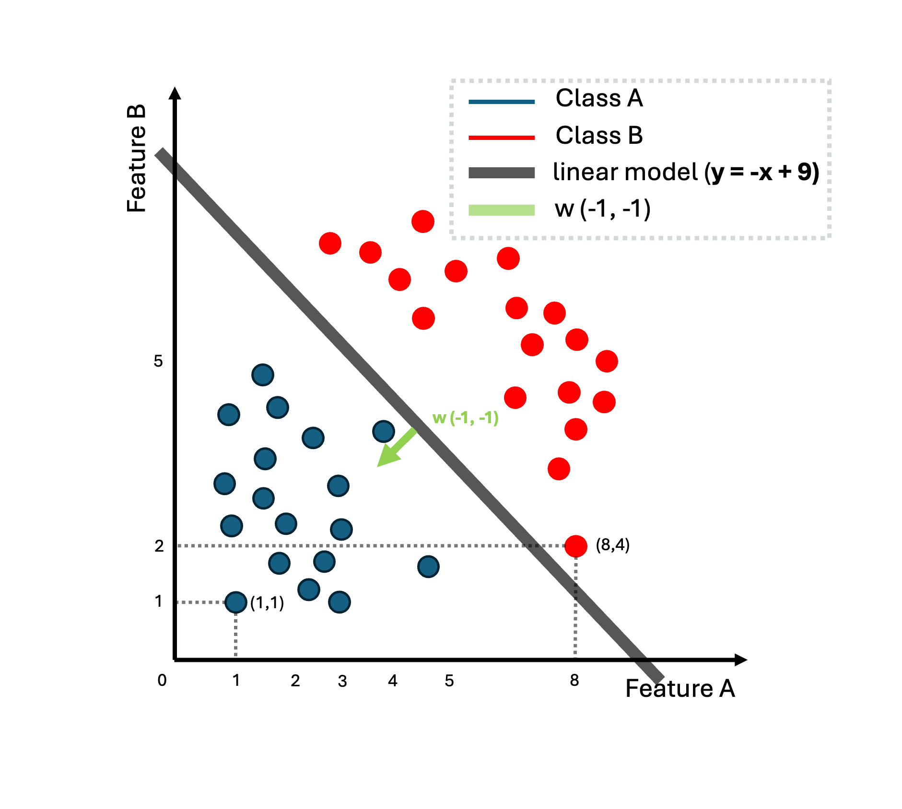

## Machine Learning definition

We will start this tutorial by introducing the concept of Machine Learning (ML). A popular definition regarding ML could be the following:

> Machine learning (ML) domain concerns the designing of algorithms that automatically extracts interesting information from knowledge sources that we call data. 

Machine learning (ML) is data-driven and the `data` is at core of machine learning. The goals is to design `general purposes machine algorithms` with which we can extract automatically `interesting patterns` from the data that are not necessarily dependent in expertise domain. For instance having a huge corpus of textual data from Wikipedia we can automatically extract information about these Wikipedia sites such as the topic of each page but also event analysis or sentiment analysis in reviews from webpages such as the IMDB or Google reviews. For instance, let's say that we have the following review from the IMDB:

> Horrible script with mediocre acting. This was so bad I could not finish it. The actresses are so bad at acting it feels like a bad comedy from minute one. The high rated reviews is obviously from friend/family and is pure BS.

In this case, we create a ML algorithm that could automatically recognize that this is a review has a `negative` sentiment. We call this type of ML application: `sentiment analysis` or `sentiment recognition`.

Other examples of tasks that concern ML are `object recognition`, `recommendation systems`, `text generation`, `voice detection`, `image generation`, `stock market prediction` etc. Some of the ML techniques require some expertise when collecting the data and some annotation of the data. For example when we collect object as images we can annotate the content of the images with what it can be found within these images, or we can have information about the houses and annotate them with the prices of the houses. There are some cases, that is not possible to do that, or it is not necessary to annotate these data like when we mine text from the web. 

The ML systems are based on three key concepts which are the following: `data`, `the task` and finally the `the model`. 

> We could say that in ML we use of a `model` to extract interesting patterns from our `data` to perform a specific `task`.

In the following section, we will talk about the first concept of ML that is the `data`.

## From data to datasets, vectors and matrices

So far, we talked about `data` that are crucial concept on ML but we haven't gave any definition on what we mean when we talk about `data` and as a consequence what is a `dataset`. There are actually multiple definitions for the word `data`. We will try to make sense for this word by providing several definitions for this word:

> Data refers to recorded observations or measurable pieces of information, often collected from experiments, transactions, sensors, texts, or user behavior, that are used to represent phenomena, derive insights, or inform decision-making through analysis.

> Data are values or observations, usually structured, often numeric, that represent attributes of entities and are used to answer questions.

> Data are representations of variables measured from the real world, which can be used to model and infer patterns or causality.

So central to the concept of data is the representation of information about the real world through numerical or other representations about an `under study` domain that can be found or produced extracted or post processed. That involves information that we exchange as human beings or measurements that derives from scientific experiments and eventually are structured and presented in a formatted and formal way. These observations about an under study phenomenon are called `observations` or `instances`. For instance if we would like to study the market value of houses in Amsterdam, we could gather information about a huge number of houses (which are our `observations` or `instances`) and composed from several bits of info like: 

- `neighborhood`, 
- `size`, 
- `number of rooms`, 
- `year of construction`,
- `has a balcony`, 
- `distance from the nearest tram stop`, 
- `condition of the interior`, `furniture` etc. 

These bits of information in the nomenclature of ML is called `features`.

When we talk about a `dataset` usually we refer to structure data that are referring to a specific under-study problem by computer. So having collected several `observations` about these data we can place them in a data structure. These datasets contains multiple observations about our problems and they can be annotated (or not) and curated by experts in the field of study.

## Types of Data 

Data exists in different flavours. First and foremost could be numerical data: imagine for example the measurements of scientific tools. Scientific instruments used to quantify physical properties. These tools range from simple rulers and graduated cylinders to more advanced devices like micrometers, pH meters, and data loggers. They could be also textual data that can be found for instance in social media in forums forums etc. Could be digitalized images and audio signals. It could be boolean values (`True` or `False`). We can actually group the data into the following categories:

- Structure data (tabular data, spreadsheet).
- Unstructured data (text, images).
- Semi-Structured Data (json files).
- Time series data (audio, stock market values).
- Categorical Data (gender, race, etcetera).
- Numerical Data

### Example of data

Here we will represent a simple example of gathering data about several people: `name`, `gender`, `degree`, `postcode`, `age`, `salary` with the observation to be each different person, and we would like to create an ML algorithm that given the info for these people to estimate a prediction for their salary. We can say that our observation is the different people in the Table 1.1 while the each characteristic can be called a `feature`.

$$\begin{aligned}
& \text {Table 1.1. A collected dataset of people and their salaries. }\\
&\begin{array}{cccc}
\hline \hline \text { Name } & \text { Gender} & \text { Degree} & \text { postcode } & \text { age } & \text { salary } \\
\hline David & M & PhD & 1011MK & 41 & 9900$ \\
James & M & BsC & 1223LK & 19 & 1780$ \\
Dale & M & PhD & 2122JJ & 27 & 7560$ \\
Laura & F & MSc & 1212NK &  19 & 1460$\\
Donna & F & MSc & 1112AA & 20 & 1400$\\
\hline
\end{array}
\end{aligned}$$

Even when we have data in tabular format, there are still choices to be
made to obtain a numerical representation. For example, in Table 1.1, the
gender column (a categorical variable) may be converted into numbers 0
representing `Male` and 1 representing `Female`. Alternatively, the gender
could be represented by numbers `−1`, `+1`, respectively (as shown in
Table 1.2). Furthermore, it is often important to use domain knowledge
when constructing the representation, such as knowing that university
degrees progress from `bachelor’s` to `master’s` to `PhD` or realizing that the
postcode provided is not just a string of characters but actually encodes
an area in London.

$$\begin{aligned}
& \text {Table 1.2. Transformed data into numerical representation }\\
&\begin{array}{cccc}
\hline \hline \text { Name } & \text { Gender} & \text { Degree} & \text { Latitude } & \text { age } & \text { salary } \\
\hline 1 & 1 & 3 & 51.507 & 41 & 9.9k \\
2 & 1 & 1 & 51.5074 & 19 & 1.7k \\
3 & 1 & 3 & 51.607 & 27 & 7.5k$ \\
4 & 2 & 2 & 51.207 &  19 & 1.6k\\
5 & 2 & 1 & 51.407 & 20 & 1.6k\\
\hline
\end{array}
\end{aligned}$$

## Data as vectors and matrices

We just saw that not all data are inherently numerical, and from the computer perspective, it is always necessary to transform these data into a numerical representation. Thus, when we talk about digital images we talk about pixel numerical representation. Regarding textual data, each character letter, digit, symbol is assigned a number via an encoding standard, such as `ASCII` or `Unicode` (pls check this site for further information). Another example concerns auditory data which when we digitalize it, we actually captured the the amplitude of sound waves over time.

For comprehensive purposes of the humans and computers, when we collect, store and share these data we need to make use of placeholders, entities that can store information and can be easy to represent and manipulate them from computer and mathematical perspective. Hence, we can introduce in our terminology the concept of a `vector` as the main placeholder of `data`.  `Vectors` are used to store information about observations in our data. In the previous example, each row of the table (each different person) is considered an `observation` and is represented by `vectors`.

Dataset as we mentioned before are usually composed with a set of multiple observations, for instance when we do have a set of images we can say that each image each a different `observation` or a different `instance`. Each `instance` could be eventually be represented by a corresponding `vector`. As we said the dataset is a collection of observations and thus a collection of `vectors`. We can introduce also the concept of a `matrix` as a set of multiple `vectors` grouped together.

Thus, a vector (an single observation or instance) can be represented as $\mathbf{x}$, so we can have:

$$\mathbf{x}_1 = \{1, 1, 3, 41.507, 41, 9.9 \}$$ 

and  

$$\mathbf{x}_2 = \{2, 1, 1, 51.5074, 19, 1.7 \}$$ 

while the whole dataset can be represented by the following matrix:

$$
\mathbf{X} = \begin{pmatrix}
1 & 1 & 3 & 51.507 & 41 & 9.9 \\
2 & 1 & 1 & 51.5074 & 19 & 1.7 \\
3 & 1 & 3 & 51.607 & 27 & 7.5 \\
4 & 2 & 2 & 51.207 & 19 & 1.6 \\
5 & 2 & 1 & 51.407 & 20 & 1.6 \\
\end{pmatrix}$$

## Intro to Linear Algebra

Vectors could be regarded as we saw so far, as placeholders from the `computer science` perspective, but at the same time, they can be perceived as objects in the cartesian space and could be manipulated by Linear Algebra tools as we have already encounter from high-school mathematics courses. They have length adn direction adn they live in a multi-dimensional space. They are called also `geometric vectors`.
 
### Geometric Vectors

These `geometric vectors` are usually denoted by a small arrow above the letter, e.g. $\vec{v_1}$ and $\vec{v_2}$. In this tutorial, we will simply denote the vectors as $\mathbf{v}_1$, $\mathbf{v}_2$ as a collection of numerical values. For example we can have that:

$$\mathbf{v}_1 = [1, 1]$$

and 
 
$$\mathbf{v}_2 = [1, 2]$$
 
These are examples of two dimensional vectors that lie on the cartesian space with coordinates $\{x, y\}$. Each dimension (or `coordinate`) of this vector it is called a `feature` and can represent a characteristic value for the observation. For example, these two value of the vector $\mathbf{v}_1$ could be the values of an image that contains just two pixels.

You may recall from high-school that these vectors can be visualized in the cartesian 2-dimensional space as:

  

Once we represent our observations in vectors and visualize them in the cartesian space we can actually perform some basic mathematical computations. One simple and straightforward example is to add these two vectors. That can be represented as 

$$\mathbf{v}_1 + \mathbf{v}_2 = [2, 3]$$ 

That is represented by the following image:

  

As you might recall the addition of the vectors in two-dimensions works as follows: you can start with the first vector which point to the position $\mathbf{v}_1 = [1, 1]$ and then you add one in the `x-axis` and 2 in the `y-axis`. The result of this addition is another vector that points to $\mathbf{v}_1 + \mathbf{v}_2 = [2, 3]$. This operation can be considered as a `tip and tail` addition. The tail here refers to the starting point of the vector, while the tip (or head) is the ending point, typically indicated by an arrowhead

Another simply example is the multiplication of a vector with the scalar. For instance 

$$\mathbf{v}_3 = 2 \cdot \mathbf{v}_1 = [2, 2]$$

  

### Vector subtraction

What if we would like to subtract two vectors. In this case, we can simple perform vector addition, however, instead of adding the two vectors directly, we will need to add the negative of a vector, an operation that looks as follows: 

$$\mathbf{v3} = \mathbf{v1} - \mathbf{v2} = \mathbf{v1} + (-\mathbf{v2})$$

So in our example $\mathbf{v3} = [0, -1]$

One remark here that is good to remember is that the vectors in our example live in the two-dimensional space, and thus, it is easy to visualize. However, they could easily live in a higher dimensionality, which is also more practical, since the most interesting problems lives in a high-dimension. The only problem is that unfortunately, we cannot visualize these vectors. Thus, in this tutorial, we are usually employ two-dimensional vectors as example since it is easy also to visualize them.

### Inner product

A really important concept in Linear algebra is called `inner product`. If we stick with the above-mentioned vectors we can calculate the following entity $\mathbf{v}_4 =\mathbf{v}_1 \cdot \mathbf{v}_2  = 1 \cdot 1 + 1 \cdot 2 = 3$. Eventually, we end up calculating a scalar value which represents the similarity of these two vectors. It shows actually if these two vectors point to the same direction they are perpendicular or point to opposite direction. Thus, the inner product:

- Is positive if the angle between vectors is less than $90^\circ$,
- Zero if the vectors are orthogonal (perpendicular),
- Negative if the angle is greater than $90^\circ$.

Another thing to keep in mind is that this product relates also with the angle between the two vectors. It ends up being as follows:

$$\mathbf{v}_1 \cdot \mathbf{v}_2 = \lVert \mathbf{v}_1  \lVert  \lVert  \mathbf{v}_2 \lVert   \cdot cos(\theta)$$

The norm of a vector 

$$\lVert \mathbf{v}_1 \lVert = \sqrt{1^2 + 1^2 } = \sqrt{2} \text{, }\lVert \mathbf{v}_2 \lVert = \sqrt{1^2 + 2^2 } = \sqrt{5} $$  

represents the length of the vector. We can also re-write as:

$$\lVert \mathbf{v}_1^{2} \lVert = 1^2 + 1^2 $$

and the angle between the two vectors as:

$$cos(\theta) = \frac{\mathbf{v}_1 \cdot \mathbf{v}_2}{\lVert \mathbf{v}_1 \lVert  \lVert \mathbf{v}_2 \lVert }$$

### Vector projections

### Matrices

Now if we would like to create a placeholder in order to store multiple vectors together (so multiple instances), we can construct a `matrix`. A matrix could encapsulate the given set of observation into a rectangular entity that looks like an extended version of a vector. For instance given the observation $\mathbf{v}_1, \mathbf{v}_2$ we can group them together into a `dataset` or a `matrix` as follows:

$$D = \begin{bmatrix}
1 & 1 \newline
1 & 2
\end{bmatrix}$$

And that can of course can be generalized with multiple vectors of n-th dimensions as follows:

$$A = \begin{bmatrix}
a_{11} & a_{12} & \cdots & a_{1n} \newline
a_{21} & a_{22} & \cdots & a_{2n} \newline
\vdots & \vdots & \ddots & \vdots \newline
a_{m1} & a_{m2} & \cdots & a_{mn}
\end{bmatrix}$$

with $a_{ij}\in \mathbb{R}$, where $\mathbb{R}$ is the set with all the real-values. We then can denote that a vector $\mathbf{v}_1 \in \mathbb{R}^2$ and the matrix $\mathbf{A} \in \mathbb{R}^{m \times n}$, where $\mathbb{R}^{m \times n}$ is the set of all real-valued $m \times n$ matrices.

#### Matrix addition

In the same spirit with the addition of a vector, we can define also the addition of two (or more) matrices. For example if we have a matrix $\mathbf{B}$ as:

$$B = \begin{bmatrix}
b_{11} & b_{12} & \cdots & b_{1n} \newline
b_{21} & b_{22} & \cdots & b_{2n} \newline
\vdots & \vdots & \ddots & \vdots \newline
b_{m1} & b_{m2} & \cdots & b_{mn}
\end{bmatrix}$$

Then, $\mathbf{C} = \mathbf{B} + \mathbf{A}$ can be defined as follows:

$$C = \begin{bmatrix}
a_{11} + b_{11} & a_{12} + b_{12} & \cdots & a_{1n} + b_{1n} \newline
a_{21} + b_{21} & a_{22} + b_{22} & \cdots & a_{2n} + b_{2n} \newline
\vdots & \vdots & \ddots & \vdots \newline
a_{m1} + b_{m1} & a_{m2} + b_{m2} & \cdots & a_{mn} + b_{mn}
\end{bmatrix}$$

It is important to note that in order to be able to add two matrices they need to have the same size otherwise it is not possible to perform the matrix addition.

#### Matrix multiplication

Another important operation in matrixes is the matrix multiplication. For matrices $\mathbf{A} \in \mathbb{R}^{m \times n} $, $\mathbf{B} \in \mathbb{R}^{n \times k} $, the multiplication operation can be denoted as $\mathbf{D} = \mathbf{A} \cdot \mathbf{B}$, with to be:

$$ \mathbf{D} = \begin{bmatrix}
d_{11} & d_{12} & \cdots & d_{1k} \newline
d_{21} & d_{22} & \cdots & d_{2k} \newline
\vdots & \vdots & \ddots & \vdots \newline
d_{m1} & d_{m2} & \cdots & d_{mk}
\end{bmatrix}$$

the elements $ d_{ij} $ of the product 

$$\mathbf{D} = \mathbf{A}\cdot \mathbf{B} \in \mathbb{R}^{m \times k} $$

are computed as: 

$$d_{ij} = \sum_{l=1}^{n} a_{il} b_{lj}, \quad i = 1, \ldots, m, \quad j = 1, \ldots, k$$

Hence, in the case of matrix multiplication it is important to note that the number of columns of the first matrix should be the same for the number of rows of the second matrix in order the multiplication to be a valid operation.

That means that in order to calculate $d_{ij}$ element we need to multiple the elements of the i-th row of $\mathbf{A}$ with the j-th column of $\mathbf{B}$ and sum them up, so to calculate the inner product of these two. Of course, a row in matrix can be considered as a vector and thus, we can just use the inner product that we can discuss earlier.

The matrices can only be multiplied if their `neighboring` dimensions match. For instance, an $n \times k$-matrix $\mathbf{A}$can be multiplied with a $k \times m$-matrix $\mathbf{B}$, but only from the left side:

$$\underbrace{A}_{n \times k} \cdot \underbrace{B}_{k \times m} =  \underbrace{D}_{n \times m}$$

The product $BA$ is not defined if $m \ne n$ since the neighboring dimensions do not match.

#### Example of matrix multiplications

An example to help you grasp the detail inner working of the matrix multiplication is placed below. By having two matrices $\mathbf{A}$ and $\mathbf{B}$:

$$\mathbf{A} = \begin{bmatrix} 1 & 2 & 3 \newline 3 & 2 & 1 \end{bmatrix} \in \mathbb{R}^{2 \times 3}$$

$$\mathbf{B} = \begin{bmatrix} 0 & 2 \newline 1 & -1 \newline 0 & 1 \end{bmatrix} \in \mathbb{R}^{3 \times 2}$$

we can obtain the results of multiplying $\mathbf{A}$ with $\mathbf{B}$

  

<!-- $$\begin{align}
AB &= \begin{bmatrix} 1 & 2 & 3 \newline 3 & 2 & 1 \end{bmatrix} \begin{bmatrix} 0 & 2 \newline 1 & -1 \newline 0 & 1 \end{bmatrix} = \begin{bmatrix} 2 & 3 \newline 2 & 5 \end{bmatrix} \in \mathbb{R}^{2 \times 2}
\end{align}$$ -->

and the results multiplying $\mathbf{B}$ and $\mathbf{A}$:

  

<!-- $$\begin{align}
BA &= \begin{bmatrix} 0 & 2 \newline 1 & -1 \newline 0 & 1 \end{bmatrix} \begin{bmatrix} 1 & 2 & 3 \newline 3 & 2 & 1 \end{bmatrix} = \begin{bmatrix} 6 & 4 & 2 \newline -2 & 0 & 2 \newline 3 & 2 & 1 \end{bmatrix} \in \mathbb{R}^{3 \times 3}
\end{align}$$ -->

From this example, we can already see that matrix multiplication is not commutative, i.e., $\mathbf{A}\mathbf{B} \neq \mathbf{B}\mathbf{A}$; 

#### Identity matrix

A very interesting and useful type of matrix is called identity matrix. The properties of this matrix is that every item of the matrix is zero except the diagonal of the matrix where the value is equal to one. An example of this matrix can be found as follows:

$$\mathbf{I}_n := 
\begin{bmatrix}
1 & 0 & \cdots & 0 & 0 \newline
0 & 1 & \cdots & 0 & 0 \newline
\vdots & \vdots & \ddots & \vdots & \vdots \newline
0 & 0 & \cdots & 1 & 0 \newline
0 & 0 & \cdots & 0 & 1
\end{bmatrix}
\in \mathbb{R}^{n \times n}$$

You should note that the identity matrix is always squared meaning that it has the same number of rows and columns which is represented by the number $n$.

#### Matrix properties

There are a lot of properties that stem from the previous mentioned operations (addition and multiplication)

- Associativity: $ \forall \mathbf{A} \in \mathbb{R}^{m \times n}, \mathbf{B} \in \mathbb{R}^{n \times p}, C \in \mathbb{R}^{p \times q} : (\mathbf{A}\mathbf{B})\mathbf{C} = \mathbf{A}(\mathbf{BC}) \tag{2.18}$
- Distributivity:  $ \forall \mathbf{A}, \mathbf{B} \in \mathbb{R}^{m \times n}, \mathbf{C}, \mathbf{D} \in \mathbb{R}^{n \times p} : (\mathbf{A} + \mathbf{B})\mathbf{C} = \mathbf{A}\mathbf{C} + \mathbf{B}\mathbf{C} \tag{2.19a}$, $\mathbf{A}(\mathbf{C} + \mathbf{D}) = \mathbf{AC} + \mathbf{AD}$

- Multiplication with the identity matrix: $ \forall \mathbf{A} \in \mathbb{R}^{m \times n}$: $\mathbf{I}_m \cdot \mathbf{A} = \mathbf{A} \cdot \mathbf{I}_n = \mathbf{A}$

- Inverse and Transpose

Consider a square matrix $\mathbf{A} \in \mathbb{R}^{n \times n}$. Let matrix $\mathbf{B} \in \mathbb{R}^{n \times n}$ have the property that $\mathbf{AB} = \mathbf{I}_n = \mathbf{BA}$. $\mathbf{B}$ is called the `inverse` of $A$ and denoted by $\mathbf{A}^{-1}$.

Unfortunately, not every matrix $A$ possesses an inverse $\mathbf{A}^{-1}$. If this inverse does exist, $\mathbf{A}$ is called `regular-invertible-nonsingular`, otherwise `singular-noninvertible`. When the matrix inverse exists, it is unique. There are ways to determine whether a matrix is invertible but this is out of the scope of the mathematics intro.

#### Inverse of a matrix

Let us assume two matrices $\mathbf{A} \in \mathbb{R}^{n \times n}$ and $\mathbf{B} \in \mathbb{R}^{n \times n}$. If the following property is true: $\mathbf{A} \cdot \mathbf{B} = \mathbf{I}_n$, then we can say that $\mathbf{B}$ is the inverse of matrix $\mathbf{A}$. 

For instance if we have the following matrices:

$$\mathbf{A} = \begin{bmatrix}
1 & 2 & 1 \newline
4 & 4 & 5 \newline
6 & 7 & 7 
\end{bmatrix} \in \mathbb{R}^{3 \times 3}$$

and 

$$\mathbf{B} = \begin{bmatrix}
-7 & -7 & 6 \newline
2 & 1 & -1 \newline
4 & 5 & -4 
\end{bmatrix} \in \mathbb{R}^{3 \times 3}$$

Then the product $\mathbf{A} \cdot \mathbf{B} = \mathbf{I}_3$  
#### Transpose of a matrix

Another definition that we will encounter in this course is the transpose matrix. So if we have two matrices again $\mathbf{A} \in \mathbb{R}^{n \times m}$ and $\mathbf{B} \in \mathbb{R}^{m \times n}$, then we call matrix $\mathbf{B}$ as the transpose matrix $\mathbf{A}$ if 
the transpose matrix of $\mathbf{B}$ denoted as $\mathbf{B}^T$ is equal with matrix $\mathbf{A}$, $\mathbf{A} = \mathbf{B}^T$. Thus, if we calculate the transpose of $\mathbf{A}^T$ from the previous example then, we can calculate the following:

$$\mathbf{A}^T = \begin{bmatrix}
1 & 4 & 6 \newline
2 & 4 & 7 \newline
1 & 5 & 7 
\end{bmatrix} \in \mathbb{R}^{3 \times 3}$$

We can say that the rows of the initial becoming the columns of the transpose matrix. Now several interesting properties for inverse and transpose matrices arise:

$$\mathbf{A} \cdot \mathbf{A}^{-1} = \mathbf{I} =  \mathbf{A}^{-1}  \cdot \mathbf{A}$$

$$\mathbf{(AB)}^{-1} = \mathbf{A}^{-1} \cdot \mathbf{B}^{-1}$$

$$(\mathbf{A+B})^{-1} \neq \mathbf{A}^{-1} + \mathbf{B}^{-1}$$

$$(\mathbf{A}^T)^{T} = \mathbf{A}$$

$$\mathbf{(AB)}^{T} = \mathbf{B}^{T} \cdot \mathbf{A}^{T}$$

$$(\mathbf{A+B})^{T} = \mathbf{A}^{T} + \mathbf{B}^{T}$$

#### Linear systems

A simply way to understand the usefulness of `matrices` and `vectors` stems from the linear system world. As you might recall from the high-school. We can define as` linear system` a collection of linear equations that involve the same set of variables. 

Let us for a second try to solve the following problem: Factory $A$ uses one machine of type $w_1$, 4 machines of type $w_2$, and 6 machines of type $w_3$ to produce a battery, while factory $B$ uses 2, 4, 7 to produce two batteries and factory $C$ employs 1, 5, 7 correspondingly to produce 3 batteries. If we assume that all three machines are working in exactly the same way, we can express the previous problem as follows:

$$1w_1 + 4 w_2 + 6 w_3 = 1$$

$$2w_1 + 4 w_2 + 7 w_3 = 2$$

$$1w_1 + 5 w_2 + 7 w_3 = 3$$

Now, if we define as:

$$\mathbf{X} = \begin{bmatrix}
1 & 2 & 1 \newline
4 & 4 & 5 \newline
6 & 7 & 7 
\end{bmatrix} \in \mathbb{R}^{3 \times 3}$$

And then we can define $\mathbf{w} = [w_1, w_2, w_3] \in \mathbb{R}^{3 \times 1}$ and $\mathbf{y} = [y_1, y_2, y_3] = [1, 2, 3] \in \mathbb{R}^{3 \times 1}$

then we can simply write $\mathbf{X} \cdot \mathbf{w} = \mathbf{y}$ or simply $\mathbf{y} = \mathbf{X} \cdot \mathbf{w}$ which stems from the properties of matrix multiplication. So in essence we can see the matrix multiplication as a simple way to represent linear equations of multiple variables $\mathbf{w} = [w_1, w_2, w_3]$. 

We can use also the following representation:

$$
\begin{pmatrix}
1 & 2 & 1 \newline
4 & 4 & 5 \newline
6 & 7 & 7 
\end{pmatrix}
\begin{pmatrix}
w_1 \newline
w_2 \newline
w_3
\end{pmatrix}
=
\begin{pmatrix}
1 \newline
2 \newline
3
\end{pmatrix}
$$

Since we do know that both three factories using their machine with the same optimal way, we can compute how much each machine contributes to the construction of a battery. To do that we will need to solve the linear system of equations with respect to $w_1, w_1, w_3$. That seems feasible since we do have a linear system of three equations with three unknown variables.

It can be proven that by using also the matrix properties for inverse matrices we can solve this linear equation problem and calculate the variables $\mathbf{w}$ as follows: 

$$\mathbf{w} = \mathbf{X}^{-1} \cdot \mathbf{y}$$

Thus, we have transformed the linear equation problem to matrix inverse and matrix computation in order to find a solution. That is something that we need to keep in mind that is omnipotent in machine learning. We are usually trying to solve a similar equation given a matrix $\mathbf{X}$ that represents our `data`.

For advanced topics in Linear Algebra you can have a look in this page [Advanced topics in Linear Algebra](./mlintro.html).

## Matrix transformations

Another way to think about matrix-vector multiplication as functions. The idea here is that when we perform $\mathbf{X} \cdot \mathbf{w} = \mathbf{y}$ then we can see 
$\mathbf{w}$ as our input and $\mathbf{y}$ out output. Matrix $\mathbf{X} $ can be considered as a function transformation f that maps input vector to the output vector. We can say that $\mathbf{X} \in \mathbb{R}^{n \times n}$ what it does is to receive an matrix $\mathbf{w} \in \mathbb{R}^{n}$ and it spits out a vector $\mathbf{y} \in \mathbb{R}^{n}$. Depending of the dimensionality of the matrix $\mathbf{X}$ this transformation could keep the same dimensionality or change the dimensionality of the output vector.

A nice outcome of the above is that we can even visualize the affect of matrix transformation. Therefore, in this part of the tutorial we will put forwards some classic examples of matrix transformation that can help grasp some intuitions on what it means to multiple a vector with the matrix. Let us say that we do have a vector: 

$$\mathbf{v}_2 = [1, 2]$$

and the matrix:

$$\mathbf{I}_2 = \begin{pmatrix}
1 & 0  \newline
0 & 1 
\end{pmatrix}$$

If we multiple $\mathbf{v}_2 \cdot \mathbf{I}_2$ its easy to figure out that we end up having as a result the same vector $[1, 2]$.

If we instead multiply $\mathbf{v}_2$ with matrix $\mathbf{A}$:

$$\mathbf{A} = \begin{pmatrix}
a & 0  \newline
0 & b 
\end{pmatrix}$$

That will return a slightly different vector which is $[a, 2\cdot b]$, so this diagonal-matrix $\mathbf{A}$ (only the diagonal values are non-zero) scales the values of the vector. Another example matrix is:

$$\mathbf{A} = \begin{pmatrix}
1 & 0  \newline
0 & -1 
\end{pmatrix}$$

which actually flips the y-axis of the vector in the negative direction. As a final example, we have matrix $\mathbf{C}$:

$$\mathbf{C} = \begin{pmatrix}
0 & -1  \newline
1 & 0 
\end{pmatrix}$$

which actually rotates a vector $90^\circ$. This can be validated by the following:

$$\mathbf{v}_2 \cdot \mathbf{C} = [1, 2] \cdot \begin{pmatrix}
0 & -1  \newline
1 & 0 
\end{pmatrix} = [-2,  1]$$

To better understand what happened, we can visualize vector $\mathbf{v}_2$ and the result of transformation:

  

## Distance between vectors

So far we have seen that we can express instance that represent observations from real-world (or experiments) as vectors. Each different value of the vector that is called a `feature` represents a different measurement for the instance (or otherwise called `dimension`). It is really useful also to introduce a notion of distance with which we can measure the closeness of vectors. In this way, we can compare different instances and judge which one are close or far to each other. If our vectors represents queries in browser and web sites, we will need a distance measurement which web-site vectors are close with our query-vector. Having a way to measure this, we can easily create a simple web browser or even a recommendation system.

If we have two vectors $\mathbf{x} = (x_1, x_2, \cdots, x_n )$ and  $\mathbf{y} = (y_1, y_2, \cdots, y_n)$ a very popular distance is the Euclidean distance which can be defined as:

$$
\text{Dis}_2(\mathbf{x}, \mathbf{y}) 
= \sqrt{\sum_{j=1}^{d} (x_j - y_j)^2} 
= \sqrt{(\mathbf{x} - \mathbf{y})^\top (\mathbf{x} - \mathbf{y})}
$$

Another way is to use 1-norm distance which is the following:

$$
\text{Dis}_1(\mathbf{x}, \mathbf{y}) 
= {\sum_{j=1}^{d} |(x_j - y_j)|} 

$$

The generalized version of the previous distances is called `Minkowski distance` and it is as follows:

$$
\text{Dis}_p(\mathbf{x}, \mathbf{y})  = \Bigg({\sum_{j=1}^{d} (x_j - y_j)^p} \Bigg)^{1/p} 

$$

The main take-home message in this sub-section is that we can make use one of the previous tools as a means to gauge the closeness of two vectors. By employing such a tool we can create powerful Machine Learning tools.

## Vectors as datasets

Now lets say that we are conducting an experiment and we gather observations (`instances`) that lives in two dimensions. We can plot the results of these observations in a cartesian two-dimensional plot as follows: 
 

  

If our observations regards students and the `features` are student grades on Mathematics and Physics in high school.

Given that we know that these observations belongs to two distinct classes (lets say bachelor and master students) and these classes can be represented as follows:

  

Now, two popular techniques in Machine learning is to assign are clustering and classification. In the first category, we are trying to assign for each instance a belonging class. In this case, we only have information about the instances. In the latter, while we would like to do the same thing, however, in this case, we do already have information about the class belonging of each sample. We thus want to use also this information to learn a way to separate between the known classes given the annotated information.

Thus, knowing the class belonging, we are looking for a line that separates the two classes. That can be seen in the following image;

  

Of course the most of the problems lies in a higher dimensionality that the previous problem. We can consider the case of three dimensions which can be also visualized as:

  

  

But we can also speak for higher than three dimensions. This is the case of the most interesting problems, however, it is impossible to visualize the values of these problems in a similar way. In this course, to help you with the understanding of key concepts we will make use of 2 or 3 dimensions to explain nuances and then, we will assume that the same concepts can be generalized in higher dimensions.

## Linear models in Machine learning

But ok seriously, why do we even mentioned all these calculations for vectors and matrices. We are just interested in data and making machines learning patterns out of these data.

The reason why we mess with these placeholders and their mathematical properties is multi-facet. Firstly, is somehow intuitive to place numerical entities in boxes that look like `vector, matrices`.
Moreover, it ends up being a convenient abstract representation of how the placeholders in computer looks like. 
We can use a lot of calculation tools that are provided by linear algebra and calculus and optimization to work with our data. 
Having placed all our data observations in placeholders (`vectors`) we can now make use of computation tools to measure similarities and be able to group together things. 
`Python` has a lot of nice packages that we can use to process our data. You will familiarize with them in the three assignments of this course. More info regarding the assignment you will be able to find here.

In the following paragraphs, we will introduce an example of  a `dataset` and a `model` that performs the task of `linear classification`.

#### Example MNIST

Now, lets say that we would like to study images with handwritten digits and the classification into the corresponding digits. For this purpose, we can are employ a set of image-examples the notorious [MNIST dataset](https://en.wikipedia.org/wiki/MNIST_database) that contains 70.000 gray scale images of handwritten digits (with pixel size of $28 \times 28$) which are `named` (or `labelled`) after the digit that they represent. So there is a way to know what each image represents. That type of `naming` is called a `label` or an `annotation`. We can represent this label using an integer variable that takes the following values $t = \{0, 1, 2, ..., 9\}$.

Each input image can be represented as a vector after placing each row next to each other. Eventually, instead of $28$ rows with $28$ columns we can end up having $1$ row with $784$ columns. We can actually use as placeholder a vector $\mathbf{x} \in \mathbb{R}^{784}$. We can store all the vector-images in one big matrix:

$$ \mathbf{X} = \begin{bmatrix}
\text{---} & \mathbf{x}_1  & \text{---} \newline
\text{---}&  \mathbf{x}_2 & \text{---} \newline
\vdots & \vdots  & \vdots \newline
\text{---} &  \mathbf{x}_n  & \text{---}
\end{bmatrix} \in \mathbb{R}^{70000 \times 784}$$

Where each row is represented by a vector $\mathbf{x}_i$. Out task is to extract useful information and patterns from these data. For example in digit-classification, we would like to build a ML model to predict automatically the digits in MNIST images without using the information from the naming or the labels. Once we build this system, we can apply to each image that contains handwritten digits and create our [OCR software](https://en.wikipedia.org/wiki/Optical_character_recognition).

Now back to the MNIST dataset. We can actually place all the labels for each image in a single vector $\mathbf{t} \in {\(0, 1, 2, ..., 9\)}^{70000}$.

### Task example: linear classifier

A simple approach to create our first classifier (our machine learning model) is as follows: 

- Introduce some parameters (we can call them also variables or `weights`) $\mathbf{w}$. 
- Then, we simply :) need to tune these parameters in such a way that each time that we will have a new observation $\mathbf{x}^{\prime}$ that contains a handwritten digit (that we do not know beforehand its `label`) 
- if we multiply this new instance (by using the `inner product` discussed before) with parameters $\mathbf{w}$ the output should be a numerical value that will represent the digit that the input observation contains.

$$y = \mathbf{w} \cdot  \mathbf{x}^{\prime}$$

Now the whole point of tuning the parameters $\mathbf{w}$ is to that $y$ should be always as close as possible to the desired digit value. 

For instance if we do have as our new observation the following digit $\mathbf{x}'$:

  

the first thing to do is that we place each row of pixels next to each other and we finally we can have a vector that looks as follows (note this is a part of the final vector and not full vector):

  

Then, the output of the ML model should be something like $y = \mathbf{w} \cdot \mathbf{x}' \approx 9$ or some other value that codifies this specific digit. 

Note that we can have instead of a scalar a vector as an output. This vector could be $\mathbf{y} \in \mathbb{R}^{9}$ where each dimensionality represents each of the desired digits. In this case, we should replace $\mathbf{w}$ with a matrix. But for now, we will stick to the simple case of the scalar output.

### Tuning phase for the parameters (training phase)

It is important of course to figure out a good way to tune the parameters $\mathbf{w}$ in such a way that the above classification task will be resolved. The process of tuning these parameters is called in machine learning `training` or `learning` process. 

To introduce this process we will introduce a very simplistic example that works as a basis to understand the whole process. During the lecture we will analyze more detailed approaches that work in reality.
For now, we will stick with a simplistic blueprint for performing linear classification.

Firstly, we will make a simplistic hypothesis that our data are linearly separable which means that there is a line or a surface plane in multi-dimensional space that could separate each different class of the problem.

This should be done by just performing a simple linear operation between the data in the dataset and the introduced parameters $\mathbf{w}$. For example we can consider the following:

$$\mathbf{y} = \mathbf{X} \cdot \mathbf{w}$$ 

Now a very good question is the following: `how can we engineer meaningful values to these parameters` $\mathbf{w}$?. 

- First thing first, is to access in a dataset of handwriting images (MNIST) that contains some annotation or label describing whats the digit representation of its image.
- Each image $\mathbf{x}_i$ contains a label $t_i$.
- We can split this dataset into two sets: training and test set. The training set we will make it use during the training phase that we will tune the parameters of the model
- The test set we will use it at the end to evaluate the performance of our new model.

Having prepared our data now we can proceed in the so-called training process, which looks usually as follows (note that this is a very simplistic example):

- We start by tuning these parameters $\mathbf{w}$ randomly. Having done that, now, we can calculate the output $\mathbf{y}$.  
- However, given that we initialize the parameters $\mathbf{w}$ randomly there is not any quarantee that the values $\mathbf{y}$ could codify meaningful MNIST digits. 
- Meanwhile, we already know how this output should be which is actually the annotations that are stored and place in the label $\mathbf{t}$.
- We should thus find a way to measure the distance between the predictions $\mathbf{y}$ and the annotations $\mathbf{t}$ and then update the values of $\mathbf{w}$ in a way that this distance between the two vectors is minimized.
- And why not using the distance metrics that we discuss before and measure the divergence between output and desired output? 
- In this way, we can measure the total error between the model output and the real labels. This is called alternative loss function or error function.
- Then we can use this loss output as a compass to modify our parameters $\mathbf{w}$ and direct them towards minimizing this entity. After all, we want to minimize this distance between correct label and the predicted values.
- Throughout this course, we will check several key ways of tuning our parameters given this error calculation.

Hooray, we have just given a simple explanation of how classification and supervised learning works in Machine Learning. 

Of course, the whole training problem is a lot more involved that our previous description. Hence, the learning objective for this course is to make clear on how ML algorithms works and how the above-mentioned steps works in practice. Furthermore, there is a huge range of problems beyond classification that ML deals with like: `regression`, `clustering`, `dimensionality reduction` and `generation` of data that we will revise in this course. Finally, you should also note that the example that we have place is an example of parameter-based classification, but classification can be done also without using explicitly new parameters $\mathbf{w}$ and by only creating rules based on data (for instance in the case of `decision trees`).

The main key-home messages for this page is that information and human observations are represented by data can be stored in placeholders which can be manipulated by computers using Linear algebra principles. ML is using Linear Algebra `magic` to do its job. 

## Geometry of linear classifiers

Let us assume that we do have a linear separable binary dataset (class A and B) as depicted in the following figure:

  

It is clear that we can find a line that separates the two classes. For instance, the following equation $y = -x1 -x2 + 9 = 0$ could separate the two classes. We can alternative write :$y = \mathbf{w}^{T}\mathbf{x} + w_0$. We thus introduce some parameters $\mathbf{w}, b$ and the 
idea is to tune these parameters to find a decision line that separates the two classes. Our data lives in two dimensions $\mathbf{x} \in \mathbb{R}^{2}$. Thus, the linear function maps input $y: \mathbb{R}^2 \to \mathbb{R}$ to a 
value and when $y = 0$ we have the decision boundary for the two classes and when $y>0$ we do have a region for the class B and when $y<0$ for class A.

Βy tuning these parameters $\mathbf{w}, b$, for instance $\mathbf{w}^{T} = [-1, -1]$ and $b = 9$, we found a way to separate the two given classes. In principle, the idea behind linear classification is to find the ideal parameters that can separate the two classes.
In this chapter, we will discuss the geometry behind linear classification and several strategies to optimize and find good parameters.

Imagine that we do have two vectors $\mathbf{x}_A, \mathbf{x}_B$ that live in the decision boundary line $y = 0$. Thus, by definition, $y_A = y_B = 0$ or we can develop further, 

$$\mathbf{w}^T \mathbf{x}_A + b = \mathbf{w}^T \mathbf{x}_B + b$$ by performing simple vector calculations we have:
$$\mathbf{w}^T ( \mathbf{x}_A - \mathbf{x}_B) = 0$$

We already have mentioned that when the dot product of two vectors is zero then, the two vectors are orthogonal. Thus, $\mathbf{w}$ and $\mathbf{x}_A - \mathbf{x}_B$ are orthogonal to each other. Now, what we need to take into account also is that 
vector $\mathbf{x}_A - \mathbf{x}_B$ is parallel to the decision boundary. Eventually, the vector $\mathbf{w}$ and $\mathbf{x}_A - \mathbf{x}_B$ are orthogonal to each other (or perpendicular). That is really important to note, that the vector of weights
always point perpendicular to the decision boundary. It is also easy to extract that the parameter $w_0$ or sometimes $b$ is the offset of the line and reveals how far the line is from the original $(0, 0)$.

  

We know also that $ y= \mathbf{w}^{T}\mathbf{x} =0$ is a parallel line to our decision boundary, but this line passes through the origin. 

Officially, to compute the distance between the boundary and the origin we will need to pick a vector that lies in in boundary and calculate the projection of this vector to the intercept $\mathbf{w}$. Let's say that we pick $\mathbf{x}^{'}$ then this projection is:

$$ d = \frac{\mathbf{w}^{T}\mathbf{x}}{||\mathbf{w}||}$$

since $\mathbf{w}^{T}\mathbf{x} + w_0 = 0$, we can write:

$$d = \frac{-w_0}{||\mathbf{w}||}$$

Finally, we can conclude that the general distance a vector in space (not necessarily a vector that lives in the boundary) can be computed as:

$$d = \frac{y(\mathbf{x})}{||\mathbf{w}||}$$ 

the distance to the surface. The main principle behind SVM is that we would like to find parameters $\mathbf{w}, b$ in such a way that the distance of the closest vectors to the decision boundary will be maximized.

## The ingredients of ML

To draw some simple lines with the lecture of this course, there we defined as key ingredients of ML the following concepts: data (instances, features), the task, and the model. In the previous example, we defined
that a single image $\mathbf{x}$ acts as the instance or observation and its pixel-value as the feature. Then, the task is the `linear classification` that we would like to perform and the model is actually the
parameters $\mathbf{w}$ that we introduced during the example and tuned during the training process.

[back](./)
