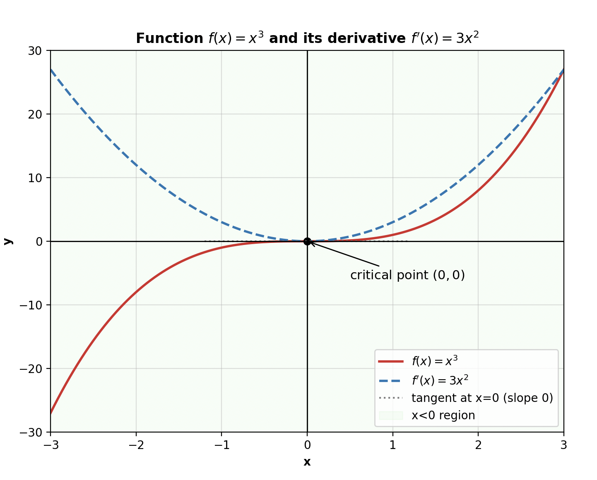

## Optimization in Machine learning

This is an auxiliar tutorial that could help students to grasp basic concepts on optimization and calculus for Machine Learning. This is an omni-present concept that 
we usually employ in ML when we want to compute a good `model` given some data $\mathbf{D}$ for a specific task $E$. We will start first by explaining what the concept of `function` is and how can we use it in our domain. Then, we will introduce the concept of a loss function and the basics of how to find minimum or maximum of a function using optimization principles. We will make use of the simple case of a univariate regression (meaning that the input $x \in \mathbb{R}$ is a single-value variable).

## Functions

Central to Machine learning to mathematics and this chapter is the concept of a function. A function $f$ is a quantity that relates two quantities to each other. We can think of the first quantity as the input and the second quantity as the output. We can use the metaphor for a function as a system. Formally, we can define a function mathematically as:

$$f:x \rightarrow y$$ 

with 

$$f : \mathbb{R} \to \mathbb{R}, \quad x \mapsto y$$

or otherwise we can write

$$y = f(x)$$

As $\mathbb{R}$ we define the space of all real numbers. Please note that the function between input and output in our previous notation, we can say that maps input from the $x \in \mathbb{R}$ to $y \in \mathbb{R}$. So the input is a real value and the output is a real value. This is visualized in the following image:

  

In the previous example, we had as input a single-value variable and output a single-value variable. That is denoted by $f : \mathbb{R} \to \mathbb{R}$. However, there is nothing to constrain us for having a single-value input and output. We can have as input a variable $x$ that has multiple dimensions. The same goes for the output. 

We can write thus the following: 

$$f:x \rightarrow y$$

$$f : \mathbb{R}^{D} \to \mathbb{R}^{M}, \quad x \mapsto y$$

with $D, M$ are the dimensionality of the input and output. We can say in other words that we have multi-dimensional (or multivariate) input and output. To understand what we mean with multi-dimensional inputs, we can think of the example of having as a input a vector with multiple features (instead of just one). A simple example of a function could be to take as input a vector variable $\mathbf{x}\in \mathbb{R}^D$ (a vector with $D$ number of features) and do nothing so return the same vector as output, so $\mathbf{y} = \mathbf{x} \in \mathbb{R}^{D}$.

In the tutorial about mathematics for ML we saw multiple types of functions. One simple example is the calculation of dot product in vectors. The dot product of a vector ($\mathbf{x} = [x_1, x_2]^{T}$) could be defined as:

$$f(\mathbf{x}) = \mathbf{x}^{T}\mathbf{x}, \text{ with } \mathbf{x} \in \mathbb{R}^2$$

would be specified as:

$$f : \mathbb{R}^{2} \to \mathbb{R}, \quad \mathbf{x} \mapsto x_1^{2} + x_2^{2}$$

## Visualizing functions

A perfect tool to better grasp the idea behind the functions is to graph and plot how these functions into a cartesian space and figure out how these functions works. The most of the functions that we will deal with in the EoML course will be either mapping $f : \mathbb{R} \to \mathbb{R}$ or $f : \mathbb{R}^2 \to \mathbb{R}$. Sometimes also $f : \mathbb{R}^3 \to \mathbb{R}$, since they are the only one that we can visualize in a plot. 

A simple example is to visualize the function $f = x^2$. 

  

We can see a different example of functions that map input and output $f : \mathbb{R} \to \mathbb{R}$.

Another example is to have as input a two-dimensional input and output a single-value variable. We can have the following example $y = f(x_1, x_2) = x_1^2 + x_2^{2}$

  

But how can we visualize function that maps high-dimensional input to multi-dimensional output. Unfortunately, that is not possible and we can only visualize functions that have a single-dimensional or two-dimensional input. At the same time, the most of the interesting problems in machine learning has higher dimensionality and we cannot visualize in the same way that we did with previous examples. There are though some tools that can perform dimensionality reduction (which are methods that remove unecessarry information) with which we can still plot things of high dimensionality.

## Functions in machine learning context

A really common discussed metaphor in machine learning is that our ML model can be considered as boxes, systems or functions, that receive some input and spit out an output. As an example we can consider the problem of classification, where we do have as input our variable $\mathbf{x}$ that represent an instance from a dataset (as an example an image from a dataset with images) and the model $f(\cdot)$ can extract an output $y = f(\mathbf{x})$ that should ideally represent the label of this instance.

## Regression setup and error function

One really common task in ML is the concept of regression. The setup in regression is as follows: we have access to data about a specific problem, for instance the House Price Prediction (Real Estate). The input features could be the following:

Features ($x$):
- Size of house (sq. meters)
- Number of bedrooms
- Age of house
- Distance to city center
- Neighborhood quality score

Output ($y$):
- Price of the house

Regression in its simplest version aims at identify a simple linear model that we can to find a linear fit of the real function that maps input to output by using our training data. As an example, lets keep our problem as simple as possible, and lets assume that given as input the size of the house we are aiming at creating a predictor that find the price of the house. Thus, our model looks as follows: 

$$y = wx + b$$

so if $x$ represents the size of the house, and $y$ the price of the house, we would like to find the slope $w$ and intercept $b$ that best fit the data. Towards this goal, we can use of an `error function` or a `cost function` (or `loss function`). In the case of regression for instance we set this function to be the mean square error:

$$\mathcal{L}_{\text{MSE}} = \frac{1}{n} \sum_{i=1}^{n} \left( y_i - \hat{y}_i \right)^2
$$

Where $y_i$ are the true label of the instances while $\hat{y}_i$ are the predicted values by the regression model. Ideally, we would like to steer and calculate these parameters $\mathbf{w], b$ that minimize the error function and lead to predicted values that are as close as possible to the real-labels of our regression problem. To calculate the `ideal` parameters we need to use an optimization algorithm to do that.

The loss function could look like as follows (this image is taken from Simon Prince book `Understanding Deep Learning`): 

  

In this figure, we can see the loss function $L(\mathbf{w})$ with respect with parameters $w, b$ slope and intercept. We can see how well different parameters w,b can fit the data with respect to the loss function (`error function`). Our task when designing an algorithm in AI is figure out which parameters $w, b$ fit our data with the minimum loss. We can see that the minimum can be found in the green spot (with roughly $w = 0.2$ and $b = 1$).

However, in this example, it was kind of easy to spot that after plotting the Loss over the regression parameters $\mathbf{w}, b$. For more complicated functions, or mutli-variate case, that wont be possible to gauge a plot and decide where the global minima for a function lies. Thus, we need to find an automatic way to compute the parameters that minimize the loss function. The mathematical tool to do so is called `optimization` it is based on differentiation and in the upcoming paragraph we will gently introduce the concepts of optimization and differentiation and gradient.

In principle, to locate the minimum of a function we calculate the slope of a function and in the position that the gradient is zero is where we do have an extreme of a function either a minima or a maxima. In the upcoming section we will see how we can compute the derivative of a function and how to use it in practice to optimize our problem.

## Slope of a function and differentiation of univariate functions

The very first thing that we will analyze is the slope of a function and in particular we will start with the slope of a linear function. What we define as slope in this situation is the rate of change of the linear function that is the same everywhere (no matter what will be the two points that we decided to choose):

  

However, the rate of change is not the same when we chose a non-linear functions. In this case, the slope does not remain the same and we cannot compute it in the same way as before. 

  

The way to calculate the average slope of a function between two points ($\partial x$) could be calculated using the following formula:

$$\frac{\partial y}{\partial x} = \frac{f(x + \partial x) - f(x)}{\partial x}$$

This fraction could be seen as the average slope between $x$ and $x + \partial x$. In the limit where the difference $\partial x$ is close to zero we obtain the `tangent` of $f$ at $x$. This tangent is called alternatively `the derivative of f at x`.

More formally, we can denote as derivative the following limit:

$$\frac{df}{dx} = \lim_{h \to 0} \frac{f(x+h) - f(x)}{h}$$

As a simple example to understand what is going on is the following: We do have the function $y = x^2$ and we would like to calculate its derivative throughout the space. In the following image you can see how the function looks like if we plot it in the Cartesian space, but also how does its derivation looks like throughout the Cartesian space:

  

Note, that close to $y = -\infty$ the slope of the function $y$ is big and point towards the negative direction since the value of $y$ tends to reduce and this is the same, then as the function tends to go towards $y = 0$, the slope still has negative values but its size tends to reduced until $y = 0$, where the slope is also $y' = 0$. Usually, with $'$ we symbolize the derivative of a function. Then, once $y$ goes towards the positive side for $x$ the slope becomes positive and the `magnitude` of the slope increases.

Thus, by calculating the derivative we calculate the slope of the function that shows in which direction our function is heading to and also the magnitude of the change. When we calculate the derivative of a function, except of finding the slope, we can local or global extremes of the function which are located in the positions where $f^{'}(x) = 0$. In our example, $f^{'}(x) = 0$ is taking place when $x = 0$, thus, we have a global minimum at this position.

In general, for each function $f(\cdot)$, when we would like to find its minimum/maximum, the first thing we need to do is to calculate the derivative, set it equal to zero and solve the equation for $x$ to find the point where the function $f(x)$ is minimized or maximized. Note, that these points where the derivative is equal to zero are called `stationary points` and they show either global or local extremes. That means that they reveal the points $x$ where the $y$ change directions (from being increasing to being decreasing). To grasp this better, we can check the following example:

  

A lot of things are going on in this figure. There are multiple stationary points where the derivative of $f^{'}(x) = 0$. We can spot all these points and they are denoted in the figure with the red spots. When the global maxima/minima exist in the extreme cases of +/- inf, then we can say that we cannot find global maxima and global minima but only local maxima/minima. An example of this is the following function:

  

In this case, we cannot speak of finding global extremes, but we can spot again a local extreme.

To come back into the Machine learning problem that we defined before, which is finding parameters $w, b$ that minimize the error function ($f(x)$), in the similar way as above-described, we are looking for the stationary points for this functions, so we compute the derivative of the function, we set it to be equally to zero, and then, we solve the equation $f^{'}(x) = 0$ with respect to $x$ and finding the stationary points. 

In the case of linear regression it ends up being easy to find this point where the parameters, w,b minimize the error function and this point is the following:

$$w = \frac{\sum_{i=1}^N (x_i - \bar{x})(y_i - \bar{y})}{\sum_{i=1}^N (x_i - \bar{x})^2}
$$

and

$$b = \bar{y} - w \bar{x}$$

## Conclusion and learning objectives of this tutorial