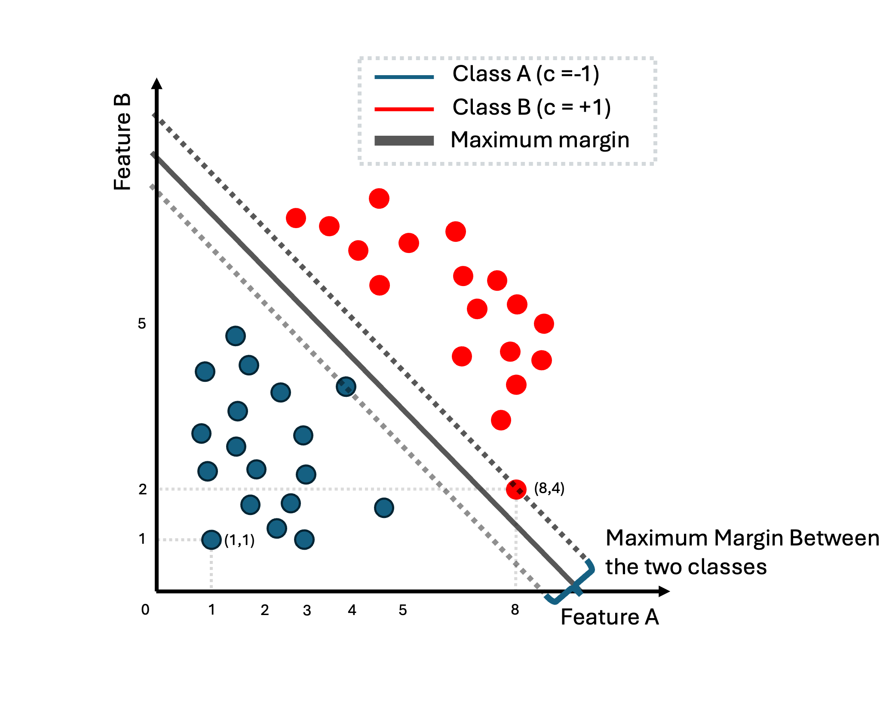

# The usual scenario in linear models classification

We have seen that usually in our classification problem we have datasets with the following form:

$$
\mathcal{D} = \{ \mathbf{x}_1, \mathbf{x}_2, \cdots, \mathbf{x}_n \} \in \mathbb{R}^{N \times D}
$$

where each instance $\mathbf{x}_n \in \mathbb{R}^D$ and since we are dealing with a supervised problem they are coupled together with annotation information which for this section we will assume that is binary annotation $(+1, -1)$ that corresponds in two classes. For instance, spam $+1$ or not spam $-1$. We can denote the full dataset with the the following tuples:

$$
 \mathcal{D} = \{ (\mathbf{x}_1, y_1), (\mathbf{x}_2, y_2), \cdots, (\mathbf{x}_n, y_n) \} 
$$

The idea in linear models is to introduce parameters $\mathbf{w}$ that maps input data instances to the desired annotation. Thus, to create a program that learns these parameters in such a way that we have learned how the mapping between instances and labels is taking place. We saw, that the most simple way, the linear classification, we assume that this mapping can be revealed by performing linear operation only such as:

$$
\hat{y}_n = \mathbf{w}^T \mathbf{x}_n + b \in \mathbb{R}
$$

Note that if our input instances live in $\mathbb{R}^2$, thus, parameter $\mathbf{w} \in \mathbb{R}^2$ the above linear equation defines a plane. When we have $y_n = 0$ we can define a line which is the decision boundary that separates the two classes. If $y_n > 0$ then we can say that the instance belongs to the positive class while it will belong to the negative class otherwise.

For a specific instance $\mathbf{x}_n$, if we apply parameters $\mathbf{w}, b$ then we can compute $\hat{y}_n$ and our assumption is that we can learn such parameters that the prediction is as close as possible to the real label $y_n$. That is the idea behind linear model such as `Perceptron`. For this algorithm, there is a proof that if a dataset is linear separable then, `Perceptron` algorithm will always convergence and compute $\mathbf{w}, b$ that can separate the two classes. However, not all the datasets are linearly separable. For instance:

  

In the above image, we can see a dataset of instances that live in the two dimensions (`feature A`, `feature B`). With red we represent the positive class while with blue the negative class. The purple instance is the item that we would like to classify in one of the two classes. If we try to learn parameters $\mathbf{w}, b$ using `Perceptron` or another linear strategy, we will figure out that is impossible to find a line that separates these two classes. 

  

The same is happening in the above example.

However, while it is not feasible to find a linear decision boundary that separates perfectly this dataset, what can thing of 
a way to transform these data in such a way that then, it will be easy to find a linear decision boundary.

But how exactly can we transform the data from the last image. If you closely look the two classes, the `red-class` lives within the rectangular that is defined by points $(-0.5, -0.5)$ and $(.5, .5)$ while `the blue class` lives in the outer space from the rectangular that is defined by points $(-1, -1)$ and $(1, 1)$. 

Now instead of using the data directly as they are, we can firstly, apply a square function for each of the input features. Thus, each input instance $\mathbf{x} = [x_1, x_{2}]\in \mathbb{R}^2$ can be represented as $\mathbf{x}' = [x_1^{2}, x_{2}^{2}] \in \mathbb{R}^2$ with $(x_1, x_2)$ to be (`feature A`, `feature B`). This mapping now changes the data instances as follows:

  

The reason that this is happening is really intuitive, every feature of the `red class` has absolute value that is less than one, while for `blue class` every instance has feature-values that are higher than one. Thus, when we square the features of these instances, `red class` is pushed closer to the origin, while `blue class` is pushed further. Note that since we squared all features, all feature-values for both classes are now positives. 

Now in this example, it is really easy to think of parameters $(\mathbf{w}, b)$ that define a decision boundary that perfectly separates the two classes. In this case, to learn this decision boundary, we first need to apply the transformation function or alternatively called the `basis function` and then, we can learn a decision boundary by simple using 
a linear model like `Perceptron`. Usually, we denote these basis functions as $\phi(\mathbf{x}) = \mathbf{x}'$. Now, the linear equation can be defined as:

$$
\hat{y}_n = \mathbf{w}^T  \phi(\mathbf{x}_n) + b \in \mathbb{R}
$$

while our dataset can be defined now as:  

$$
\mathcal{D} = \{ \phi(\mathbf{x}_1), \phi(\mathbf{x}_2), \cdots, \phi(\mathbf{x}_n ) \} \in \mathbb{R}^{N \times D} 
$$

Note that in the previous example $\mathbf{x}_n \in \mathbb{R}^2$ and $\phi(\mathbf{x}_n) \in \mathbb{R}^2$ so the mapping $\phi$ takes an input in two-dimensions and returns a transformed version of input into the same two-dimensional space, by just squaring each features. However, there is nothing that can constraints us to keep the same dimensionality. As a generalization we can consider that a `basis function` maps input space into another space $\phi: \mathbb{R}^{D} \to \mathbb{R}^{M}$. This can be seen in the following transformation:

  

To sum up, we saw so far that when we do have a linear separable dataset, we can apply directly a linear model to learn a decision boundary the perfectly separates the two classes. When
our problem is not linear (meaning that we cannot compute a linear decision boundary to separate the two-classes) there is a solution to our problem. This is to apply a `basis function` that maps our initial dataset in such a way that we can simple then, apply a linear model to find a perfect decision boundary.

However, the example that we have presented, it was simple to find this basis function by just looking the image with all the instances of the dataset. Most of times, finding a good basis function is not an intuitive task and it requires extensive experimentation. In some other cases, the only way to achieve linearity is by applying `basis function` that lives in `a really high dimensional world`. Thus, it is not always easy or feasible to find a good `basis function`. Later in this tutorial we will introduce methods to mitigate this.

# Linear models

The main idea behind many classification algorithms is to represent data in $\mathbb{R}^D$ and then partition this space, ideally in a way that examples
with the same label (and no other examples) are in the same partition. In the case of binary classification, the space would be divided into two
parts corresponding to the positive and negative classes, respectively. We consider a particularly convenient partition, which is to (linearly) split
the space into two halves using a hyperplane. Let example $\mathbf{x} \in \mathbb{R}^D$ be an element of the data space. Consider the function:

$$
f: \mathbb{R}^D \to  \mathbb{R}
$$

with function $f(\mathbf{x})$ to be:

$$
f(\mathbf{x}) = \mathbf{w}^T\mathbf{x} + b
$$

or if we consider to apply a basis function $\phi$ then we can denote:

$$
f(\mathbf{x}) = \mathbf{w}^T \phi(\mathbf{x}) + b
$$

Therefore, we define the hyperplane that separates the two classes in our binary classification problem as:

$$
\{\mathbf{x} \in \mathbb{R}^D: f(\mathbf{x}) = 0 \}
$$

Since the input space is $\mathbb{R}^D$, parameters $(\mathbf{w}, b)$ define a hyperplane in $\mathbb{R}^{D-1}$ space. When the input is two-dimensional the decision boundary is a line, when the input three-dimensional that is a plane. An illustration of this function can be seen in the following figure:

  

From this example it is clear that $\mathbf{w}$ represents the slope of the hyperplane and the term bias $b$ the offset (the distance of the hyperplane from the origin). 

Vector $\mathbf{w}$ is always orthogonal to the hyperplane, and the hyperplane spans the space into two regions. In the first we have the first class while in the second we do have the second class.

When presented with a test example, we classify the example as positive or negative depending on the side of the hyperplane on which it
occurs. Let's say that the test example is $\mathbf{x}_t$, then, we can apply the linear model $f(\mathbf{x}_t)$. If $f(\mathbf{x}_t)>0$ we can say that the sample can be classified in the
`positive class` $+1$ while if $f(\mathbf{x}_t) < 0$ it can be classified as `negative class` $-1$ while as we mentioned before when $f(\mathbf{x}_t) = 0$ lies exactly on the decision boundary.

During the training phase, we would like to ensure that the instances with annotation that is positive like the following instance-pair: $(\\mathbf{x}_n, y_n = +1)$ are located in the positive region that is defined by the decision boundary and thus
$f(\mathbf{x}_n) \ge 0$, while for  a negative instance-pair $(\\mathbf{x}_n, y_n = -1)$ it should be that $f(\mathbf{x}_n) \le 0$. 

This can be expressed from the following equation:

$$
y_n (\mathbf{w}^T  \mathbf{x}_n) + b \ge 0
$$

or the following one if we want to apply a `basis function`:

$$
y_n (\mathbf{w}^T  \phi(\mathbf{x}_n)) + b \ge 0
$$

# Support Vector Machines

So far, we have established the fact that when our dataset is linear separable we can compute a decision boundary that is defined by parameters $(\mathbf{w}, b)$ (for example via Perceptron algorithm). As you have seen during lectures, due to randomness in this algorithm, 
each time we run the algorithm we end-up having different decision boundary. That outcome can be seen in the following picture:

  

There are multiple decision boundaries that are defined from different parameters $(\mathbf{w}, b)$ that perfectly separate a linear dataset or 
a non-linear datasets that we have applied some `basis function`. Which one of all these lines should we pick?

In `perceptron`, we can end up having any one these lines based on how we initialize our parameters. However, that is not a very good strategy. 
We can end-up having decision boundary that are very close to the `extreme` training samples from either the`red` or `blue` class. 
Here we use the term `extreme` to denote those instances between the two classes that are close to the opposite class.

A better idea is to choose the separating hyperplane that maximizes the `margin` between the `positive` and `negative` examples. In other words, 
we want the positive and negative examples to be separated by large margin. So if we have a linearly separable dataset we want the margin between the 
decision boundary and the two classes to be as large as possible. But what we mean with the word `margin`?

It is the distance of the `hyperplane` to the closest examples in the dataset, assuming that the dataset is linearly separable. Or `alternatively` the smallest
distance between the decision boundary and any of the samples. Thus, we want to find parameters  $(\mathbf{w}, b)$ that defines a decision boundary that maximizes 
the `margin`. This is the main of `Support vector machine` (SVM) algorithm. 

To understand better what this margin means and what is the SVM algorithm we need to revise our geometric understanding of the linear models. This can be summarized by 
the following image:

  

For each sample $\mathbf{x}$ (the vector with blue in the above image), we can compute its distance from the decision boundary defined by the $y(\mathbf{x}') = 0$ (for all points $\mathbf{x}'$ that lives in the decision boundary) and 
is the `red line` in the figure. This distance is actually the `margin` when this instance is an `extreme` instance and its the closest sample to the decision boundary. 
Thus, its distance from this decision boundary defines the `margin`. 

Fro the figure, we can easily conclude that the blue vector can be decomposed in the following way:

$$
\mathbf{x} = \mathbf{x}_{\perp} + r \frac{\mathbf{w}}{||\mathbf{w}||}
$$

or verbally we can say that vector $\mathbf{x}$ can be decomposed as the vector from the origin to the point in the 
decision line that vector $\mathbf{x}$ is projected, plus a vector that is in the direction of slope $\mathbf{w}$ or 
the normalized version of it $ \frac{\mathbf{w}}{||w||}$ but multiplied by an `unknown` factor $r$.

If we multiply both sides with $\mathbf{w}^T$ and adding $b$ then we do have:

$$
\underbrace{\mathbf{w}^T\mathbf{x} + b}_{= y(\mathbf{x})} = \underbrace{\mathbf{w}^T \mathbf{x}_{\perp} + b}_{\text{a point in the boundary} = 0} + \underbrace{r  \mathbf{w}^T \frac{\mathbf{w}}{||\mathbf{w}||}}_{\mathbf{w}^T\mathbf{w} = ||w||^2}
$$

that we can simplify:

$$
y(\mathbf{x}) = r ||\mathbf{w}|| 
$$

and finally the distance of a point to the decision boundary can be computed as:

$$
r = \frac{y(\mathbf{x})}{||\mathbf{w}|| }
$$

If this point is an `extreme` point then, this distance is the so-called `margin`. 

The idea in SVM, is to pick the decision boundary for which the distance from the `extreme` point or points is maximized. We are only interested in solutions for which all data points are correctly
classified, so that $y_n \mathbf{x}_n > 0$ for all $n$. Thus the distance of a point $\mathbf{x}_n$ can be denoted as:

$$
\frac{y_n y(\mathbf{x}_n)}{||\mathbf{w}||} = \frac{y_n (\mathbf{w}^T \mathbf{x}_n + b)}{||\mathbf{w}||}
$$

or if we apply as before a `basis function` we can denote as:

$$
\frac{y_n y(\phi(\mathbf{x}_n))}{||\mathbf{w}||} = \frac{y_n (\mathbf{w}^T \phi(\mathbf{x}_n) + b)}{||\mathbf{w}||}
$$

The margin is given by the perpendicular distance to the closest point $\mathbf{x}_n$ from the data set, and we wish to optimize the parameters $\mathbf{w}$ and $b$ in order to maximize this
distance. Finding an optimal margin involves actually two things: firstly find these instances from the two classes that are closer to each other (the so-called `extreme points`) and also maximize the distance 
of these points to the `margin`.

The first objective is easy to be formalized. Since we know the distance of each point to the decision boundary that is given by $\frac{y_n y(\phi(\mathbf{x}_n))}{||\mathbf{w}||}$ or $\frac{y_n (\mathbf{w}^T \phi(\mathbf{x}_n) + b)}{||\mathbf{w}||}$
then we can formalize the computation as:

$$
\min_{n} \frac{y_n (\mathbf{w}^T \phi(\mathbf{x}_n) + b)}{||\mathbf{w}||} = \frac{y_n (\mathbf{w}^T \kappa \phi(\mathbf{x}_n) + \kappa b)}{||\kappa \mathbf{w}||}
$$

Here we have shown as well that if we multiply the equation parts with $\kappa$ the equation stays the same and it results to the same `margin`. That means that $\mathbf{w}, b$ are not unique and mutliples of these parameters leads to 
the same decision boundary and `margin`. 

Now a simple trick here is to constraint the introduced parameters $\kappa$ in such a way that the points closest to the decision boundary (`extreme points`) it holds that
the numerator from the previous equation evaluates to 

$$y_n (\mathbf{w}^T \phi(\mathbf{x}_n) + b) = 1$$

TThus, this can simply imply that for all points it holds that: 

$$y_n (\mathbf{w}^T \phi(\mathbf{x}_n) + b) \geq 1$$

Finally, our ultimate objective is to find parameters $\mathbf{w}, b$ that maximize this `margin` which can be defined based on our constraint as:

$$
\arg \max_{\mathbf{w}, b} \frac{1}{||\mathbf{w}||} \text{, for all points } y_n (\mathbf{w}^T \phi(\mathbf{x}_n) + b) \geq 1
$$

maximizing this entity is equivalent to minimizing the following:

$$
\arg \min_{\mathbf{w}, b} \frac{1}{2}||\mathbf{w}||^2 \text{, subject to N constraints: } y_n (\mathbf{w}^T \phi(\mathbf{x}_n) + b) \geq 1
$$

Finally, after some geometric interpretation and analysis on the concept of `margin` we ended up articulating an `inequality constraint optimization` problem. To dig a bit further, to find
a solution to this problem we can employ Lagrangian multipliers. These multipliers can be denoted as $a_n \geq 0$, each multiplier relates to each constraint and we can define in that way the 
Lagrangian function:

$$
\mathcal{L}(\mathbf{w}, b, \mathbf{a}) = \frac{1}{2}||w||^2 - \sum_{n=1}^{N} a_n \{y_n(\mathbf{w}^T \phi(\mathbf{x}_n) + b) - 1 \}, \text{the multipliers: } \mathbf{a} = [a_a, a_2, \cdots a_n]^T 
$$

Here it is important to understand that the `minus sign` is because we want to minimize over parameters $\mathbf{w}, b$ and maximize over parameters $\mathbf{a}$.  This function is
also called the `primal Lagrangian function`. The general recipe for finding optimal parameters for the `Lagrangian function` is to compute the partial derivatives over these parameters and set it to zero. 
Henceforth, that leads to the following expressions:

$$
\mathbf{w} = \sum_{n=1}^N a_n y_n \phi(\mathbf{x}_n)
$$

and when we derive over parameter $b$ we do have:

$$
0 = \sum_{n=1}^{N} a_n y_n
$$

That is good, since now we can factorize the primal function and use the two previous equation eliminate $\mathbf{w}, b$ from the function. That leads to the `dual lagrangian function` that 
look as follows:

$$
\tilde{\mathcal{L}}(\mathbf{a}) = \sum_{n=1}^{N} a_n - \frac{1}{2} \sum_{n=1}^{N} \sum_{m=1}^{N} a_n a_m y_n y_m \underbrace{\phi(\mathbf{x}_n)^T \phi(\mathbf{x}_m)}_{k(\mathbf{x}_n, \mathbf{x}_m)}, \text{ subject to: } a_n \geq 0 \text{ and: } \sum_{m=1}^{N} a_n y_n = 0.
$$

and now we want to maximize this dual lagrangian with respect to parameters $\mathbf{a}$. This takes the form of quadratic function subject to a set ot inequality constraints. We will not discuss in this section the optimization of the dual function, however, we saw how to introduce kernels to our problem. This formulation allows the model to
be reformulated using kernels, and so the maximum margin classifier can be applied efficiently to feature spaces whose dimensionality exceeds the number of data points,
including infinite feature spaces.

Once we learned the lagrangian parameters we can use them to make predictions for samples $\mathbf{x}'$. We can start by using the typical way in linear models:

$$
y = \mathbf{w}^T \mathbf{x}' + b
$$

but now by analyzing and using the outcome of the support vector analysis:

$$
y =  \sum_{n=1}^{N} a_n y_n k(\mathbf{x}', \mathbf{x}_n) + b
$$

Thus, we can compute the class based on the bias $b$ using the kernel function $k(\mathbf{x}', \mathbf{x}_n)$. Now, this would require to compute the kernel function for each of the 
instances in the training set. However, we know that $a_n \geq 0$, so here we do have two cases: one that the multipliers are greater than zero, and we do have the extreme points or the support vectors or zero otherwise. In practice only new samples are having $a_n \geq 0$, so the prediction is only based in few computations.

### Intermezzo kernels and kernel trick

So far we have seen only parametric learning methods like `linear regression` or `Perceptron`. These methods form of the mapping $y(\mathbf{x}, \mathbf{w})$ from input $\mathbf{x}$ to output $y$ is governed by a vector $\mathbf{w}$ of adaptive parameters. During training phase the task is to learn the parameters $\mathbf{w}$ and then, during inference we employ these parameters to perform `predictions`.

There is another strategy that we can use where we can also use `training data` during the `inference time` to make predictions. Think for instance the example of K-Nearest Neighbors.These are examples of memory-based methods that involve storing the entire training set in order to make predictions for future data
points. They typically require a `similarity measurement` to be defined that measures the similarity of any two vectors in input space, and are generally fast to `train` but slow at making
predictions for test data points. Even the traditional methods can be cast into non-parametric using during inference this `similarity measurement` that usually is called `kernel function`.

This function is simply the inner product between two instances in the vector space:

$$
\boldsymbol{\phi}(\mathbf{x})^T \boldsymbol{\phi}(\mathbf{x}')
$$

so the initial instance is transformed by the basis function for instance $\mathbf{x}$ and then we compute the inner product with some other sample $\boldsymbol{\phi}(\mathbf{x}')$
which reveals the similarity of these two vectors. We can define this similarity to be our `kernel function` as follows:

$$
k(\mathbf{x}, \mathbf{x}') = \boldsymbol{\phi}(\mathbf{x})^T \boldsymbol{\phi}(\mathbf{x}')^T
$$

which is translates as a `similarity measurement` in the feature space inner product between two instances $\mathbf{x}, \mathbf{x}'$. 

In a similar fashion with SVM, when we introduce kernels we are trying to compute the predictions of the model not by using the linear modelling parameters $\mathbf{w}$ 
but the kernel functions evaluated on all the training samples. That changes the perspective and the dimensionality of the problem at hand. 

Usually, in the linear modelling optimization we come across the following matrix multiplication 

$$\mathbf{X}^{T}\mathbf{X} \in \mathbb{R}^{D \times D}$$

or: 

$$\boldsymbol{\Phi}(\mathbf{X})^{T} \boldsymbol{\Phi}(\mathbf{X}) \in \mathbb{R}^{M \times M}$$

for instance that appears in the primal optimization of a linear model but that can be replaced from a dual representation (as we have seen in `SVM`) by the following: 

$$ \boldsymbol{K} = \boldsymbol{\Phi}(\mathbf{X}) \boldsymbol{\Phi}(\mathbf{X})^T \in \mathbf{R}^{N \times N}$$

Just to disentangle a bit the discussion here, we will use the following terminology, for matrix $\boldsymbol{\Phi}(\mathbf{X})$ or simply $\boldsymbol{\Phi}$ this is called the `design matrix`. Given a dataset

$$
\boldsymbol{X} = 
\begin{bmatrix} 
- & \mathbf{x}_1^T & - \\ 
- & \mathbf{x}_2^T & - \\ 
& \vdots & \\ 
- & \mathbf{x}_N^T & - 
\end{bmatrix} 

= 

\begin{pmatrix}
{x}_{11} & {x}_{12} & \cdots & {x}_{1d} \\
{x}_{21} & {x}_{22} & \cdots & {x}_{2d} \\
\vdots & \vdots & \ddots & \vdots \\
{x}_{N1} & {x}_{N2} & \cdots & {x}_{Nd}
\end{pmatrix} \in \mathbb{R}^{N \times D}
$$

$$
\boldsymbol{\Phi} = 
\begin{bmatrix} 
- & \phi_1^T & - \\ 
- & \phi_2^T & - \\ 
& \vdots & \\ 
- & \phi_N^T & - 
\end{bmatrix} 

= 
\begin{pmatrix}
\phi_0(\mathbf{x}_1) & \phi_1(\mathbf{x}_1) & \cdots & \phi_{M-1}(\mathbf{x}_1) \\
\phi_0(\mathbf{x}_2) & \phi_1(\mathbf{x}_2) & \cdots & \phi_{M-1}(\mathbf{x}_2) \\
\vdots & \vdots & \ddots & \vdots \\
\phi_0(\mathbf{x}_N) & \phi_1(\mathbf{x}_N) & \cdots & \phi_{M-1}(\mathbf{x}_N)
\end{pmatrix} \in \mathbb{R}^{N \times M}
$$

Then, when we compute $\boldsymbol{\Phi}^T\boldsymbol{\Phi}$ we can analyze it further to understand what is happening:

$$
\boldsymbol{\Phi}^T\boldsymbol{\Phi} = 

\begin{bmatrix} 
| & | & & | \\ 
\phi^{(1)} & \phi^{(2)} & \cdots & \phi^{(M)} \\ 
| & | & & | 
\end{bmatrix} 

\begin{bmatrix} 
- & \phi_1^T & - \\ 
- & \phi_2^T & - \\ 
& \vdots & \\ 
- & \phi_N^T & - 
\end{bmatrix} 

\in \mathbf{R}^{M \times M}
$$

In our notation this matrix, is the outer product $\boldsymbol{\phi}\boldsymbol{\phi}^T$ of the elements of the `design matrix`. While the matrix formed with the following way:

$$
\boldsymbol{\Phi}\boldsymbol{\Phi}^T = 

\begin{bmatrix} 
- & \phi_1^T & - \\ 
- & \phi_2^T & - \\ 
& \vdots & \\ 
- & \phi_N^T & - 
\end{bmatrix} 

\begin{bmatrix} 
| & | & & | \\ 
\phi^{(1)} & \phi^{(2)} & \cdots & \phi^{(M)} \\ 
| & | & & | 
\end{bmatrix} 

\in \mathbf{R}^{N \times N}
$$

The idea is that in the the dual representation do not depend in the feature basis function that is usually represented by $\boldsymbol{\Phi}^T\boldsymbol{\Phi}$ but solely on the distance between instances $\boldsymbol{\Phi}\boldsymbol{\Phi}^T$  using the kernel function. One of the reason that we want to take advantage of the kernel trick, which states that the computation of the can de computed in the original dimensionality of the raw data before we apply the basis functions $\phi$.
 
That ofc sounds really ambiguous and to better grasp this, we have put forward the following example.

### Kernel trick example

To understand how a kernel function works we need to introduce some examples. Let's say that we do have two vectors $\mathbf{x} = [x_1, x_2]^T \in \mathbb{R}^2$ and $\mathbf{x} = [x_1, x_2]^T \in \mathbb{R}^2$
and then we define a polynomial kernel of order $M= 2$ as:

$$
k = (1 + \mathbf{x}^T\mathbf{z})^2 = (1 + x_1z_1 + x_2 z_2)^2 = 1 + 2x_1z_1 + 2x_2z_2 + (x_1z_1)^2 + (x_2z_2)^2 + 2x_1z_1x_2z_2
$$

which can actually computed as:

$$
k = \underbrace{(1, \sqrt{2}x_1, \sqrt{2}x_2, x_1^2, x_2^2, \sqrt{2}x_1x_2)^T}_{ = \phi(\mathbf{x})}\underbrace{(1, \sqrt{2}z_1, \sqrt{2}z_2, z_1^2, z_2^2, \sqrt{2}z_1z_2)}_{ = \phi(\mathbf{z})} = \phi(\mathbf{x})^T\phi(\mathbf{z})

$$

with $\phi(\mathbf{x}) \in \mathbf{R}^6$

### Sparse kernel machines

### Soft margin and slack variables

The analysis that we have done so far it is based on the assumption that our binary (noted as that due to the annotation) dataset is linearly separable in the input space or in the feature space after the applied `basis function` or the `kernel trick` is applied and thus, we can find a line that perfectly separates the two classes. However, this is not always the case. Even when we are applying some non-linearities with the kernel trick its is not always feasible to create linear separable feature space. 

The assumption in SVM is that our datasets are linearly separable and we create a margin based on this assumption (`hard margin`). To tackle this constraint we can relax this assumption
and allow some misclassification mistakes when defining the margin. This way we are trying to achieve what is called `soft margin` since we are allowing are classifier to perform some misclassifications during the training process.

  

As we can see from the previous example there might be a chance the binary class dataset can have `overlap` between the two classes and therefore we cannot perfectly separate the two classes by following the previous steps. We therefore need a way to modify the support vector machine so as to allow some of the training points to be misclassified.

So far, we implicitly used an loss function that gave infinite error if a data point was misclassified and zero error if it was classified correctly, and
then optimized the model parameters to maximize the margin. We now modify this approach so that data points are allowed to be on the `wrong side` of the margin boundary, but with a penalty that increases with the distance from that boundary.

To do this, we can introduce `slack variables` $\xi_n \geq 0$ where $n = 1, 2, \cdots, N$ we introduce one `slack variable` per training data instance. The idea is that when $\xi_n = 0$ the corresponding training instances are in the correct margin boundary while for the rest we do have $\xi_n = \| y_n  - y(\mathbf{x}_n)\|$. Instances $\mathbf{x}_n$ for which $\xi_n = 1$ are exactly on the decision boundary while when $\xi > 1$ then these points are misclassified.

  

That can be seen in the above image. ALl these constraints can be grouped from the following equation:

$$
y_n y(\mathbf{x}_n) \geq 1 - \xi_n, \text{ with } n = 1, 2, \cdots, N
$$

where the `slack variables` are constrained to be $\xi_n \geq 0$. Our goal is now to maximize the margin while softly penalizing points that lie
on the wrong side of the margin boundary:

$$
C \sum_{n=1}^{N} \xi_n + \frac{1}{2}\|| w \||^2
$$

with variable $C$ to be a `hyperparameter` that controls that controls the sensitivity of the method to the newly introduced `slack variables`. Thus,
its a tradeoff between the misclassification penalty and the margin itself. When the value of $C >> 0$ and tends to infinity, that results to the initial 
support vectors, so in essence it results in omitting completely these `slack variables` while when we do have a value of $C$ close to zero but not zero then 
we indeed allow a lot of misclassification to take place.

So now that we have introduce the `slack variables` we can re-write our optimization problem as follows:

$$
\mathcal{L}(\mathbf{w}, b, \mathbf{a}) = \frac{1}{2}||w||^2 + C \sum_{n=1}^N \xi_n - \sum_{n=1}^{N} a_n \{y_n(\mathbf{w}^T \phi(\mathbf{x}_n) + b) - 1 \} - \sum_{n=1}^N \mu_n \xi_n
$$

where $\{a_n \geq 0\}$ and $\{\mu_n \geq 0\}$ our Lagrangian multipliers for our two constraints. The recipe for solving this constraint optimization is to write down the lagrangian function as we just did analyze the `Karush Kunh Tucker` or `KKT` conditions that are the following:

$$
\begin{aligned}
a_n &\geq 0 \\
y_n y(\mathbf{x}_n) - 1 + \xi_n &\geq 0 \\
a_n \left( y_n y(\mathbf{x}_n) - 1 + \xi_n \right) &= 0 \\
\mu_n &\geq 0 \\
\xi_n &\geq 0 \\
\mu_n \xi_n &= 0
\end{aligned}
$$

Then next step in our recipe is to compute the partial derivatives $\frac{\partial \mathcal{L}}{\partial \mathbf{w}} =0 $, $\frac{\partial \mathcal{L}}{\partial b} =0$ and $\frac{\partial \mathcal{L}}{\partial \xi_n} = 0$

and based on the outcome to eliminate the primal variables $\mathbf{w}, b, \xi_n$. Thus, at the end we do have the following expression:

$$
\widetilde{L}(\mathbf{a}) = \sum_{n=1}^{N} a_n - \frac{1}{2} \sum_{n=1}^{N} \sum_{m=1}^{N} a_n a_m y_n y_m k(\mathbf{x}_n, \mathbf{x}_m)
$$

that is eventually the same optimization as we had in the `hard margin` case. However, there are different constraints this time. We need to minimize the above equation with the 
following constraints in mind:

$$
0 \leq a_n \leq 0
$$

and:

$$
\sum_{n=1}^N a_n y_n = 0
$$

This is proven to be also a `quadratic problem` as before with the prediction equation to be similar with the `hard margin` problem but this time the interpretation is different. The
same way as before, when $a_n = 0$ we do have again correctly classified instances. The remaining data points constitute the support vectors. These instances have $a_n >0$ and they must satisfy:

$$
y_n y(\mathbf{x}_n) = 1 - \xi_n
$$

### Lagrangian multipliers and how they work
